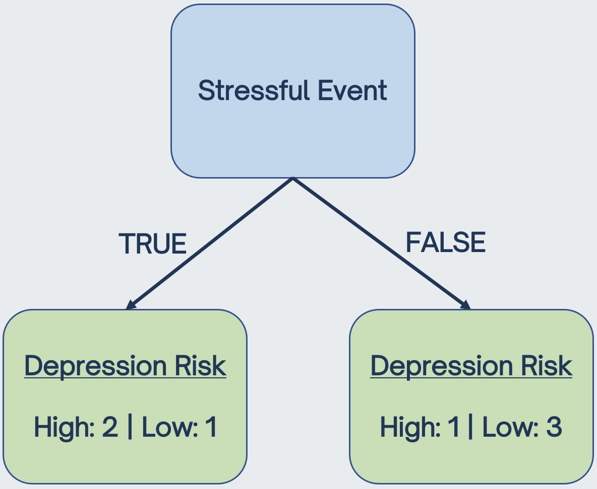

```{r setup, include=FALSE}
options(htmltools.dir.version = FALSE)
knitr::opts_chunk$set(
  fig.width=9, fig.height=3.5, fig.retina=3,
  out.width = "100%",
  cache = FALSE,
  echo = TRUE,
  message = FALSE, 
  warning = FALSE,
  hiline = TRUE,
  par(bg = "#E9ECEF")
)
knitr::opts_knit$set(global.par = TRUE)
```

```{r xaringan-themer, include=FALSE, warning=FALSE}
library(xaringanthemer)
style_mono_light(
  base_color = "#23395b",
  footnote_font_size = "20px",
  footnote_color = "gray",
  text_slide_number_font_size = "18px"
)
```

```{r xaringanExtra, echo=FALSE}
xaringanExtra::use_tachyons()
xaringanExtra::use_clipboard()
```

```{r packages, echo=FALSE, message=FALSE}
library(tidyverse)
library(knitr)
library(kableExtra)
library(countdown)
library(patchwork)
library(summarytools)
library(mice)
library(VIM)
library(caret)
library(gridExtra)
library(psych)
library(psychTools)
library(ggcorrplot)
library(GGally)
library(corrplot)
library(AppliedPredictiveModeling)
library(rpart)
library(tree)
library(ggforce)
library(tidymodels)
```

class: inverse, center, middle
# Overview

<style type="text/css">
.remark-code {
  border: 1px solid grey;
}
</style>

---
## Lecture Topics

.pull-left[
**Simple Decision Trees**
- Motivation (modeling nonlinearity)
- Classification trees
- Regression trees
- Recursive partitioning
- Pruning
- Stopping criteria (e.g., maximum depth)

**Ensemble Methods**
- Random forests 
- Aggregating predictions from many models
- Improved prediction accuracy at the cost of lower interpretability  
]

.pull-right[
```{r, echo = FALSE, out.height=450, out.width = 400}
include_graphics("flowchart2.jpg")
```
]

---
## Geometry of Data

Thus far, we have only been modeling linear relationships with linear boundaries between classes, e.g.: 

```{r, echo = FALSE, fig.showtext=TRUE}
set.seed(1)
x = rnorm(400)
y = rnorm(400)
simdat <- data.frame(x, y)
simdat$group_lin <- ifelse(simdat$x < simdat$y, 1, 0)

ggplot(simdat, aes(x, y)) + 
  geom_point(aes(color = group_lin)) +
  theme_xaringan(text_font_size = 14, title_font_size = 16) +
  theme(panel.grid.minor = element_blank(),
        panel.background = element_rect(fill = "white"),
        legend.position = "none")
```

---
## Geometry of Data

But what about other types of relationships? 

```{r, echo = FALSE}
simdat$group_circle <- ifelse(simdat$x < 1 & simdat$x > -1 & simdat$y < 1 & simdat$y > -1, 1, 0)

ggplot(simdat, aes(x, y)) + 
  geom_point(aes(color = group_circle)) +
  theme_xaringan(text_font_size = 14, title_font_size = 16) +
  theme(panel.grid.minor = element_blank(),
        panel.background = element_rect(fill = "white"),
        legend.position = "none")
```

---
## Geometry of Data

But what about other types of relationships? 

```{r, echo = FALSE}
simdat$group_quadrants <- ifelse((simdat$x < -0.5 & simdat$y > 0) | (simdat$x > 0.5 & simdat$y < 0), 1, 0)

ggplot(simdat, aes(x, y)) + 
  geom_point(aes(color = group_quadrants)) +
  theme_xaringan(text_font_size = 14, title_font_size = 16) +
  theme(panel.grid.minor = element_blank(),
        panel.background = element_rect(fill = "white"),
        legend.position = "none")
```

---
## Geometry of Data

Whereas these classes are very clearly separated, it's no longer easy to use a **single equation** to describe the boundaries between them. 

.pull-left[
```{r, echo = FALSE}
ggplot(simdat, aes(x, y)) + 
  geom_point(aes(color = group_circle)) +
  theme_xaringan(text_font_size = 14, title_font_size = 16) +
  theme(panel.grid.minor = element_blank(),
        panel.background = element_rect(fill = "white"),
        legend.position = "none")
```
]

.pull-right[
```{r, echo = FALSE}
ggplot(simdat, aes(x, y)) + 
  geom_point(aes(color = group_quadrants)) +
  theme_xaringan(text_font_size = 14, title_font_size = 16) +
  theme(panel.grid.minor = element_blank(),
        panel.background = element_rect(fill = "white"),
        legend.position = "none")
```
]

--

 allow us to build models that are capable of describing these complex decision boundaries while maintaining ease of interpretability.

---
class: inverse, center, middle
# Decision Trees

---
## Decision Trees

Tree-based models use the logic of `if-then` statements in order to partition the data into . For instance: 

--

`if has legs` </br>
`| if barks then animal = dog` </br>
`| else animal = cat` </br>
`else animal = fish`

--

This is an example of a simple **classification tree**. Decision trees can also be used for regression problems (i.e., **regression trees**).

A key benefit of decision trees is that they are  and able to model nonlinear relationships. 

However, they typically provide  than other supervised learning methods (e.g., random forests, which we will talk about later today).

---
## Decision Trees

.pull-left[
Decision trees are often visualized **graphically**.

The top node is called the .

Subsequent splitting nodes are called  or .

The output labels are called  or .

If a statement is , you go to the left. 

If a statement is , you go to the right.
]

.pull-right[
```{r, echo = FALSE, out.width = "100%"}
include_graphics("simpletree.png")
```
]

---
class: inverse, center, middle
# Classification Trees

---
## Building a Classification Tree

The goal of classification trees are to partition data into homogeneous groups, as defined by  (i.e., including a larger proportion of one class than the other in each node).

--

In building a classification tree, we use  to find the best data splits that maximize node purity.

--

The <sup>[1]</sup> is the most commonly-used metric for quantifying purity, and is calculated as:

$$Gini = 1 - \sum\limits_{i = 1}^C(p_i)^2$$
where
- $p_i$ = the probability of being in the $i$th class
- $C$ = total number of classes

.footnote[
The Gini index ranges from 0 - 1, with smaller values indicating greater purity.
]

---
## Building a Classification Tree

Let's walk through an example of building a classification tree using this toy dataset to predict depression risk: 

Stressful Event&emsp; | Family History&emsp; | Age&emsp;&emsp;&emsp; | Depression Risk&emsp;
:------- | :-------- | :------- |:------- |
No | Yes | 10 | Low 
No | No | 12 | Low
Yes | Yes | 16 | High
Yes | Yes | 22 | High
No | Yes | 30 | High 
No | No | 38 | Low
Yes | No | 46 | Low

--

The first thing we need to do is choose the  by determine which feature (stressful life event, family history of depression, or age) best predicts future depression risk. 

---
## Choosing the Root Node

.pull-left[
Start by finding the **Gini index** of stressful life events.

&emsp; | Family History&emsp; | Age&emsp;&emsp;&emsp; | &emsp;
:------- | :-------- | :------- |:------- |
 | Yes | 10 |  
 | No | 12 | 
 | Yes | 16 | 
 | Yes | 22 | 
 | Yes | 30 |  
 | No | 38 | 
 | No | 46 | 
]

--

.pull-right[
```{r, echo = FALSE, out.width="90%"}

```
]

---
## Choosing the Root Node
.pull-left[
Both terminal nodes (leaves) are **impure**, as they include people with high and low depression risk. 
]

.pull-right[
```{r, echo = FALSE, out.width="90%"}

```
]

---
## Choosing the Root Node
.pull-left[
Both terminal nodes (leaves) are **impure**, as they include people with high and low depression risk. 

To quantify this impurity, we first calculate the **Gini impurity** of each leaf: 

$Gini_{left} = 1 - P(High)^2 - P (Low)^2 = 0.444$
$Gini_{right} = 1 - P(High)^2 - P (Low)^2 = 0.375$
]

.pull-right[
```{r, echo = FALSE, out.width="90%"}

```
]


---
## Choosing the Root Node
.pull-left[
Both terminal nodes (leaves) are **impure**, as they include people with high and low depression risk. 

To quantify this impurity, we first calculate the **Gini impurity** of each leaf: 

$Gini_{left} = 1 - P(High)^2 - P (Low)^2 = 0.444$
$Gini_{right} = 1 - P(High)^2 - P (Low)^2 = 0.375$

We then calculate the total Gini index by taking the weighted average of the Gini leaf indices:

$Gini_{stress} = (\frac{3}{7})*0.444 + (\frac{4}{7})*0.375 = 0.405$
]

.pull-right[
```{r, echo = FALSE, out.width="90%"}

```
]


---
## Choosing the Root Node

We can compare this to the Gini index for family history, which comes to:

$Gini_{family}=((\frac{4}{7})*(1 - (\frac{3}{4})^2 - (\frac{1}{4})^2)) + ((\frac{3}{7})*(1 - (\frac{0}{3})^2 - (\frac{3}{3})^2)) = 0.214$

.pull-left[
Stressful Event&emsp; | &emsp; | Age&emsp;&emsp;&emsp; | &emsp;
:------- | :-------- | :------- |:------- |
No |  | 10 |  
No |  | 12 | 
Yes |  | 16 | 
Yes |  | 22 | 
No |  | 30 |  
No |  | 38 | 
Yes |  | 46 | 
]

--

.pull-right[
```{r, echo = FALSE, out.width="90%"}
include_graphics('familytree.png')
```
]

---
## Choosing the Root Node

Calculating the Gini index for **numerical features** is slightly more complicated. We sort values from lowest to highest, calculate the midpoint of adjacent rows, and use these cutoffs to find the lowest Gini index for all  splits. In this case, the lowest Gini index is for age < 14.5 (Gini = 0.343): 

.pull-left[
Stressful Event&emsp; | Family History&emsp; | &emsp;&emsp;&emsp; | &emsp;
:------- | :-------- | :------- |:------- |
No | Yes |  |  
No | No |  | 
Yes | Yes |  | 
Yes | Yes |  | 
No | Yes |  |  
No | No |  | 
Yes | No |  | 
]

--

.pull-right[
```{r, echo = FALSE, out.width="90%"}
include_graphics("agetree.png")
```
]

---
## Recursive Partioning

.pull-left[
Comparing the Gini index for stressful life events (0.405) to family history of depression (0.214) to age<14.5 (0.343), we see that family history has the lowest Gini index (i.e., highest **purity**).

Thus, we set family history as the root node. 

We then  to find the next split from the impure node.

We can continue this process until we are left with . 

Note that if we are left with an  leaf, the label is set to the **mode** of all observations within the leaf.
]

--

.pull-right[
```{r, echo = FALSE, out.width="90%"}
include_graphics("familytree2.png")
```
]

---
class: inverse, center, middle
# Regression Trees


---
## Building a Regression Tree

Similar to classification trees, the goal of regression trees are to partition data into homogeneous groups. The difference is that we're now predicting  at each terminal node (leaf), rather than classes.  

--

In growing a regression tree, we start with the entire data set $S$ to find the optimal feature and splitting value that partitions the data into two groups $S_1$ and $S_2$ to minimize the sum of squared errors: 

$$SSE = \sum\limits_{i \in S_1}(y_i-\bar{y}_1)^2 + \sum\limits_{i \in S_2}(y_i-\bar{y}_2)^2$$
where
- $\bar{y}_1$ = mean of training set outcomes in group $S_1$
- $\bar{y}_2$ = mean of training set outcomes in group $S_2$

--

Within each $S_1$ and $S_2$ group, we then repeat this  process until the number of samples within each terminal node falls below some threshold (typically, $n=20$).

The predicted value of the terminal node is then given as the  of all observations within that node. 

---
## Building a Regression Tree

Let's say we have data that look like this. How should we model these data? 

```{r, echo = FALSE}
set.seed(2021)
x <- seq(0, 11)
y <- c(runif(3, 0, 2), runif(5, 5, 9), runif(4, 3, 4))
regtree <- data.frame(x, y)
  
ggplot(regtree, aes(x, y)) + 
  geom_point(shape = 16, size = 3) +
  theme_xaringan(text_font_size = 16, title_font_size = 20) +
  labs(x = "feature", y = 'outcome') +
  theme(panel.grid.minor = element_blank(),
        panel.background = element_rect(fill = "white"))
```

---
## Building a Regression Tree

```{r, echo = FALSE}
p1 <- 
  ggplot(regtree, aes(x, y)) + 
  geom_point(shape = 16, size = 3) +
  theme_xaringan(text_font_size = 16, title_font_size = 12) +
  stat_smooth(
    aes(x = x, y = y), 
    method = "lm",
    se = FALSE,
    color = "blue",
    size = 1.5
  ) +
  labs(title = "Linear Regression: Poor Fit", x = "feature") +
  theme(panel.grid.minor = element_blank(),
        panel.background = element_rect(fill = "white"))

p2 <- 
  ggplot(regtree, aes(x, y)) + 
  geom_point(shape = 16, size = 3) +
  theme_xaringan(text_font_size = 16, title_font_size = 12) +
  stat_smooth(
    aes(x = x, y = y), 
    method = "lm",
    formula = y ~ poly(x, 2), 
    se = FALSE,
    color = "purple",
    size = 1.5
  ) +
  labs(title = "Simple Polynomial: Still Poor", x = "feature") +
  theme(panel.grid.minor = element_blank(),
        panel.background = element_rect(fill = "white"))

p3 <- 
  ggplot(regtree, aes(x, y)) + 
  geom_point(shape = 16, size = 3) +
  theme_xaringan(text_font_size = 16, title_font_size = 12) +
  stat_smooth(
    aes(x = x, y = y), 
    method = "lm",
    formula = y ~ poly(x, 8), 
    se = FALSE,
    color = "red",
    size = 1.5
  ) +
  labs(title = "Higher Degree Polynomial: Overfit", x = "feature") +
  theme(panel.grid.minor = element_blank(),
        panel.background = element_rect(fill = "white"))

(p1 | p2 | p3) + 
  plot_annotation(
    theme = theme(
      plot.background = element_rect(fill = "#E9EBEE", color = NA)
    )
  )
```

---
## Simple Regression Tree

A regression tree can solve this problem by partioning the data into more homogeneous groups, and using the mean of observations within a group to make predictions.

.pull-left[
```{r, echo = FALSE, fig.width=12, fig.height=8}
ggplot(regtree, aes(x, y)) + 
  geom_point(shape = 16, size = 3) +
  geom_segment(aes(x = 0, y = mean(y[1:3]), xend = 3, yend = mean(y[1:3])), col = 'darkred') + 
  geom_segment(aes(x = 3, y = mean(y[4:8]), xend = 7, yend = mean(y[4:8])), col = 'darkred') +
  geom_segment(aes(x = 8, y = mean(y[9:12]), xend = 11, yend = mean(y[9:12])), col = 'darkred') +
  theme_xaringan(text_font_size = 30, title_font_size = 40) +
  labs(title = "Regression Tree: Simple Example", x = "feature", y = 'outcome') +
  theme(panel.grid.minor = element_blank(),
        panel.background = element_rect(fill = "white"))
```
]

--

.pull-right[
```{r, echo = FALSE, out.width = "80%"}
include_graphics("regtree.png")
```
]

---
## Comprehension Check 

<span style="font-size:24px;">**Let's say we continued this recursive partioning process until we were left only with pure nodes (classification tree) or minimal SSE (regression tree). </br> </br> What are some problems that could arise?**</span>

--

</br> 
Some answers: 

- Overfitting training data
- Poor prediction on test data/future/new data
- Instability of model (if data are even slightly altered, you may find entirely different splits)
- Small number of participants in leaves
- Selection bias: features with higher number of distinct values are favored
- Poorer interpretation

---
class: inverse, center, middle
# Preventing Overfitting

---
## Preventing Overfitting
.pull-left[
If we let decision trees grow to their full capacity, the tree will continue to grow until each terminal node is entirely homogeneous (**100%** training accuracy).

This would inevitably lead to **poor prediction** on testing data and any future datasets.

To prevent this from happening, we need to  at a certain point, before it overfits the training data. 

There are two main methods for preventing overfitting in classification and regression trees:  and .

]
.pull-right[
```{r, echo = FALSE, fig.width=12, fig.height=8}
ggplot(regtree, aes(x, y)) + 
  geom_point(shape = 16, size = 3) +
  geom_segment(aes(x = 0, y = mean(y[0:1]), xend = 1, yend = mean(y[0:1])), col = 'darkred') + 
  geom_segment(aes(x = 1, y = mean(y[1:3]), xend = 3, yend = mean(y[1:3])), col = 'darkred') +
  geom_segment(aes(x = 3, y = mean(y[4:5]), xend = 5, yend = mean(y[4:5])), col = 'darkred') +
  geom_segment(aes(x = 5, y = mean(y[5:7]), xend = 8, yend = mean(y[5:7])), col = 'darkred') +
  geom_segment(aes(x = 8, y = mean(y[9:10]), xend = 10, yend = mean(y[9:10])), col = 'darkred') +
  geom_segment(aes(x = 10, y = mean(y[11:12]), xend = 12, yend = mean(y[11:12])), col = 'darkred') +
  
  geom_segment(aes(x = 1, y = mean(y[0:1]), xend = 1, yend = mean(y[1:3])), col = 'darkred') +
  geom_segment(aes(x = 3, y = mean(y[1:3]), xend = 3, yend = mean(y[4:5])), col = 'darkred') +
  geom_segment(aes(x = 5, y = mean(y[4:5]), xend = 5, yend = mean(y[5:7])), col = 'darkred') +
  geom_segment(aes(x = 8, y = mean(y[5:7]), xend = 8, yend = mean(y[9:10])), col = 'darkred') +
  geom_segment(aes(x = 10, y = mean(y[9:10]), xend = 10, yend = mean(y[11:12])), col = 'darkred') +
  theme_xaringan(text_font_size = 30, title_font_size = 40) +
  labs(title = "Regression Tree: Overfit", x = "feature", y = 'outcome') +
  theme(panel.grid.minor = element_blank(),
        panel.background = element_rect(fill = "white"))
```
]
---
## Stopping Criteria 
.left-column[
<br />
```{r, echo = FALSE}
include_graphics("stop.png")
```
]
.right-column[
 prevent trees from continuing to grow if certain conditions are met Common conditions include: 

1) Not splitting if the leaf is homogenous (standard)

2) Not splitting if the number of observations in a leaf will fall below some threshold, typically $n=20$ (standard)

3) Not splitting if the  in the tree is above some threshold

How do we decide what number of leaves to stop at? **Hyperperamter tuning** with the `maxdepth` parameter with `method = rpart2` in {caret}! 

While stopping criteria prevent us from overfitting a full tree, 
]

---
## Stopping Criteria in R 

```{r}
heart <- read.csv("heart.csv")
set.seed(2021)
trainIndex <- createDataPartition(heart$output, p = 0.8, list = FALSE, times = 1)
heart_train <- heart[trainIndex, ]
heart_test <- heart[-trainIndex, ]

heart_recipe <- 
  heart_train %>% 
  recipe(output ~ .) %>%
  step_num2factor(output, transform = function(x) x + 1, levels = c("low_risk", "high_risk")) %>%
  step_dummy(all_nominal_predictors())

heart_tree_md <- train(heart_recipe, data = heart_train, 
                       method = 'rpart2', #<<
                       tuneLength = 6, #<<
                       trControl = trainControl(method = 'cv', number = 10))
```

---
## Stopping Criteria in R 

.scroll-output-full[
```{r}
heart_tree_md
```
]

---
## Pruning
.left-column[
<br />
```{r, echo = FALSE}

```
]
.right-column[

An alternative to stopping criterion is . 

Rather than preventing a complex tree from growing, we can impose a **penalty** on complex trees with . 

This modifies the $SSE$ to: 

$SSE_{c_p} = \sum\limits_{i \in S_1}(y_i-\bar{y}_1)^2 + \sum\limits_{i \in S_2}(y_i-\bar{y}_2)^2 + c_pT$

where:
- $c_p$ = complexity parameter
- $T$ = number of terminal nodes

Much like $\lambda$ in regularized regression, the $c_p$ penalty allows us  we sacrifice some training accuracy to improve test accuracy. We use internal cross-validation to tune for optimal $c_p$ parameters with `method = rpart` in {caret}.
]

---
## Pruning in R

```{r}
heart_tree_cp <- train(heart_recipe, data = heart_train, 
                       method = 'rpart', #<<
                       tuneLength = 6, 
                       trControl = trainControl(method = 'cv', number = 10))
```

--

.scroll-output[
```{r}
heart_tree_cp
```
]

---
## Decision Trees Summary

While stopping criteria and pruning help reduce overfitting, single decision trees are still limited in overall , compared to other supervised learning methods. 

A single tree has excellent interpretability and is easy to explain to people. Decision trees also closely mirror human decision-making processes! 

--

However, a single tree is also typically **not flexible enough** to accurately classify or predict new data. 

Single trees can also be highly . The structure of trees might change dramatically with a small change in the training data.

--

One solution to these problems is to  to improve predictive accuracy and model stability. 

---
class: inverse, center, middle
# Random Forests

---
## Random Forests

.left-column[
</br>
```{r, echo = FALSE}

```
]
.right-column[
The goal of random forests is to combine the simplicity of a single decision tree with greater model **flexibility**. 

Random forests use **bootstrapped aggregation** (i.e., ) to combine predictions from multiple decision trees together. 

Random forests also use methods to **decorrelate** trees for more reliable and less variable predictions.

Taken together, this **ensemble method** allows for greater **predictive accuracy** in new datasets than any single classification or regression tree. 

However, this comes at the cost of **lower interpretability**.
]

---
## Building a Random Forest

Let's return to this toy dataset to walk through the process of building a random forest model. 

.pull-left[
Stressful Event&emsp; | Family History&emsp; | Age&emsp;&emsp;&emsp; | Depression Risk&emsp;
:------- | :-------- | :------- |:------- |
No | Yes | 10 | Low 
No | No | 12 | Low
Yes | Yes | 16 | High
Yes | Yes | 22 | High
No | Yes | 30 | High 
No | No | 38 | Low
Yes | No | 46 | Low
]

--

.pull-right[
The first step is to create a **bootstrapped dataset** from this original data. 

To do so, we can randomly draw (with replacement) samples from this dataset, to create a bootstrapped dataset of the same size. 

Importantly, this bootstrapped dataset will include some observations more than once. 

Other observations will be left out (note: this is called the ).
]

---
## Building a Random Forest

**Step 2**: Use the bootstrapped dataset to build a decision tree, using  at each split. 

--

.pull-left[
**Bootstrapped Dataset**

&emsp; | Family History&emsp; | &emsp;&emsp;&emsp; | Depression Risk&emsp;
:------- | :-------- | :------- |:------- |
Yes | Yes | 22 | High
No | No | 38 | Low
Yes | Yes | 16 | High
No | No | 12 | Low
No | Yes | 30 | High 
No | No | 38 | Low
Yes | Yes | 22 | High
]

--

.pull-right[
```{r, echo = FALSE, out.width="80%"}
include_graphics("forest_split1.png")
```
]

---
## Building a Random Forest

**Step 2**: Use the bootstrapped dataset to build a decision tree, using  at each split. 

.pull-left[
**Bootstrapped Dataset**

Stressful Event&emsp; | &emsp; | &emsp;&emsp;&emsp; | Depression Risk&emsp;
:------- | :-------- | :------- |:------- |
Yes | Yes | 22 | High
No | No | 38 | Low
Yes | Yes | 16 | High
No | No | 12 | Low
No | Yes | 30 | High 
No | No | 38 | Low
Yes | Yes | 22 | High
]
.pull-right[
```{r, echo = FALSE, out.width="80%"}
include_graphics("forest_split2.png")
```
]
---
## Building a Random Forest

**Step 3**: Repeat steps 1 and 2! Generate another bootstrapped dataset and build another decision tree, using only a random subset of $m$ features at each split. Repeat for many (e.g., 1000) trees. 

</br>

```{r, echo = FALSE}
include_graphics("manytrees.png")
```

---
## Random Forests 

**Hyperparameter Tuning**: We can tune the hyperparameter `mtry` to find the  to select at each split using `method = rf` in {caret}.

--

**Evaluation**: Evaluate accuracy of our random forest based on the proportion of  samples that were correctly classified. 

--

**Prediction**: When making predictions for new data, use the outcome with the  from all trees. 

--

**Summary**: By only using a  of features at each decision tree split, our trees are . 

Even if one feature has a very strong relationship with the outcome, it will not have an outsized influence in building our trees. 

Averaging the output of many uncorrelated trees is particularly effective at .

Thus, random forests typically produce more  than single decision trees.


---
class: inverse, center, middle
# Live Coding

---
## Live Coding Activity

**Live Coding**: I will walk through examples of decision trees and random forests in RStudio. 

- You can follow along in your own RStudio (easiest with 1 large or 2+ monitors)
- Or you can download `Day_3B_Activity.Rmd` and follow along

.footnote[
All files are on the workshop OSF page: https://osf.io/3qhc8/. 
]

--
</br>

**Small Group Activity**: Afterwards, we will split you into small breakout room groups to practice building decision trees and random forests with a new dataset. 

If you have any questions, please post them in the chat or workshop Slack channel. 

We will also float between different breakout rooms to answer questions. 

