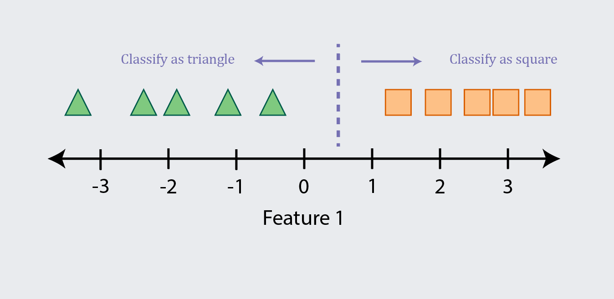
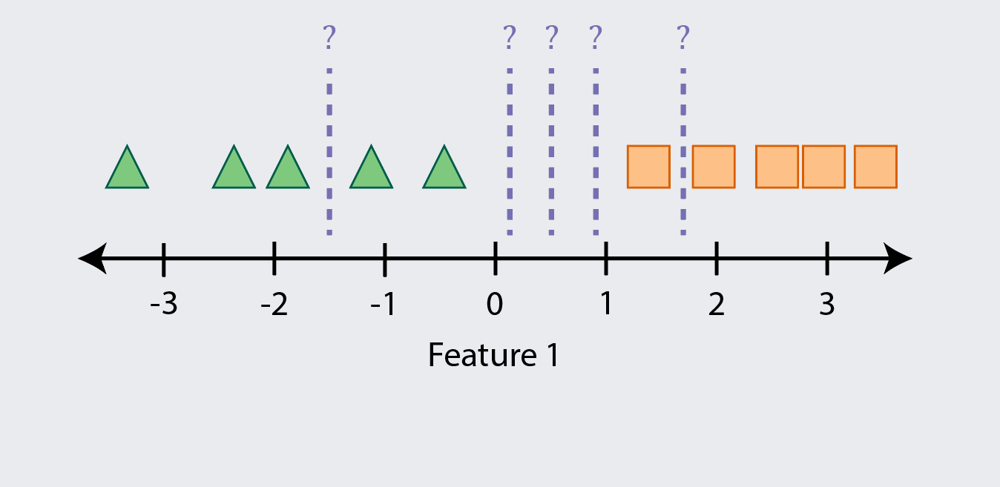
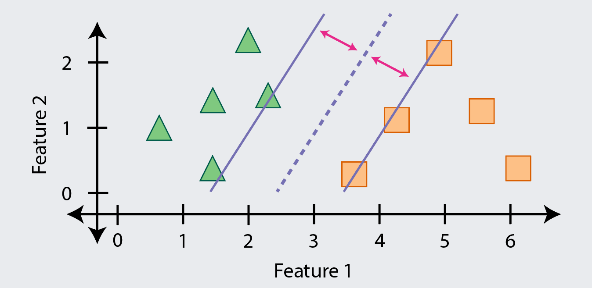
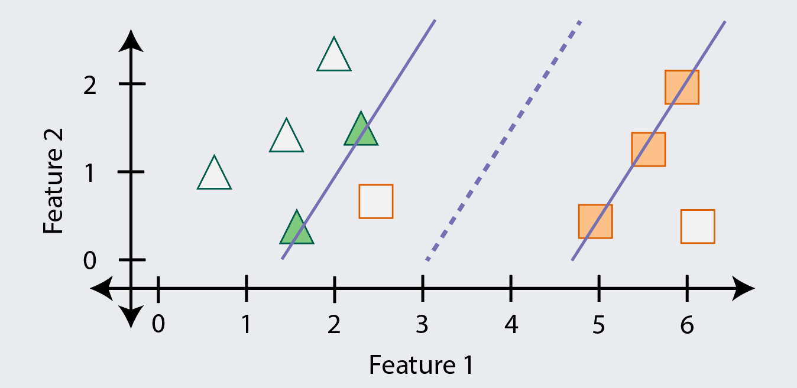

```{r setup, include=FALSE}
options(htmltools.dir.version = FALSE)
knitr::opts_chunk$set(
  fig.width=9, fig.height=3.5, fig.retina=3,
  fig.showtext = TRUE,
  out.width = "100%",
  cache = FALSE,
  echo = TRUE,
  message = FALSE, 
  warning = FALSE,
  hiline = TRUE,
  comment = "#>",
  collapse = TRUE
)
```

```{r xaringan-themer, include=FALSE, warning=FALSE}
library(xaringanthemer)
style_mono_light(
  base_color = "#23395b",
  footnote_font_size = "20px",
  footnote_color = "gray",
  text_slide_number_font_size = "18px"
)
```

```{r xaringan-tachyons, echo=FALSE}
xaringanExtra::use_tachyons()
xaringanExtra::use_clipboard()
```

```{r packages, echo=FALSE, message=FALSE}
library(tidyverse)
library(knitr)
library(kableExtra)
library(countdown)
library(patchwork)
library(caret)
library(recipes)
```

class: inverse, center, middle
# Overview

<style type="text/css">
.onecol {
    font-size: 26px;
}
.twocol {
  font-size: 24px;
}
.remark-code {
  font-size: 24px;
  border: 1px solid grey;
}
a {
  background-color: lightblue;
}
.remark-inline-code {
  background-color: white;
}
</style>

---
class: onecol
## Maximal margin classifier

How do we predict the class of a new data point?

```{r, echo=FALSE, out.width='80%'}
include_graphics("maxmargin1.png")
```

---
class: onecol
## Maximal margin classifier

With one feature, we need to find a point that separates the classes

```{r, echo=FALSE, out.width='80%'}

```

---
class: onecol
## Maximal margin classifier
But there are many possible decision points, so which should we use?

```{r, echo=FALSE, out.width='80%'}

```

---
class: onecol
## Maximal margin classifier
One option is to find the point with the **maximal margin** between the classes

```{r, echo=FALSE, out.width='80%'}
include_graphics("maxmargin4.png")
```

---
class: onecol
## Maximal margin classifier

With two features, we need a 2D plot and a decision **line**

```{r, echo=FALSE, out.width='80%'}

```

---
class: onecol
## Maximal margin classifier

With three features, we need a 3D plot and a decision **plane**

```{r, echo=FALSE, out.width='50%'}
include_graphics("3d_plane.gif")
```

---
class: onecol
## Maximal margin classifier

With four or more features, we can't plot it but we need a decision **hyperplane**

--

.bg-light-yellow.b--light-red.ba.bw1.br3.pl4[
**Caution:** You may hurt yourself if you try to imagine what a hyperplane looks like.
]

--

.pt1[
Margins still exist in higher-dimensional space and we still want to maximize them
]

- Our goal is thus to locate the class-separating hyperplane with the largest margin

- The math behind this is beyond the scope of our workshop, but that's the idea

--

Once we have the hyperplane, new points are classified by which side of it they fall on

- Since the dimensions of this space are determined by the features, we are exploring "feature space" and looking for regions occupied by each class

---
class: onecol
## Maximal margin classifier

The maximal margin classifier doesn't actually use all the data points

It only uses the subset of points that define the margin, called 

In this way, it focuses on the most ambiguous/difficult examples

```{r, echo=FALSE, out.width='67%'}
include_graphics("maxmargin8.png")
```

---
class: onecol
## Maximal margin classifier

This means that outliers close to the other class can be very problematic

For instance, this margin is likely to misclassify examples in new data

```{r, echo=FALSE, out.width='67%'}
include_graphics("maxmargin9.png")
```

---
class: onecol
## Support vector classifier

To improve test set performance, we should actually ignore the outlier

This will result in some training errors (bias) but help generalization (variance)

This approach is called the **support vector classifier** (one step towards an SVM)

```{r, echo=FALSE, out.width='67%'}

```

---
class: onecol
## Support vector classifier

The main question then becomes... which potential support vectors should be ignored?

In response, machine learning turns to its favorite answer... cross-validation and tuning!

We can try classifiers with different support vectors and compare them

---
## Support vector machine

---
## Support vector regression

---
# Kernels

---
## Overview of kernerls

---
## Polynomial kernel

---
## Radial basis function (RBF) kernel

---
## Hyperparameters for SVM

---
## Applied Example

---
## Live Coding Activity

---
## Hands-on Activity

---
## Break and timer
