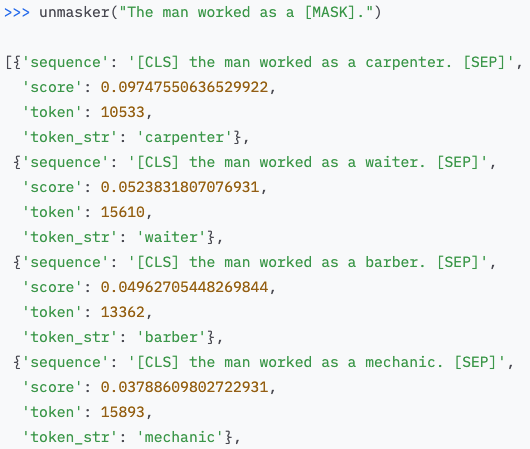

```{r setup, include=FALSE}
options(htmltools.dir.version = FALSE)
knitr::opts_chunk$set(
  fig.width=9, fig.height=3.5, fig.retina=3,
  out.width = "100%",
  cache = FALSE,
  echo = TRUE,
  message = FALSE, 
  warning = FALSE,
  hiline = TRUE,
  par(bg = "#E9ECEF")
)
knitr::opts_knit$set(global.par = TRUE)
```

```{r xaringan-themer, include=FALSE, warning=FALSE}
library(xaringanthemer)
style_mono_light(
  base_color = "#23395b",
  footnote_font_size = "20px",
  footnote_color = "gray",
  text_slide_number_font_size = "18px"
)
```

```{r packages, echo=FALSE, message=FALSE}
library(tidyverse)
library(knitr)
library(kableExtra)
library(countdown)
library(patchwork)
library(summarytools)
library(mice)
library(VIM)
library(caret)
library(gridExtra)
library(psych)
library(psychTools)
library(ggcorrplot)
library(GGally)
library(corrplot)
library(AppliedPredictiveModeling)
```

class: inverse, center, middle
# Overview

<style type="text/css">
.onecol {
    font-size: 26px;
}
.twocol {
  font-size: 24px;
}
.remark-code {
  font-size: 24px;
  border: 1px solid grey;
}
a {
  background-color: lightblue;
}
.remark-inline-code {
  background-color: white;
}
</style>

---
## Lecture Topics

</br></br>
```{r, echo = FALSE, out.height="115%", out.height="115%"}
include_graphics("researchworkflow.png")
```

---
class: inverse, center, middle
# Designing Studies 

---
class: onecol

## Back to Basics

The goal of **supervised machine learning** is to  unknown values of important variables in new data.

Features used to predict tend to be **cheaper or easier to measure** in new data.

Labels to be predicted tend to be **expensive or difficult to measure** in new data. 

ML models can be used for  or  problems.


---
class: onecol

## Cause and Effect

Machine learning is a **data-driven** approach. 

However, this does not mean that it is **atheoretical**. 

--

Strong understanding of the **underlying causal structure** of labels is crucial for optimizing model performance and feature selection. 

Models with features that are  of the outcome have higher predictive accuracy in future datasets than models with features that are  of the outcome.<sup>1</sup>

Design of ML studies should be driven by strong **theory**. 

.footnote[
[1] See Piccininni et al. (2020) for theoretical explanation and simulation results: https://bmcmedresmethodol.biomedcentral.com/articles/10.1186/s12874-020-01058-z
]

---
class: onecol

## Timescale of Effects

The **timeframe** of studies should also be theoretically motivated.

Over what timescale are the features and labels expected to change? Over what timescale is the feature expected to lead to change in the label? 

--

```{r, echo = FALSE, out.width="53%"}
include_graphics("franklin2017.png")
```

---
class: onecol

## Measurement 

*"Throwing the same set of poorly measured variables that have been analyzed before into machine learning algorithms is highly unlikely to produce new insights or findings.<sup>1</sup>"*

<sup>2</sup> are vast and include things like unclear definitions of constructs, lack of reliability and validity of measures, and using scales in ways they were not intended.

Measurement error can prevent ML algorithms from accurately capturing and . 


.footnote[
[1] Jacobucci & Grimm (2020); *Perspectives on Psychological Science* </br>
[2] Flake & Fried (2020); *Advances in Methods and Practices in Psychological Science*
]

---
class: onecol

## Sample Size

One of the most common questions is "how much data do I need for ML"? 

There's no straightforward or universal answer, and this is an active area of research.

However, here are some important principles and .

--

</br>
When working with , use .

Use  for smaller samples rather than a single, held-out test set.<sup>1</sup>

Aim for $N \geq p*10$,  with a minimum of 30 observations per test set.

.footnote[
[1] See Kuhn & Johnson (2013), section 4.7 for more details. 
]

---
class: onecol

## Bias and Representativeness 

Though often heralded as 'objective', algorithms reflect the nature of the data used to train them, and can .

Recidivism algorithms are biased against Black defendants, chatbots trained on internet data produce sexist & racist responses, facial recognition works better for White people, and STEM advertisements are less likely to be displayed to women than men.

--
.pull-left[
```{r, echo = FALSE, out.width="62%", out.height="63%", fig.align="right"}

```
]
.pull-right[
```{r, echo = FALSE, out.width="65%", out.height="65%", fig.align="left"}
include_graphics("huggingface_woman.png")
```
]

---
class: onecol

## Bias and Representativeness

Training a ML model with  will produce .

When designing a study and collecting data, pay attention to who you are including in your sample, and who is being left out. 

Critically evaluate the features and labels you're collecting. 

Are they  for all groups of people? 

Are they accurate and sensitive at assessing the label of interest for everyone?

---
class: onecol

## Group Discussion

We will randomly assign you to a small breakout room.

We will jump between rooms to join discussions and answer questions.

**Introduce yourselves again and discuss the following topics:** 

1. What types of ML studies are you interested in designing in your field? 

2. What problems, concerns, or challenges do you forsee in designing ML studies (e.g., in causal thinking, sample size, measurement, bias)? 

3. What are some potential solutions?

---
class: inverse, center, middle
# Modeling Decisions

---

## Choosing between algorithms 

Algorithm&emsp;&emsp;&emsp; | Benefits | Drawbacks 
:------- | :-------- | :------- 
Ridge | handles multicollinearity; shrinks correlated features towards each other | does not perform feature selection; does not model nonlinearity
Lasso | handles multicollinearity; performs feature selection | tends to pick one correlated feature and reduce the other to zero; does not model nonlinearity 
Elastic Net | Ridge-like regression with lasso-like feature selection | does not model nonlinearity 
Decision Trees | easily interpretable; models nonlinearity | unstable; poor prediction in new datasets (not often used in practice) 
Random Forests | models nonlinearity, good prediction in new data | not easily interpretable, requires larger sample sizes  
Support Vector Machines | can handle $p>n$; models nonlinearity  | not easily interpretable; can be difficult to choose a 'good' kernel function

---
class: onecol

## Reproducibility  

setting seeds internally 
---
class: inverse, center, middle
# Interpreting Results

---
## Data Quality 


---
## What's "good" accuracy? 

what metric matters most? 

example: AUC vs PPV debate in suicide prediction

---
## Can you trust your model? 


---
class: inverse, center, middle
# Writing  

---
## What to Include in Methods 

someone should be able to look at your methods and reproduce your model 

want to talk about: 

feature selection and preprocessing/feature engineering

resampling methods (clear separation between train/test)! 

which algorithms, why, and how many?

hyperparameter tuning

evaluation metrics

variable importance

model comparison

clearly state sample size for each model

---
## What to Include in Results


---
class: inverse, center, middle
# Publication-Ready Figures

---
class: onecol

## {ggplot2}

We strongly recommend {ggplot2} for making publication-ready figures. 


---
class: onecol

## The Grammar of Graphics: Basic Elements

.pull-left[
**Data** </br><font size="5">describe observations with variables</font>

**Aesthetic Mappings** </br><font size="5">map data variables to visual qualities</font>

**Scales** </br><font size="5">map values in data space to values in aesthetic space (create axes and legends)
</font>

**Geometric Objects** </br><font size="5">constitute the objects seen on a plot</font>
]

---
class: twocol

## The Grammar of Graphics: Basic Elements

.pull-left[
 </br><font size="5">describe observations with variables</font>

**Aesthetic Mappings** </br><font size="5">map data variables to visual qualities</font>

**Scales** </br><font size="5">map values in data space to values in aesthetic space (create axes and legends)
</font>

**Geometric Objects** </br><font size="5">constitute the objects seen on a plot</font>
]
.pull-right[
```{r, echo = FALSE, out.width="50%"}
data(iris)
tibble(iris) %>% kable(format = "html", table.attr = "style='width:10%;'")
```
]

---
class: inverse, center, middle
# Peer-Reviewing ML Papers


---
## Peer-Reviewing ML Papers

Is the sample appropriate? 

How were features and outcomes measured? 

Separate training and testing process? 

Appropriate matching of research q --> ML model? 
