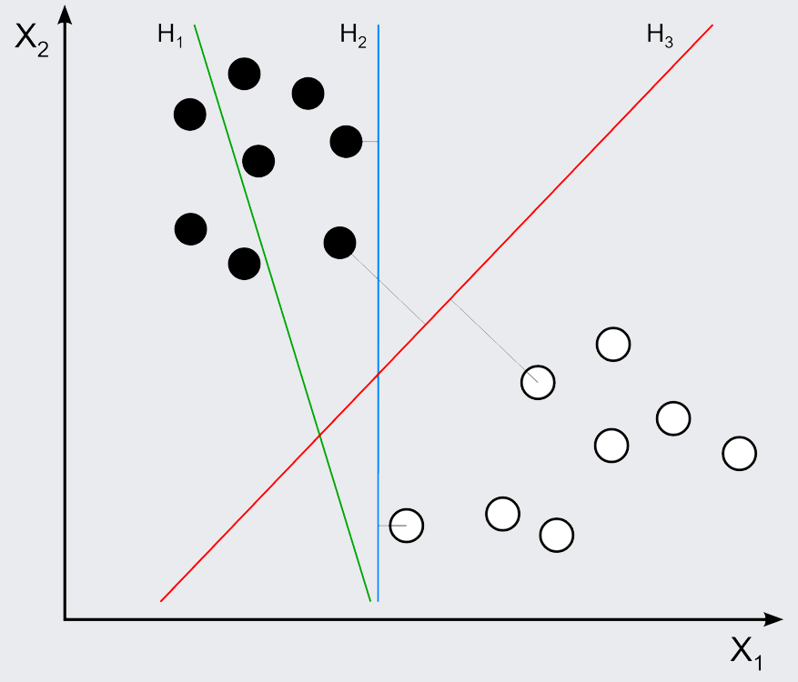
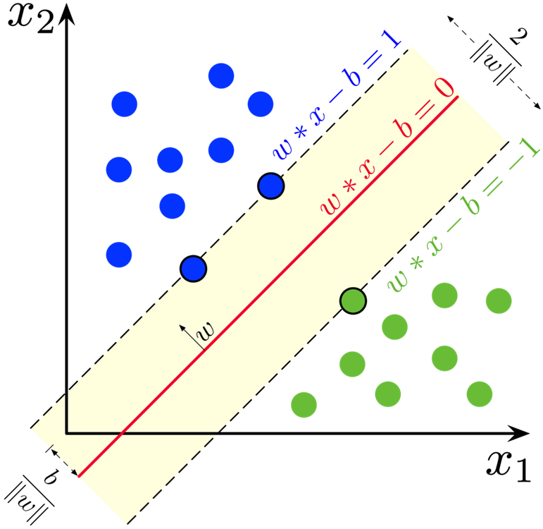
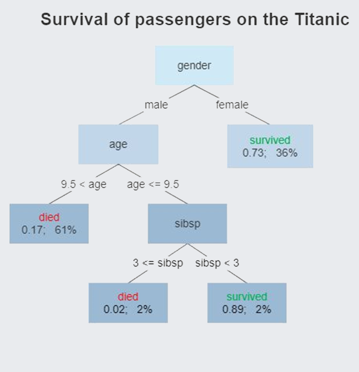
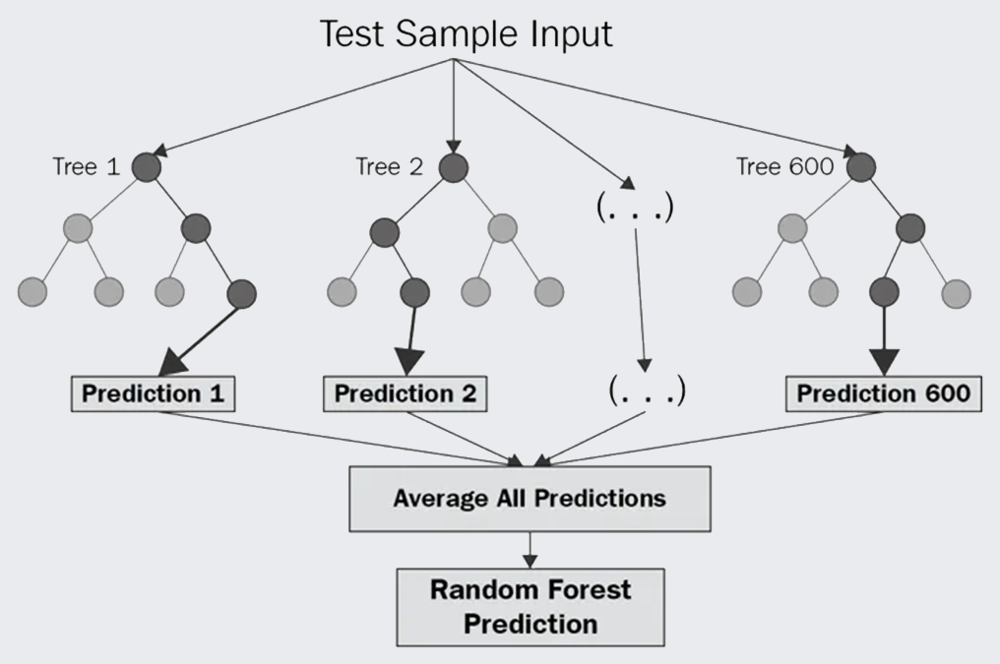
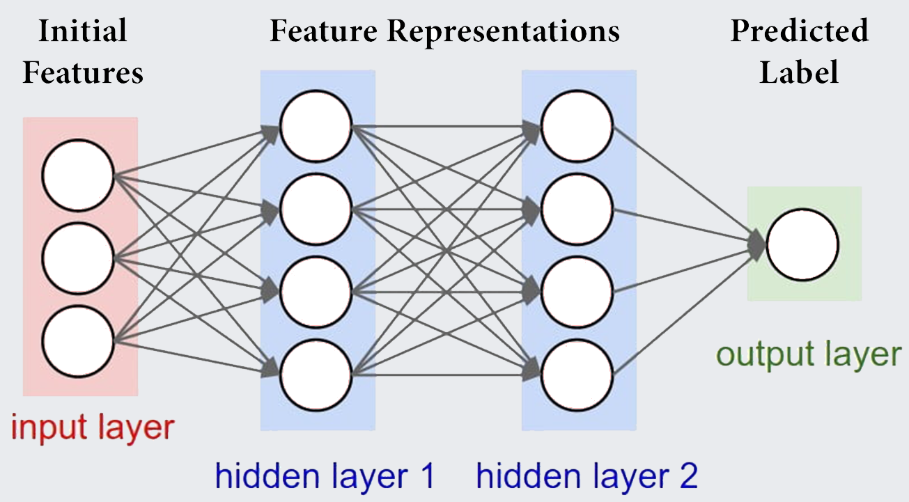

```{r setup, include=FALSE}
options(htmltools.dir.version = FALSE)
knitr::opts_chunk$set(
  fig.width=9, fig.height=3.5, fig.retina=3,
  out.width = "100%",
  cache = FALSE,
  echo = TRUE,
  message = FALSE, 
  warning = FALSE,
  hiline = TRUE
)
```

```{r xaringan-themer, include=FALSE, warning=FALSE}
library(xaringanthemer)
style_mono_light(
  base_color = "#23395b"
)
```

```{r packages, echo=FALSE, message=FALSE}
library(tidyverse)
library(knitr)
library(kableExtra)
library(countdown)
library(patchwork)
```

class: inverse, center, middle
# Workshop Overview
---
## Instructor Profiles

.pull-left[
#### Jeffrey Girard
Assistant Professor<br />Department of Psychology<br />University of Kansas

**Research Areas**
- Affective Science
- Clinical Psychology
- Computer Science

**Machine Learning**
- Recognition of Facial Expressions
- Prediction of Emotional States
- Prediction of Mental Health Status
]

.pull-right[
.center[
```{r jg, echo=FALSE, out.width=300, out.height=300}
include_graphics("jg_headshot.jpeg")
```

[www.jmgirard.com](https://www.jmgirard.com)<br />[jmgirard@ku.edu](mailto:jmgirard@ku.edu)<br /> [@jeffreymgirard](https://twitter.com/jeffreymgirard)
]
]
---
## Instructor Profiles

.pull-left[
#### Shirley Wang
Doctoral Candidate<br />Department of Psychology<br />Harvard University

**Research Areas**
- Clinical Psychology
- Computational Psychiatry
- Mathematical Modeling

**Machine Learning**
- Prediction of suicide risk
- Prediction of longitudinal illness course
- Idiographic prediction
]

.pull-right[
.center[
```{r sw, echo=FALSE, out.width=300, out.height=300}
include_graphics("sw_headshot.jpeg")
```

[shirleywang.rbind.io](https://shirleywang.rbind.io/)<br />[shirleywang@g.harvard.edu](mailto:shirleywang@g.harvard.edu)<br /> [@ShirleyBWang](https://twitter.com/ShirleyBWang)
]
]
---
## Goals and Timeline
.pull-left[
#### Workshop Goals
Build a foundation of concepts and skills

Describe every step from start to finish

Emphasize the practical and applied aspects

Provide intuitions rather than lots of theory

Deep dive into a small number of algorithms

Highlight the algorithms "best" for this audience

Communicate the pros and cons of different choices

Become a responsible practitioner of machine learning
]

--

.pull-right[
```{r timeline, echo=FALSE}
timeline <- tribble(
  ~Day, ~Topic, ~Lead,
  "1-A", "Conceptual introductions", "JG",
  "1-B", "Logistics and data exploration", "SW",
  "2-A", "Feature engineering", "JG",
  "2-B", "Regularized regression", "SW",
  "3-A", "Cross-validation and tuning", "JG",
  "3-B", "Decision trees", "SW",
  "4-A", "Random forests", "JG",
  "4-B", "Practical issues", "SW",
  "5-A", "Challenges and future directions", "Both",
  "5-B", "Hackathon and consultation", "Both"
)
kable(timeline, format = "html") %>% kable_styling()
```
]
---
## Format and Materials
.pull-left[
Each workshop day will have two parts (A and B)

Each part will have some *lecture* and *live coding*

Each part will have some hands-on activities

We will take a short break after the first part

The non-lead instructor can help during lecture
]
--
.pull-right[
Course materials are posted on both Github and OSF

- [github.com/ShirleyBWang/pittmethods_ml](https://github.com/ShirleyBWang/pittmethods_ml)

- [osf.io/3qhc8](https://osf.io/3qhc8)

You can download slides, code, and data from either

Materials are covered by a "CC-By Attribution" license
]
---
## Etiquette and Responsibilities
.pull-left[
Be respectful in chat, audio, and video

Post questions in chat or "Raise Hand" in Zoom

Mute yourself when in main room unless talking

Clarifications and general questions are welcome

Ask for help if or when feeling lost

Save idiosyncratic questions for consultations

Be patient and respectful with yourself and others
]
--
.pull-right[
**You are free to:**

Turn your camera on or off as you prefer

Arrive late and depart early if needed or desired

Ask for help with workshop content and technology

Share your ideas and opinions respectfully

Use workshop materials according to the license

Contact the instructors during/after the workshop
]
---
class: inverse, center, middle
# Small Group Icebreakers
---
## Icebreakers
We will randomly assign everyone to one of two breakout rooms

Each breakout room will be led by one of the instructors

Each person will have *up to one minute* to introduce themselves

In addition to sharing your name, please answer these questions:

1. Where are you joining us from?
2. What field(s) do you work in?
3. What is one of your research interests?
4. What is one of your personal interests?

The instructor will go first and call on attendees to go next

If you would prefer not to share, please indicate that in chat
---
class: inverse, center, middle
# Conceptual Introduction
---
## What is machine learning?
Machine learning (ML) is a 

The goal of ML is to  that 

ML algorithms learn by finding  in the data

--

<p style="padding-top:20px;">ML is a large discipline with many subfields that we won't touch upon</p>

Many forms of ML are more applicable to  than to scientists

But some forms of ML make great additions to your scientific toolkit

--

<p style="padding-top:20px;">ML has similar goals to classical statistics but different values and norms</p>

Because they developed separately, talking across statistics and ML can be hard

But there is interdisciplinary work trying to merge ML and classical statistics

---
## Types of Modeling
.pull-left[
### Inference
Draw  about the data

Higher need for model 

Emphasis on statistical 

<br />

- *Is self-control associated with truancy?*

- *Which dosages of a drug are safe?*

- *Which personality traits predict the<br />amount of positive emotion shown?*
]
--
.pull-right[
### Prediction
Make  on new data

Higher need for model 

Emphasis on prediction 

<br />

- *How likely is this child to become truant?*

- *What dosage is this patient likely to tolerate?*

- *How much positive emotion is this person expressing in this image/video/tweet?*
]
---
## A Tale of Two Traditions
.pull-left[
### Classical Statistics
Tend to emphasize 

Tend to value model 

Tend to use  assumptions

<br />

- *Generalized linear modeling*

- *Linear mixed effects modeling*

- *Structural equation modeling*
]
--
.pull-right[
### Machine Learning
Tends to emphasize 

Tends to value model 

Tends to use  patterns

<br />

- *Support vector machines*

- *Decision trees and random forests*

- *Artificial neural networks*
]
---
## Types of Variable
.pull-left[
### Labels / Outcomes
Labels are variables that we 

Labels likely *won't be available* in novel data<br />
(e.g., difficult to collect or haven't happened yet)

(outcome, dependent, endogenous, or $y$ variables)

```{r label_icons, echo=FALSE}

```

]
--
.pull-right[
### Features / Predictors
Features are variables that 

Features likely *will be available* in novel data<br />
(e.g., easier to collect or have already happened)

(predictor, independent, exogenous, or $x$ variables)

```{r feature_icons, echo=FALSE}
include_graphics("feature_icons.png")
```

]

---
## Types of Learning
.pull-left[
### Supervised Learning
Algorithm is given <br /> and tries to "map" between them

Can we  from the<br />values that the features take on?

```{r supervised_example, echo=FALSE}
include_graphics("supervised_example.png")
```

]
--
.pull-right[
### Unsupervised Learning
Algorithm is given <br />and looks for patterns within them

Can we find subgroups/clusters or latent dimensions/embeddings in the data?

```{r unsupervised_example, echo=FALSE}
include_graphics("unsupervised_example.png")
```

]

---
## Modes of Supervised Learning
.pull-left[
### Regression
Predict continuous, numerical values

```{r regression_diagram, echo=FALSE}
include_graphics("regression_diagram.png")
```

- *How much will a customer spend?*
- *What GPA will a student achieve?*
- *How long will a patient be hospitalized?*
]
--
.pull-right[
### Classification
Predict discrete, categorical values

```{r classification_diagram, echo=FALSE}
include_graphics("classification_diagram.png")
```

- *Is this email spam or non-spam?*
- *Which candidate will this user vote for?*
- *Is this patient's glucose low, normal, or high?*
]
---
## Modes of Supervised Learning
.pull-left[
### Regression
```{r regression_example, echo=FALSE, fig.height=3, fig.width=4}
set.seed(2021)
signal <- function(x) {sin(2*pi*x)}
x_linspace <- seq(0, 1, by = 0.02)
x_data <- runif(length(x_linspace), 0, 1)
y_true <- signal(x_linspace)
y_data <- signal(x_data) + rnorm(length(x_data), 0, 0.25)
dat <- tibble(
  x_linspace,
  x_data,
  y_true,
  y_data
)
ggplot(dat) + 
  geom_point(aes(x = x_data, y = y_data), shape = 1, size = 3, color = "grey30") + 
  stat_smooth(
    aes(x = x_data, y = y_data), 
    method = "lm",
    se = FALSE,
    formula = y ~ poly(x, 4), 
    color = "purple",
    size = 1.5
  ) +
  coord_cartesian(xlim = c(0, 1)) +
  labs(x = "feature", y = "label") +
  theme_xaringan(text_font_size = 16) +
  theme(
    panel.grid.minor = element_blank(), 
    panel.background = element_rect(fill = "white")
  )
```
]
--
.pull-right[
### Classification
```{r classification_example, echo=FALSE, fig.height=3, fig.width=4}
set.seed(1)
class1 <- data.frame(
  class = rep("1", 150),
  x = c(rnorm(25, 0, 1), rnorm(50, 0, 1), rnorm(50, 5, 2), rnorm(25, 8, 1)),
  y = c(rnorm(25, 0, 2), rnorm(50, -5, 2), rnorm(50, 1, 1), rnorm(25, -5, 2))
)
class2 <- data.frame(
  class = rep("2", 100),
  x = rnorm(100, 4, 1),
  y = rnorm(100, -5, 1)
)
dat <- bind_rows(class1, class2)

ggplot(dat, aes(x = x, y = y)) + 
  geom_point(aes(fill = class, shape = class), size = 2.5, alpha = .75) +
  ggalt::geom_encircle(
    data = filter(dat, class == "2"), 
    size = 4, 
    color = "purple"
  ) +
  scale_fill_manual(values = c("#d8b365", "#5ab4ac")) +
  scale_shape_manual(values = c(21, 22)) +
  labs(x = "feature 1", y = "feature 2", fill = "label", shape = "label") +
  theme_xaringan(text_font_size = 16) +
  theme(
    panel.grid.minor = element_blank(), 
    panel.background = element_rect(fill = "white"),
    legend.position = "none"
  )
```

]
---
## Knowledge check
<span style="font-size:30px;">Ann has developed an ML system that looks at a patient's physiological signals and tries to determine whether they are having a micro-seizure.</span>

.pull-left[
### Question 1
**The features are <span style="text-decoration: underline; white-space: pre;">           </span> and the labels are <span style="text-decoration: underline; white-space: pre;">           </span>?**

a) physiological signals; physiological signals

b) physiological signals; micro-seizure (yes/no)

c) micro-seizure (yes/no); physiological signals

d) micro-seizure (yes/no); micro-seizure (yes/no)

]

.pull-right[
### Question 2
**Which type of machine learning is this?**

a) Supervised regression

b) Supervised classification

c) Unsupervised regression

d) Unsupervised classification
]
---
class: inverse, center, middle
# Modeling Workflow
---
## Typical Workflow

<br /><br />

.center[
```{r,echo=FALSE}
include_graphics("workflow.png")
```
]
---
## Exploratory Analysis
.left-column[
<br />
```{r, echo=FALSE}
include_graphics("explore.jpg")
```
]
.right-column[
#### Quality Control
Examine the distributions of feature and label variables

Look for errors, outliers, missing data, etc.

#### Modeling Inspiration
Identify relevant features for a label

Detect highly correlated features

Determine the "shape" of relationships
]

---
## Feature Engineering
.left-column[
<br />
```{r, echo=FALSE}
include_graphics("engineer.jpg")
```
]
.right-column[
**Extract** features *(e.g., from text, images, and audio)*

**Transform** features *(e.g., center, normalize, log)*

**Re-encode** features *(e.g., dummy code, one hot)*

**Combine** features *(e.g., ratios, means, interactions)*

**Reduce** dimensionality *(e.g., PCA, EFA, GDA)*

**Impute** missing values *(e.g., mean, median, PMM)*

**Drop** features *(e.g., redundant, low variance)*

**Select** features *(e.g., wrapper-based, filter-based)*
]
---
## Model Development
.left-column[
<br />
```{r, echo=FALSE}
include_graphics("develop.jpg")
```
]
.right-column[
**What *algorithm* or framework to use?**
- Elastic Net, Random Forest, SVM, MLP

**What *engine* to use for fitting the model?**
- Which software implementation

**What *mode* should the model run in?**
- Regression, classification, ordinal

**What *formula* should the model fit?**
- Which features and how to combine them
]
---
## Algorithm Intuition: Support Vector Machines
.pull-left[
```{r, echo=FALSE, out.height=400, out.width=400}

```
]
--
.pull-right[
```{r, echo=FALSE, out.height=450, out.width=450}

```
]
---
## Algorithm Intuition: Support Vector Machines
```{r, echo=FALSE}
include_graphics("svm3.png")
```
---
## Algorithm Intuition: Decision Trees and Random Forests
.pull-left[
```{r, echo=FALSE}

```
]
--
.pull-right[
```{r,echo=FALSE}

```
]
---
## Algorithm Intuition: Artificial Neural Networks
.center[
```{r, echo=FALSE, out.height=400, out.width=724}

```
]
---
## Model Tuning
.left-column[
<br />
```{r, echo=FALSE}
include_graphics("tune.jpg")
```
]
.right-column[
**Models learn by estimating <span style="color:darkred;">parameters</span> from data**
- where and how to define the margin in an SVM
- which leaves and branches to use in a decision tree
- what weights to use in connecting neurons in an ANN

**Learning is also influenced by <span style="color:darkred;">hyperparameters</span>**
- which type of kernel to use in a non-linear SVM
- how many decision trees to include in a random forest
- how many hidden layers to include in an ANN

**Hyperparameters often control the *flexibility* of a model**
]
---
## Model Tuning
Unlike parameters, hyperparameters cannot be estimated from the data

Instead, we must "tune" our hyperparameters by trying and comparing many values

.pull-left[
**Grid Search**

Try all hyperparameter values in a pre-defined set (e.g., spaced evenly throughout a likely range)

**Iterative Search**

Sequentially discover new combinations of values based on previous results (using an algorithm)
]

.pull-right[
```{r,echo=FALSE}
include_graphics("tuning_example.png")
```
*The contour lines show performance is best at top-right*
]
---
## Model Evaluation

.left-column[
```{r target, echo=FALSE}
include_graphics("target.jpg")
```
]

.right-column[
**How to quantify model performance?**
- Compare predictions (i.e., model-predicted labels) to trusted labels

**Regression Metrics**
- Error-based (RMSE, MAE, Huber loss)
- Correlation-based (CCC, $R^2$)

**Classification Metrics**
- Class-based (Accuracy, Sensitivity, Specificity, $\phi$, $F_\beta$, $J$)
- Probability-based (AUC, log loss, cost)
- Curve Analysis (ROC, P-R, Gain, Lift)
- Multiclass (macro, micro, specialized)
]
---
## Knowledge check
<span style="font-size:30px;">Yuki trained an algorithm to predict the number of "likes" a tweet will receive based on measures of the tweet's formatting and content.</span>

.pull-left[
### Question 1
**Calculating the length of each tweet is <span style="text-decoration: underline; white-space: pre;">           </span>?**

a) Feature Engineering

b) Model Development

c) Model Tuning

d) Model Evaluation
]

.pull-right[
### Question 2
**Which performance metric would be appropriate?**

a) $F_\beta$ score

b) ROC Curve

c) Number of features

d) Mean Absolute Error (MAE)
]
---
class: inverse, center, middle
# Flexibility and Overfitting
---
## Modeling Flexibility
```{r, echo=FALSE}
set.seed(2021)
signal <- function(x) {sin(2*pi*x)}
x_linspace <- seq(0, 1, by = 0.02)
x_data <- runif(length(x_linspace), 0, 1)
y_true <- signal(x_linspace)
y_data <- signal(x_data) + rnorm(length(x_data), 0, 0.25)
dat <- tibble(
  x_linspace,
  x_data,
  y_true,
  y_data
)

p1 <- 
  ggplot(dat) + 
  geom_point(aes(x = x_data, y = y_data), shape = 1, size = 3, color = "grey30") + 
  stat_smooth(
    aes(x = x_data, y = y_data), 
    method = "lm", 
    se = FALSE,
    formula = y ~ x, 
    color = "blue",
    size = 1.5
  ) +
  coord_cartesian(xlim = c(0, 1)) +
  labs(title = "Underfit", x = "feature", y = "label") +
  theme_xaringan(text_font_size = 14, title_font_size = 18) +
  theme(panel.grid.minor = element_blank(),
        panel.background = element_rect(fill = "white"))

p2 <- 
  ggplot(dat) + 
  geom_point(aes(x = x_data, y = y_data), shape = 1, size = 3, color = "grey30") + 
  stat_smooth(
    aes(x = x_data, y = y_data), 
    method = "lm",
    se = FALSE,
    formula = y ~ poly(x, 17), 
    color = "red",
    size = 1.5
  ) +
  coord_cartesian(xlim = c(0, 1)) +
  labs(title = "Overfit", x = "feature", y = NULL) +
  theme_xaringan(text_font_size = 14, title_font_size = 18) +
  theme(panel.grid.minor = element_blank(),
        panel.background = element_rect(fill = "white"))

p3 <- 
  ggplot(dat) + 
  geom_point(aes(x = x_data, y = y_data), shape = 1, size = 3, color = "grey30") + 
  stat_smooth(
    aes(x = x_data, y = y_data), 
    method = "lm",
    se = FALSE,
    formula = y ~ poly(x, 4), 
    color = "purple",
    size = 1.5
  ) +
  coord_cartesian(xlim = c(0, 1)) +
  labs(title = "Good Fit", x = "feature", y = NULL) +
  theme_xaringan(text_font_size = 14, title_font_size = 18) +
  theme(panel.grid.minor = element_blank(),
        panel.background = element_rect(fill = "white"))

(p1 | p3 | p2) + 
  plot_annotation(
    theme = theme(
      plot.background = element_rect(fill = "#E9EBEE", color = NA)
    )
  )
```

---
## A Technical Definition of Overfitting
---
## A Lay Definition of Overfitting
---
## An Example of Overfitting
---
## Knowledge check
---
class: inverse, center, middle
# Addressing Overfitting
---
## Hold Out Set Validation
---
## Cross-Validation
---
## Knowledge check
---
class: inverse, center, middle
# Small Group Discussion
---
class: inverse, center, middle
# Time for a Break!
```{r, echo=FALSE}
countdown(
  minutes = 10, 
  seconds = 0, 
  right = "33%", 
  left = "33%",
  bottom = "15%",
  color_background = "white",
  color_text = "black",
  color_running_background = "white",
  color_running_text = "black",
  warn_when = 60
)
```
