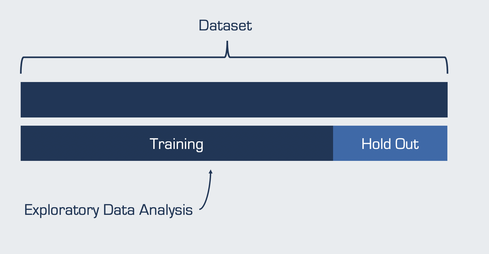

```{r setup, include=FALSE}
options(htmltools.dir.version = FALSE)
knitr::opts_chunk$set(
  fig.width=9, fig.height=3.5, fig.retina=3,
  out.width = "100%",
  cache = FALSE,
  echo = TRUE,
  message = FALSE, 
  warning = FALSE,
  hiline = TRUE
)
```

```{r xaringan-themer, include=FALSE, warning=FALSE}
library(xaringanthemer)
style_mono_light(
  base_color = "#23395b"
)
```

```{r packages, echo=FALSE, message=FALSE}
library(tidyverse)
library(knitr)
library(kableExtra)
library(countdown)
library(patchwork)
```

class: inverse, center, middle
# Packages
---
## caret

The `caret` (**C**lassification **A**nd **RE**gression **T**raining) package includes functions for:
- data visualization
- data pre-processing
- feature selection
- data splitting
- model training & testing
- variable importance estimation

--

<p style="padding-top:20px;"> There are many packages for building machine learning models, which often have different syntax.

`caret`  the process for creating predictive models.

It includes 50+ machine learning models.

It has historically been the >most popular package for machine learning in R, with many resources, solutions, and answers to questions available online.

---
## tidymodels

The `tidymodels` meta-package is a collection of many packages for machine learning, including: 
- `rsample` for data splitting and resampling
- `recipes` for pre-processing
- `parsnip` for trying out many models
- `workflows` to streamline the pre-processing, modeling, and post-processing
- `tune` to optimize model hyperparameters
- `yardstick` for model performance metrics
- `broom` for converting information to user-friendly formats
- `dials` for creating and managing tuning parameters

--

<p style="padding-top:20px;"> Both `tidymodels` and `caret` are written by the same author (Max Kuhn). 

While `caret` has been around for a long time, `tidymodels` is much newer.

Unlike `caret`, `tidymodels` is built using  principles.

---
## Packages

We will demonstrate use of both modeling frameworks (`caret` and `tidyverse`) throughout the course.

You are free to use whichever framework you prefer during the small group and individual activities. 

--

<p style="padding-top:20px;">Please make sure you have both packages installed: 

`install.packages("caret")`

`install.packages("tidymodels")`

---
class: inverse, center, middle
# Exploratory Data Analysis

---
## Typical Workflow
<br />
```{r jg, echo=FALSE}
include_graphics("workflow_eda.png")
```

---
## Exploratory Data Analysis
.left-column[
</br>
```{r, echo=FALSE}
include_graphics("explore.jpg")
```
]

.right-column[

**Goals**
- Develop an understanding of your data
- Make informed model building decisions (e.g., feature selection)

**Questions**
- What type of variation occurs in my variables?
- Are there any anomalies, errors, or outliers?
- How much missing data do I have?
- What type of covariation occurs between my variables?
- Are there any nonlinearities in my data?
- Are my data appropriate for the task? 
]

--
.pull-right[
<div style= "font-size:38pt; text-align:center;"> 
]

---
class: inverse, center, middle
# Simple Holdout Set

---
##Simple Train/Test Split

```{r, echo = FALSE}

```

---
##Simple Train/Test Split: `caret`

Use the `caret::createDataPartition()` function to create balanced training and testing splits based on the outcome variable. Random sampling occurs within each factor level to  in the datasets. 

Specify the proportion of data you want in the training split (e.g., `p = 0.8`) for an 80%/20% data split.

Remember to set a seed so your results are !

--

```{r}
library(caret)
set.seed(2021)
trainIndex_caret <- createDataPartition(iris$Species, p = .8,
                                        list = FALSE, 
                                        times = 1)
```

---
##Simple Train/Test Split: `caret`

Use the `createDataPartition` row indices to split your data into single train and test sets.

```{r}
irisTrain_caret <- iris[trainIndex_caret, ]
irisTest_caret <- iris[-trainIndex_caret, ]
```

--

Now 80% of the data is designated for model training and can be used for exploratory data analysis. 20% of the data is  before testing the model, to avoid overly optimistic results. 

```{r}
dim(irisTrain_caret)
dim(irisTest_caret)
```

---
##Simple Train/Test Split: `tidymodels`

Use the `rsample::initial_split()` function to create training and testing splits. Use the `strata` argument to  in training/test sets (as is automatically done in `caret::createDataPartition`).

Specify the proportion of data you want in the training split (e.g., `prop = 0.8`) for an 80%/20% data split.

Remember to set a seed so your results are reproducible!

--

```{r}
library(tidymodels)
set.seed(2021)
irisSplit_tidy <- initial_split(iris, 
                                prop = 0.8, 
                                strata = Species)
```

---
##Simple Train/Test Split: `tidymodels`

After `initial_split()`, use the `rsample::training()` and `rsample::testing()` functions to create and return the actual data subsets.

```{r}
irisTrain_tidy <- training(irisSplit_tidy)
irisTest_tidy <- testing(irisSplit_tidy)
```

--

As before, we see that 80% of the data are in `irisTrain_tidy` and 20% of the data are in `irisTest_tidy`. 

```{r}
dim(irisTrain_tidy)
dim(irisTest_tidy)
```

---
##Simple Train/Test Split: Live Coding

Follow along at [INSERT LINK].</br>

```{r, echo = FALSE, out.width=800, out.height=380}
include_graphics("datasplit.png")
```

---
class: inverse, center, middle
# Exploratory Data Analysis
## On the training data!

---
##What type of variation occurs in my variables?


---
##Are there data anomalies, errors, or outliers?


---
##How much missing data do I have?


---
##What type of covariation occurs between my variables?


---
##Are there nonlinearities?


---
##Are my data appropriate for the task? 
