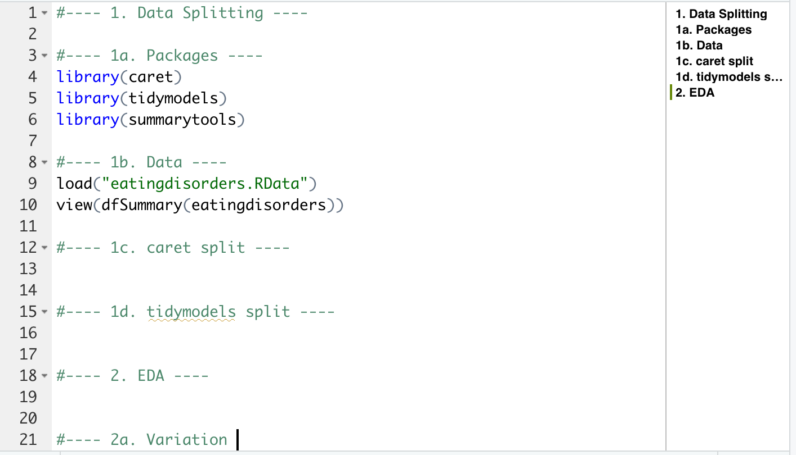

```{r setup, include=FALSE}
options(htmltools.dir.version = FALSE)
knitr::opts_chunk$set(
  fig.width=9, fig.height=3.5, fig.retina=3,
  out.width = "100%",
  cache = FALSE,
  echo = TRUE,
  message = FALSE, 
  warning = FALSE,
  hiline = TRUE
)
```

```{r xaringan-themer, include=FALSE, warning=FALSE}
library(xaringanthemer)
style_mono_light(
  base_color = "#23395b"
)
```

```{r packages, echo=FALSE, message=FALSE}
library(tidyverse)
library(knitr)
library(kableExtra)
library(countdown)
library(patchwork)
library(summarytools)
library(mice)
library(VIM)
library(gridExtra)
```

class: inverse, center, middle
# Packages
---
## caret

The `caret` (**C**lassification **A**nd **RE**gression **T**raining) package includes functions for:
- data visualization
- data pre-processing
- feature selection
- data splitting
- model training & testing
- variable importance estimation

--

<p style="padding-top:20px;"> There are many packages for building machine learning models, which often have different syntax.

`caret`  the process for creating predictive models.

It includes 50+ machine learning models.

It has historically been the >most popular package for machine learning in R, with many resources, solutions, and answers to questions available online.

---
## tidymodels

The `tidymodels` meta-package is a collection of many packages for machine learning, including: 
- `rsample` for data splitting and resampling
- `recipes` for pre-processing
- `parsnip` for trying out many models
- `workflows` to streamline the pre-processing, modeling, and post-processing
- `tune` to optimize model hyperparameters
- `yardstick` for model performance metrics
- `broom` for converting information to user-friendly formats
- `dials` for creating and managing tuning parameters

--

<p style="padding-top:20px;"> Both `tidymodels` and `caret` are written by the same author (Max Kuhn). 

While `caret` has been around for a long time, `tidymodels` is much newer.

Unlike `caret`, `tidymodels` is built using  principles.

---
## Packages

We will demonstrate use of both modeling frameworks (`caret` and `tidyverse`) throughout the course.

You are free to use whichever framework you prefer during the small group and individual activities. 

--

<p style="padding-top:20px;">Please make sure you have both packages installed: 

`install.packages("caret")`

`install.packages("tidymodels")`

---
class: inverse, center, middle
# Exploratory Data Analysis

---
## Typical Workflow
<br />
```{r jg, echo=FALSE}
include_graphics("workflow_eda.png")
```

---
## Exploratory Data Analysis
.left-column[
</br>
```{r, echo=FALSE}
include_graphics("explore.jpg")
```
]

.right-column[

**Goals**
- Develop an understanding of your data
- Make informed model building decisions (e.g., feature selection)

**Questions**
- What type of variation occurs in my variables?
- Are there any anomalies, errors, or outliers?
- How much missing data do I have?
- What type of covariation occurs between my variables?
- Are there any nonlinearities in my data?
- Are my data appropriate for the task? 
]

--
.pull-right[
<div style= "font-size:38pt; text-align:center;"> 
]

---
class: inverse, center, middle
# Simple Holdout Set

---
##Simple Train/Test Split

```{r, echo = FALSE}
include_graphics("datasplit_simple.png")
```

---
##Data Splitting

An important note on terminology beyond simple train/test data splits: 

- Training: The data subsample used to explore the data and fit the model.
- Validation: Used for model evaluation while tuning hyperparameters; often implicitly split via cross-validation.
- Test: Entirely held-out from model training/tuning; used to provide a unbiased evaluation of the final model. 

```{r, echo = FALSE, out.height = "70%", out.width = "70%"}
include_graphics("datasplit_val.png")
```


---
##Simple Train/Test Split: `caret`

Use the `caret::createDataPartition()` function to create balanced training and testing splits based on the outcome variable. Random sampling occurs within each factor level to  in the datasets. 

Specify the proportion of data you want in the training split (e.g., `p = 0.8`) for an 80%/20% data split.

Remember to set a seed so your results are !

--

```{r}
library(caret)
set.seed(2021)
trainIndex_caret <- createDataPartition(iris$Species, p = .8,
                                        list = FALSE, 
                                        times = 1)
```

---
##Simple Train/Test Split: `caret`

Use the `createDataPartition` row indices to split your data into single train and test sets.

```{r}
irisTrain_caret <- iris[trainIndex_caret, ]
irisTest_caret <- iris[-trainIndex_caret, ]
```

--

Now 80% of the data is designated for model training and can be used for exploratory data analysis. 20% of the data is  before testing the model, to avoid overly optimistic results. 

```{r}
dim(irisTrain_caret)
dim(irisTest_caret)
```

---
##Simple Train/Test Split: `tidymodels`

Use the `rsample::initial_split()` function to create training and testing splits. Use the `strata` argument to  in training/test sets (as is automatically done in `caret::createDataPartition`).

Specify the proportion of data you want in the training split (e.g., `prop = 0.8`) for an 80%/20% data split.

Remember to set a seed so your results are reproducible!

--

```{r}
library(tidymodels)
set.seed(2021)
irisSplit_tidy <- initial_split(iris, 
                                prop = 0.8, 
                                strata = Species)
```

---
##Simple Train/Test Split: `tidymodels`

After `initial_split()`, use the `rsample::training()` and `rsample::testing()` functions to create and return the actual data subsets.

```{r}
irisTrain_tidy <- training(irisSplit_tidy)
irisTest_tidy <- testing(irisSplit_tidy)
```

--

As before, we see that 80% of the data are in `irisTrain_tidy` and 20% of the data are in `irisTest_tidy`. 

```{r}
dim(irisTrain_tidy)
dim(irisTest_tidy)
```

---
##Simple Train/Test Split: Live Coding

Follow along at [INSERT LINK].</br>

```{r, echo = FALSE, out.width=800, out.height=380}

```

---
class: inverse, center, middle
# Exploratory Data Analysis
## On the training data!

---
##What type of variation occurs in my variables?

The `dfsummary()` function from `summarytools` is useful for quickly identifying trends and anomalies at a glance. 

--

```{r, echo = FALSE}
print(dfSummary(irisTrain_caret[, c(1, 2, 5)], plain.ascii = FALSE, valid.col = FALSE, headings = FALSE), method = 'render')
```

---
##What type of variation occurs in my variables?

Overlaying distributions together on the same plot can also be helpful.

```{r, echo = FALSE}
ggplot(data = diamonds, mapping = aes(x = carat, colour = cut)) +
  geom_freqpoly(binwidth = 0.1) +
  theme_xaringan(text_font_size = 14, title_font_size = 18) +
  theme(panel.grid.minor = element_blank(), panel.background = element_rect(fill = "white"))
```

---
##Are there data anomalies, errors, or outliers?

Check data distributions and summary statistics for:
- Extreme values
- Nonsensical values
- Inconsistencies 
- You may need to adjust plot margins or axes!

.pull-left[
```{r, echo = FALSE}
ggplot(diamonds) +
  geom_histogram(mapping = aes(x = y), binwidth = 0.5) +
  theme_xaringan(text_font_size = 14, title_font_size = 18) +
  theme(panel.grid.minor = element_blank(), panel.background = element_rect(fill = "white"))
```
]

.pull-right[
```{r, echo = FALSE}
ggplot(diamonds) + 
  geom_histogram(mapping = aes(x = y), binwidth = 0.5) +
  coord_cartesian(ylim = c(0, 50)) +
  theme_xaringan(text_font_size = 14, title_font_size = 18) +
  theme(panel.grid.minor = element_blank(), panel.background = element_rect(fill = "white"))
```
]

---
##Missing Data

Quick review of missing data mechanisms:

**Missing completely at random (MCAR)**
- No systematic pattern of missing data; the probability of an observation being missing does not depend on any observed or missing values. 
- E.g., If a weighing scale sometimes runs out of batter, missing data on weight is only due to bad luck and not any measured or missing data.

**Missing at random (MAR)** 
- Systematic relationship between missing values and the *observed* data, but *not* the missing data.
- E.g., If people with eating disorders are more likely to decline being weighed, missing data on weight is systematically related to eating disorder diagnosis.

**Missing not at random (MNAR)**
- Systematic relationship between missing values and those values themselves. 
- E.g., If people with higher weights are more likely to decline being weighed, missing data on weight is systematically related to *weight itself*.

---
##Missing Data

```{r, echo = FALSE}
iris_miss <- as.data.frame(lapply(iris[1:2], function(cc) cc[ sample(c(TRUE, NA), prob = c(0.75, 0.25), size = length(cc), replace = TRUE) ])) # credit to https://stackoverflow.com/questions/27454265/randomly-insert-nas-into-dataframe-proportionaly

iris_miss <- as.data.frame(lapply(iris[3:4], function(cc) cc[ sample(c(TRUE, NA), prob = c(0.85, 0.15), size = length(cc), replace = TRUE) ]))
```

The `VIM` and `mice` packages are helpful for visualizing and imputing missing data. 

.footnote[
credit to https://www.datacamp.com/community/tutorials/visualize-data-vim-package
]
--

.pull-left[
```{r, echo = FALSE}
set.seed(2021)
mnar_data <- data.frame(x = rnorm(100), y = rnorm(100)) %>%
    mutate(y_miss = ifelse(y > 1, y, NA),
           y = ifelse(is.na(y_miss), y, NA),
           x_miss = ifelse(is.na(y), x, NA))

ggplot(mnar_data, aes(x, y)) +
  geom_point(size = 4, alpha = 0.6) +
  geom_vline(aes(xintercept = x_miss), col = 'darkred', alpha = 0.6, linetype = 'dashed') +
  ylim(NA, max(mnar_data$y_miss, na.rm = TRUE)) +
  ggtitle("Training Data we Observe") +
  theme_xaringan(text_font_size = 14, title_font_size = 18) +
  theme(panel.grid.minor = element_blank(), panel.background = element_rect(fill = "white"))

```
]

--

.pull-right[
```{r, echo = FALSE}
ggplot(mnar_data, aes(x, y)) +
    geom_point(size = 4, alpha = 0.6) +
    geom_point(aes(x, y_miss), col = "red", size = 4, alpha = 0.6) +
    geom_hline(aes(yintercept = y_miss), col = "red", alpha = 0.6,
               linetype = "dashed") +
    ylim(NA, max(mnar_data$y_miss, na.rm = TRUE)) +
    ggtitle("Where Data are Missing") +
  theme_xaringan(text_font_size = 14, title_font_size = 18) +
  theme(panel.grid.minor = element_blank(), panel.background = element_rect(fill = "white"))
```
]

--

Two helpful questions to guide missing data visualization:
- Which variables have missing observations (and how many)?
- Does missing data in one variable depend on other variables?

---
##Which variables have missing observations? How many?

We can inspect the prevalence of missing data using aggregation plots in `VIM` with the `aggr()` function.

```{r, echo = FALSE}
load("biopics.RData")
```


```{r, out.height = "70%", out.width = "70%"}
aggr(biopics, numbers = TRUE, prop = c(TRUE, FALSE))
```

.footnote[
credit to https://www.datacamp.com/community/tutorials/visualize-data-vim-package
]

---
##Does missing data in one variable depend on others?

We also want to know if missing data systematically vary by other observed data. If the other data are numeric we use a *spinogram*; if categorical we can use a *spineplot*. The `spineMiss()` function generates both plots.

```{r, message=FALSE, warning=FALSE, results = 'hide', out.height="70%", out.width="70%"}
spineMiss(biopics[, c("sub_race", "earnings")])
```

.footnote[
credit to https://www.datacamp.com/community/tutorials/visualize-data-vim-package
]

---
##Does missing data in one variable depend on others?

Let's flip the two variables to ask: does the percentage of missing data in `sub_race` differ by `earnings`?
```{r, message=FALSE, warning=FALSE, results = 'hide', out.height="70%", out.width="70%"}
spineMiss(biopics[, c("earnings", "sub_race")])
```

.footnote[
credit to https://www.datacamp.com/community/tutorials/visualize-data-vim-package
]

---
##Does missing data in one variable depend on others?

*Mosiac plots* generalize spineplots and spinograms (which only plot two variables at a time) to multiple variables.

```{r, echo = FALSE}
biopics <- biopics %>%
    mutate(US_movie = ifelse(grepl("US", country), TRUE, FALSE))
```


```{r, message=FALSE, warning=FALSE, results = 'hide', out.height="70%", out.width="70%"}
mosaicMiss(biopics[, c("sub_sex", "US_movie", "earnings")], highlight = 3, 
           plotvars = 1:2, miss.labels = FALSE)
```

.footnote[
credit to https://www.datacamp.com/community/tutorials/visualize-data-vim-package
]
---
##What type of covariation occurs between my variables?


---
##Are there nonlinearities?


---
##Are my data appropriate for the task? 
