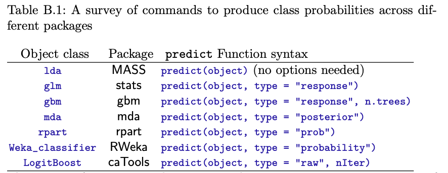

```{r setup, include=FALSE}
options(htmltools.dir.version = FALSE)
knitr::opts_chunk$set(
  fig.width=9, fig.height=3.5, fig.retina=3,
  out.width = "100%",
  cache = FALSE,
  echo = TRUE,
  message = FALSE, 
  warning = FALSE,
  hiline = TRUE
)
```

```{r xaringan-themer, include=FALSE, warning=FALSE}
library(xaringanthemer)
style_mono_light(
  base_color = "#23395b",
  footnote_font_size = "20px",
  footnote_color = "gray",
  text_slide_number_font_size = "18px"
)
```

```{r packages, echo=FALSE, message=FALSE}
library(tidyverse)
library(knitr)
library(kableExtra)
library(countdown)
library(patchwork)
library(summarytools)
library(mice)
library(VIM)
library(caret)
library(gridExtra)
library(psych)
library(psychTools)
library(ggcorrplot)
```

class: inverse, center, middle
# Packages

---
##How do we implement machine learning in R?

There are  for building and evaluating machine learning models in R. 

Each implements specific ML models (e.g., `glmnet` for lasso and elastic net regularization, `rpart` for decision trees, `randomforest` for random forests).

These packages were built by different people over time, so .

This can be confusing to remember!

--

```{r, echo = FALSE, out.height="70%", out.width="70%"}

```

---
##`caret`

Recognizing the need for  the process of building and evaluating machine learning models, Max Kuhn and others developed the `caret` (**C**lassification **A**nd **RE**gression **T**raining) package. 

This package allows researchers to quickly build and compare many different models.

There are 200+ machine learning models available in `caret`.

--

`caret` includes functions for:
- data visualization
- data pre-processing
- feature selection
- data splitting
- model training & testing
- variable importance estimation

---
##`caret`

.pull-left[
The `train()` function is the primary function for training models and tuning hyperparameters.

This  is used to train any and all machine learning models.

Users should also specify tuning parameter values and resampling method (e.g., *k*-fold cross-validation).
]

.pull-right[
```{r, echo = FALSE}
include_graphics("caret_train.png")
```
]

--
</br>
```{r}
iris_fit <- train(Species ~., data = iris,
                  method = 'glmnet',
                  trControl = trainControl(method = "cv", number = 10))

```

---
##`caret`

Because `caret` has historically been the most popular package for machine learning in R, there are many freely available resources, solutions, and answers to questions online.

--

.pull-left[
```{r, echo = FALSE}
include_graphics("caret_tutorial.png")
```
]

--

.pull-right[
```{r, echo = FALSE, out.height = "48%", out.width="48%"}
include_graphics("appliedpredictivemodeling.png")
```
]

---
## `tidymodels`

The newer `tidymodels` package is the `tidyverse` version of `caret`. Both packages were developed by the same author (Max Kuhn)!  

--

`tidymodels` is a  and includes a collection of many packages: 
- `rsample` for data splitting and resampling
- `recipes` for pre-processing
- `parsnip` for trying out many models
- `workflows` to streamline the pre-processing, modeling, and post-processing
- `tune` to optimize model hyperparameters
- `yardstick` for model performance metrics
- `broom` for converting information to user-friendly formats
- `dials` for creating and managing tuning parameters

--

We will be focusing on `caret` during this workshop, but please feel free to experiment with `tidymodels` as well and keep an eye out for this framework in coming years!

---
class: inverse, center, middle
# Exploratory Data Analysis

---
## Typical Workflow
<br />
```{r, echo=FALSE}
include_graphics("workflow.png")
```

---
## Typical Workflow
<br />
```{r, echo=FALSE}
include_graphics("workflow_eda.png")
```

---
## Exploratory Data Analysis
.left-column[
</br>
```{r, echo=FALSE}
include_graphics("explore.jpg")
```
]

.right-column[

**Goals**
- Develop an understanding of your data
- Make informed model building decisions (e.g., feature selection)

**Questions**
- What type of variation occurs in my variables?
- Are there any anomalies, errors, or outliers?
- How much missing data do I have?
- What type of covariation occurs between my variables?
- Are there any nonlinearities in my data?
- Are my data appropriate for the task? 
]

--
.pull-right[
<div style= "font-size:38pt; text-align:center;"> 
]

---
class: inverse, center, middle
# Simple Holdout Set

---
##Simple Train/Test Split

```{r, echo = FALSE}
include_graphics("datasplit_simple.png")
```

---
##Data Splitting

An important note on terminology beyond simple train/test data splits: 

- **Training**: The data subsample used to explore the data and fit the model.
- **Validation**: Used for model evaluation while tuning hyperparameters; often implicitly split via cross-validation.
- **Test**: Entirely held-out from model training/tuning; used to provide a unbiased evaluation of the final model. 

```{r, echo = FALSE, out.height = "70%", out.width = "70%"}
include_graphics("datasplit_val.png")
```

---
##Simple Train/Test Split

Use the `caret::createDataPartition()` function to create balanced training and testing splits based on the outcome variable. Random sampling occurs within each factor level to  in the datasets. 

Specify the proportion of data you want in the training split (e.g., `p = 0.8`) for an 80%/20% data split.

Remember to set a seed so your results are !

--

```{r}
library(caret)
set.seed(2021)
trainIndex <- createDataPartition(iris$Species, p = .8,
                                  list = FALSE, 
                                  times = 1)
```

---
##Simple Train/Test Split

Use the `createDataPartition` row indices to split your data into single train and test sets.

```{r}
irisTrain <- iris[trainIndex, ]
irisTest <- iris[-trainIndex, ]
```

--

Now 80% of the data is designated for model training and can be used for exploratory data analysis. 20% of the data is  before testing the model, to avoid overly optimistic results. 

```{r}
dim(irisTrain)
dim(irisTest)
```

---
##Why EDA on training data only?

The **ultimate goal** of exploratory data analysis is to . 

We split our data into training and testing subsets to evaluate the accuracy of our model in predicting *unseen* data. 

This gives us a sense for how our model might perform in the **future** on new datasets.

--

</br> 
If modeling decisions are made based on data patterns we observe in the test set, we  estimates in the test set. 

**When possible, it is ideal** to perform exploratory data analysis only on your training data only.

But note that doesn't mean we can't check the test data for coding errors or data anamolies!

---
##Knowledge check

<span style="font-size:30px;">Taylor is interested in building a machine learning model to predict future risk of depression. How should they explore these elements of their dataset?</span>

.pull-left[
### Question 1
**Looking for outliers or data anamolies:**

a) Training data only

b) Test data only

c) Both training and test

d) Neither 
]

.pull-right[
### Question 2
**Finding features that correlate with the outcome:**

a) Training data only

b) Test data only

c) Both training and test

d) Neither
]

---
class: inverse, center, middle
# Exploratory Data Analysis
## Data Distributions and Error Detection

---
##What type of variation occurs in my variables?

The `dfsummary()` function from `summarytools` is useful for quickly identifying trends and anomalies at a glance. 

--

```{r, echo = FALSE}
print(dfSummary(irisTrain[, c(1, 2, 5)], plain.ascii = FALSE, valid.col = FALSE, headings = FALSE), method = 'render')
```

---
##What type of variation occurs in my variables?

Overlaying distributions together on the same plot can also be helpful.

```{r, echo = FALSE, fig.showtext = TRUE}
ggplot(data = diamonds, mapping = aes(x = carat, colour = cut)) +
  geom_freqpoly(binwidth = 0.1) +
  theme_xaringan(text_font_size = 14, title_font_size = 18) +
  theme(panel.grid.minor = element_blank(), panel.background = element_rect(fill = "white"))
```

---
##Are there data anomalies, errors, or outliers?

Check data distributions and summary statistics for:
- Extreme values
- Nonsensical values
- Inconsistencies 
- You may need to adjust plot margins or axes!

.pull-left[
```{r, echo = FALSE}
ggplot(diamonds) +
  geom_histogram(mapping = aes(x = y), binwidth = 0.5) +
  theme_xaringan(text_font_size = 14, title_font_size = 18) +
  theme(panel.grid.minor = element_blank(), panel.background = element_rect(fill = "white"))
```
]

.pull-right[
```{r, echo = FALSE}
ggplot(diamonds) + 
  geom_histogram(mapping = aes(x = y), binwidth = 0.5) +
  coord_cartesian(ylim = c(0, 50)) +
  theme_xaringan(text_font_size = 14, title_font_size = 18) +
  theme(panel.grid.minor = element_blank(), panel.background = element_rect(fill = "white"))
```
]

---
class: inverse, center, middle
# Exploratory Data Analysis
## Missing Data

---
##A technical explanation of missing data

**Missing completely at random (MCAR)**
- No systematic pattern of missing data; the probability of an observation being missing does not depend on any observed or missing data values. 
- E.g., If a weighing scale sometimes runs out of batter, missing data on weight is only due to bad luck and not any measured or missing data.

**Missing at random (MAR)** 
- Systematic relationship between missing values and the *observed* data, but *not* the missing data.
- E.g., If people with eating disorders are more likely to decline being weighed, missing data on weight is systematically related to eating disorder diagnosis.

**Missing not at random (MNAR)**
- Systematic relationship between missing values and those values themselves. 
- E.g., If people with higher weights are more likely to decline being weighed, missing data on weight is systematically related to *weight itself*.

---
##An intuitive explanation of missing data

```{r, echo = FALSE, out.width="60%"}
include_graphics("mcar_dog.png")
```

---
##Missing Data

```{r, echo = FALSE}
iris_miss <- as.data.frame(lapply(iris[1:2], function(cc) cc[ sample(c(TRUE, NA), prob = c(0.75, 0.25), size = length(cc), replace = TRUE) ])) # credit to https://stackoverflow.com/questions/27454265/randomly-insert-nas-into-dataframe-proportionaly

iris_miss <- as.data.frame(lapply(iris[3:4], function(cc) cc[ sample(c(TRUE, NA), prob = c(0.85, 0.15), size = length(cc), replace = TRUE) ]))
```

.footnote[
credit to https://www.datacamp.com/community/tutorials/visualize-data-vim-package
]

.pull-left[
```{r, echo = FALSE}
set.seed(2021)
mnar_data <- data.frame(x = rnorm(100), y = rnorm(100)) %>%
    mutate(y_miss = ifelse(y > 1, y, NA),
           y = ifelse(is.na(y_miss), y, NA),
           x_miss = ifelse(is.na(y), x, NA))

ggplot(mnar_data, aes(x, y)) +
  geom_point(size = 4, alpha = 0.6, col = 'aquamarine4') +
  geom_vline(aes(xintercept = x_miss), col = 'darkred', alpha = 0.6, linetype = 'dashed') +
  ylim(NA, max(mnar_data$y_miss, na.rm = TRUE)) +
  ggtitle("Training Data we Observe") +
  theme_xaringan(text_font_size = 14, title_font_size = 18) +
  theme(panel.grid.minor = element_blank(), panel.background = element_rect(fill = "white"))

```
]

--

.pull-right[
```{r, echo = FALSE}
ggplot(mnar_data, aes(x, y)) +
    geom_point(size = 4, alpha = 0.6, col = "aquamarine4") +
    geom_point(aes(x, y_miss), col = "red", size = 4, alpha = 0.6) +
    geom_hline(aes(yintercept = y_miss), col = "red", alpha = 0.6,
               linetype = "dashed") +
    ylim(NA, max(mnar_data$y_miss, na.rm = TRUE)) +
    ggtitle("Where Data are Missing") +
  theme_xaringan(text_font_size = 14, title_font_size = 18) +
  theme(panel.grid.minor = element_blank(), panel.background = element_rect(fill = "white"))
```
]

--

The `VIM` package is particularly helpful for visualizing patterns of missing data.

Two helpful questions to guide missing data visualization:
- Which variables have missing observations (and how many)?
- Does missing data in one variable depend on other variables?

---
##Which variables have missing observations? How many?

**Aggregation plots** are useful for inspecting the prevalence of missing data. 

```{r, echo = FALSE}
load("biopics.RData")
```


```{r, echo = FALSE, out.height = "85%", out.width = "85%"}
aggr(biopics, numbers = TRUE, prop = c(TRUE, FALSE), col = c("bisque2","darkcyan"))
```

.footnote[
credit to https://www.datacamp.com/community/tutorials/visualize-data-vim-package
]

---
##Does missing data in one variable depend on others?

We also want to know if missing data systematically vary by other observed data. If the other data are numeric we use a **spinogram**; if categorical we can use a **spineplot**.

```{r, echo = FALSE, message=FALSE, warning=FALSE, results = 'hide', out.height="80%", out.width="80%"}
spineMiss(biopics[, c("sub_race", "earnings")], col = c("bisque2","darkcyan"))
```

.footnote[
credit to https://www.datacamp.com/community/tutorials/visualize-data-vim-package
]

---
##Does missing data in one variable depend on others?

Let's flip the two variables to ask: does the percentage of missing data in `sub_race` differ by `earnings`?

```{r, echo = FALSE, message=FALSE, warning=FALSE, results = 'hide', out.height="80%", out.width="80%"}
spineMiss(biopics[, c("earnings", "sub_race")], col = c("bisque2","darkcyan"))
```

.footnote[
credit to https://www.datacamp.com/community/tutorials/visualize-data-vim-package
]

---
##Does missing data in one variable depend on others?

**Mosiac plots** generalize spineplots and spinograms (which only plot two variables at a time) to multiple variables.

```{r, echo = FALSE}
biopics <- biopics %>% mutate(US_movie = ifelse(grepl("US", country), TRUE, FALSE))
```


```{r, echo = FALSE, message=FALSE, warning=FALSE, results = 'hide', out.height="85%", out.width="85%"}
mosaicMiss(biopics[, c("sub_sex", "US_movie", "earnings")], highlight = 3, 
           plotvars = 1:2, miss.labels = FALSE, col = c("bisque2","darkcyan"))
```

.footnote[
credit to https://www.datacamp.com/community/tutorials/visualize-data-vim-package
]

---
##Do missing data patterns differ across the dataset? 

**Parallel coordinate plots** allow us to look at patterns of missingness across the entire dataset.

```{r, echo = FALSE, message=FALSE, warning=FALSE, results = 'hide', out.height="85%", out.width="85%"}
parcoordMiss(biopics, highlight = 'earnings', alpha = 0.6, col = c("bisque2","darkcyan"))
```

.footnote[
credit to https://www.datacamp.com/community/tutorials/visualize-data-vim-package
]
---
class: inverse, center, middle
# Exploratory Data Analysis
## Feature Covariation and Correlations

---
##What type of covariation occurs between my variables?

**Correlation matrices** provide quick information about bivariate correlations among features. 

TODO: can't figure out how to remove white surrounding background
```{r, echo = FALSE}
data(msq)
cormat <- cor(msq[, c(2, 4, 5, 15, 19, 20, 30, 43, 49, 55, 67)], use = 'pairwise.complete.obs')
pmat <- cor_pmat(bfi)
ggcorrplot(cormat) + 
  theme_xaringan(text_font_size = 14, title_font_size = 18) +
  theme(panel.grid.minor = element_blank(), panel.background = element_rect(fill = "transparent", color = NA))

```

---
##What type of covariation occurs between my variables?

TODO: Another correlation matrix, with numbers

---
##What type of covariation occurs between my variables?

TODO: Another correlation matrix, with hierarchical clustering

---
##What type of covariation occurs between my variables?

TODO: Scatterplot matrix

---
class: inverse, center, middle
# Exploratory Data Analysis
## Linearity and Nonlinearity

---
##Are there nonlinearities?

TODO

---
class: inverse, center, middle
# Exploratory Data Analysis
## Takeaways

---
##Are my data appropriate for the task? 

TODO

---
##Knowledge Check

TODO

---
##Small Group Activity

TODO