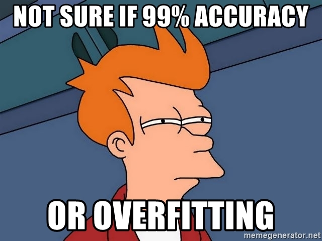

```{r setup, include=FALSE}
options(htmltools.dir.version = FALSE)
knitr::opts_chunk$set(
  fig.width=9, fig.height=3.5, fig.retina=3,
  out.width = "100%",
  cache = FALSE,
  echo = TRUE,
  message = FALSE, 
  warning = FALSE,
  hiline = TRUE,
  par(bg = "#E9ECEF")
)
knitr::opts_knit$set(global.par = TRUE)
```

```{r xaringan-themer, include=FALSE, warning=FALSE}
library(xaringanthemer)
style_mono_light(
  base_color = "#23395b",
  footnote_font_size = "20px",
  footnote_color = "gray",
  text_slide_number_font_size = "18px"
)
```

```{r packages, echo=FALSE, message=FALSE}
library(tidyverse)
library(knitr)
library(kableExtra)
library(countdown)
library(patchwork)
library(summarytools)
library(mice)
library(VIM)
library(caret)
library(gridExtra)
library(psych)
library(psychTools)
library(ggcorrplot)
library(GGally)
library(corrplot)
library(AppliedPredictiveModeling)
```

class: inverse, center, middle
# Overview

---
## Lecture Topics

.pull-left[
**Linear Regression Review**
- Ordinary least squares 
- Minimizing sum-of-squared-errors
- Limitations of OLS regression

**Introduction to Regularization**
- Why regularize? 
- Bias-variance tradeoff 
- Coefficient paths
- Feature selection
- Tuning hyperparameters
]

.pull-right[
**Ridge**
- $L_2$ penalty
- Parameter shrinkage towards zero

**Lasso**
- $L_1$ penalty
- Some parameters actually go to zero

**Elastic Net**
- Combining penalty terms
- $\lambda$ and $\alpha$ tuning parameters
]

---
class: inverse, center, middle
# Linear Regression Review

---
## Linear Regression 

Linear regression and closely related models (ridge, lasso, elastic net, etc.) can all be written in the form: 

$$y_i = b_0 + b_1x_{i1} + b_2x_{i2} + ... + b_Px_{iP} + e_i$$

where

- $y_i$: value of the response for the $i$th observation
- $b_0$: estimated intercept 
- $b_j$: estimated coefficient for the $j$th predictor
- $x_{ij}$: value of the $j$th predictor for the $i$th observation
- $e_i$: random error unexplained by the model

--

Such models are  because each parameter (e.g., $b_1$, $b_2$, etc.) appears only with a power of 1 and is not multipled or divided by any other parameter. 

Nonlinear *variables* (e.g., $x_1^2$) can still be included in linear regression as long as the *parameters* remain linear.

---
## Ordinary Least Squares Regression

In ordinary least squares regression, the parameters (e.g., $b_1$, $b_2$, etc.) are estimated to .

</br>
```{r complexity, echo=FALSE, out.width="90%"}
set.seed(2021)
signal <- function(x) {sin(2*pi*x)}
x_linspace <- seq(0, 1, by = 0.02)
x_data <- runif(length(x_linspace), 0, 1)
y_true <- signal(x_linspace)
y_data <- signal(x_data) + rnorm(length(x_data), 0, 0.25)
dat <- tibble(
  x_linspace,
  x_data,
  y_true,
  y_data
)

ggplot(dat) + 
  geom_point(aes(x = x_data, y = y_data), shape = 1, size = 3, color = "grey30") + 
  stat_smooth(
    aes(x = x_data, y = y_data), 
    method = "lm",
    se = FALSE,
    formula = y ~ poly(x, 17), 
    color = "red",
    size = 1.5
  ) +
  coord_cartesian(xlim = c(0, 1)) +
  labs(title = "Overfitting: Low Bias, High Variance",x = "feature", y = NULL) +
  theme_xaringan(text_font_size = 14, title_font_size = 16) +
  theme(panel.grid.minor = element_blank(),
        panel.background = element_rect(fill = "white"))

```

---
##Ordinary Least Squares Regression

Specifically, parameters in OLS regression are chosen to minimize the sum-of-squared errors (SSE):

$$SSE = \sum\limits_{i = 1}^n(y_i - \hat{y_i})^2$$

where
- $n$: number of observations 
- $y_1$: $i$th observed response
- $\hat{y_i}$: $i$th predicted response

However, any dataset is influenced by both the underlying data-generating mechanisms *and* , which by definition is not shared with other samples drawn from the same population. 

---
##Ordinary Least Squares Regression

```{r, echo = FALSE, out.width="60%", fig.align='center'}

```

---
##Ordinary Least Squares Regression

While OLS regression is readily interpretable and easy to compute, there are several noteworthy limitations:

- Risk of 
-  parameter estimates
- Poor  in new datasets
- Sensitive to  (adjusting parameter estimates to better accommodate outlier observations with large residuals in order to minimize SSE)
- Cannot handle datasets with high 
- Cannot handle datasets with  
- May not adequately capture  relationships<sup>1<sup>

Regularization addresses many (but not all) of these problems.

.footnote[
[1] This remains a problem with regularized regression models.
]

---
class: inverse, center, middle
# Regularization
### (a.k.a. penalization or shrinkage)

---
##Why regularize?
.left-column[
<br />
```{r, echo=FALSE}
include_graphics("overfit_graph.png")
```
]
.right-column[
**Reducing Overfitting**
- OLS regression models overfit the data and inflate parameter estimates
- Regularized regression adds an additional  to the error function 
- This constrains parameter estimates.
- Regularization penalizes model complexity.
- Regularization also increases predictive accuracy in future datasets
- Compared to OLS regression models, regularized regression models have a  but .
- We sacrifice some accuracy in the training set for higher accuracy in the test set. 
]

---
##Why regularize?
.left-column[
<br />
```{r, echo=FALSE}
include_graphics("feature_selection.png")
```
]
.right-column[
**Feature Selection**
- We are often interested in finding a subset of 'good' predictors.
- However, there are are many problems<sup>1</sup> with the traditional approach of stepwise regression models.
- Regularization shrinks parameter estimates towards zero.
- Some parameters are  in lasso regression models.
- Thus, lasso simultaneously reduces overfitting and performs feature selection.
]

.footnote[
[1] see Harrell (2015) for details and explanation: https://link.springer.com/book/10.1007/978-3-319-19425-7
]

---
class: inverse, center, middle
# Ridge Regression

---
## Ridge Regression

Recall the SSE error function for OLS regression: 

$$SSE = \sum\limits_{i = 1}^n(y_i - \hat{y_i})^2$$

Ridge regression adds a penalty term to this function known as the $L_2$ penalty: 

$$SSE_{L2} = \sum\limits_{i = 1}^n(y_i - \hat{y_i})^2 + \lambda \sum\limits_{j = 1}^P \beta_j^2$$
where
- $n$: number of observations 
- $y_1$: $i$th observed response
- $\hat{y_i}$: $i$th predicted response
- $P$: number of parameters 
- $\beta_j$: the $j$th parameter

---
## Ridge Regression
.left-column[
<br />
```{r, echo = FALSE}
include_graphics("ridge.png")
```
]
.right-column[
Whereas our goal in OLS regression was to minimize the difference between the observed and predicted data, ridge regression has an additional goal of .

Thus, parameter estimates are only able to become large if there is a proportional reduction in $SSE_{L2}$. 

The $\lambda$ parameter is a  controlling the degree of regularization.

At higher values of $\lambda$, parameters will be shrunk closer to zero.

We can find the 'best' value of $\lambda$ through cross-validation hyperparameter tuning.
]

---
## Ridge Regression in R

Notes to self:

Step 1: preprocessing (need to standardize variables)

Step 2: traincontrol

Step 3: set tuning grid (optional)

Step 4: train

Step 5: predict

Step 6: variable importance

---
class: inverse, center, middle
# Lasso Regression

---
## Lasso Regression

Lasso stands for the **L**east **A**bsolute **S**hrinkage and **S**election **O**perator. 

Similar to ridge regression, lasso regression adds an additional penalty term (in this case, the $L1$ penalty) to the OLS error function:

$$SSE_{L1} = \sum\limits_{i = 1}^n(y_i - \hat{y_i})^2 + \lambda \sum\limits_{j = 1}^P \lvert \beta_j \rvert$$
where
- $n$: number of observations 
- $y_1$: $i$th observed response
- $\hat{y_i}$: $i$th predicted response
- $P$: number of parameters 
- $\beta_j$: the $j$th parameter 

---
## Lasso Regression
.left-column[
<br />
```{r, echo = FALSE}

```
]
.right-column[
Here, we aim to minimize the **absolute value** of all parameters (rather than the square of parameters as with ridge). 

While this may seem like a small change, it has the effect of , whereas ridge only shrinks values **towards** zero. 

If $\lambda$ is set high enough, all parameters will be shrunk to zero. 

Ridge and lasso also differ in their handling of **multicollinearity.**

Whereas ridge tends to shrink coefficients of correlated predictors towards each other, lasso tends to **pick one and ignore the rest**. 
]

---
## Lasso Regression in R


---
class: inverse, center, middle
# Elastic Net Regression

---
## Elastic Net Regression

Elastic net regression is a generalization of the lasso model, which combines both $L1$ and $L2$ penalty terms:

---
## Elastic Net Regression in R


---
## Group Activity
