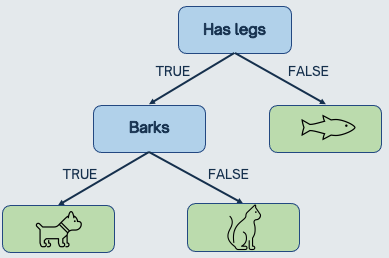
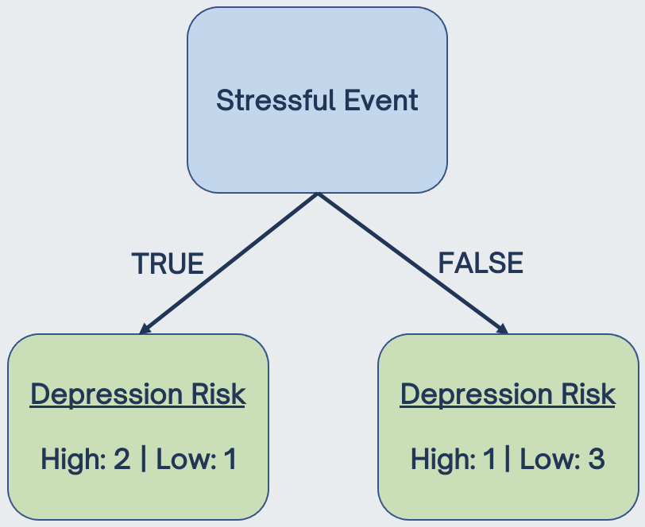
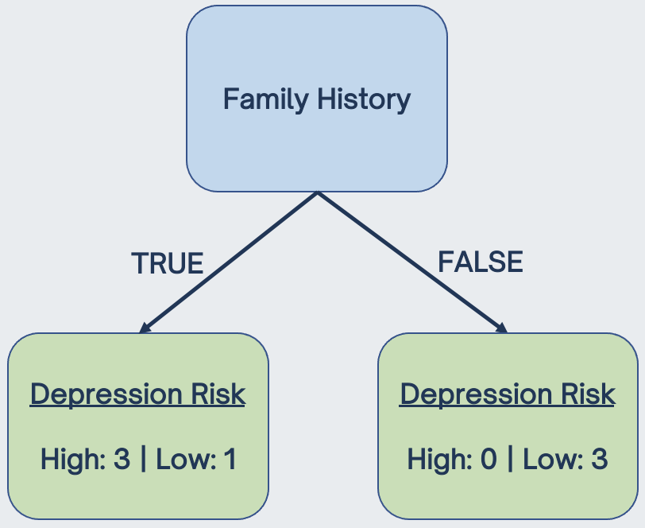
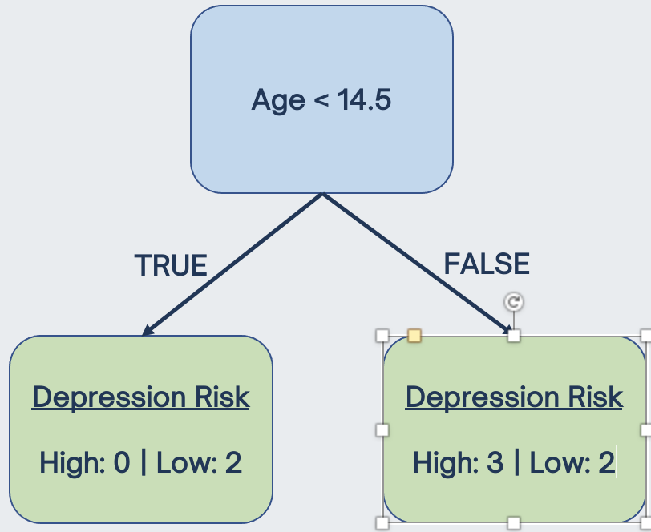
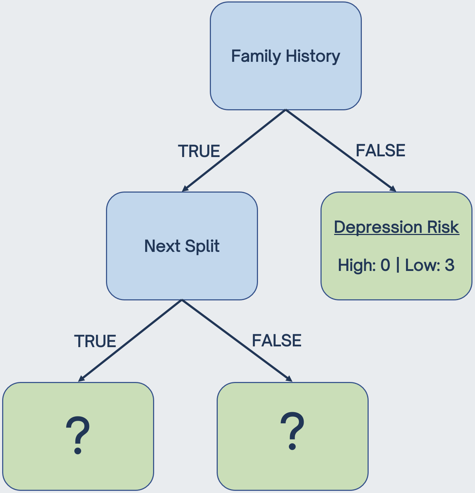

```{r setup, include=FALSE}
options(htmltools.dir.version = FALSE)
knitr::opts_chunk$set(
  fig.width=9, fig.height=3.5, fig.retina=3,
  out.width = "100%",
  cache = FALSE,
  echo = TRUE,
  message = FALSE, 
  warning = FALSE,
  hiline = TRUE,
  par(bg = "#E9ECEF")
)
knitr::opts_knit$set(global.par = TRUE)
```

```{r xaringan-themer, include=FALSE, warning=FALSE}
library(xaringanthemer)
style_mono_light(
  base_color = "#23395b",
  footnote_font_size = "20px",
  footnote_color = "gray",
  text_slide_number_font_size = "18px"
)
```

```{r packages, echo=FALSE, message=FALSE}
library(tidyverse)
library(knitr)
library(kableExtra)
library(countdown)
library(patchwork)
library(summarytools)
library(mice)
library(VIM)
library(caret)
library(gridExtra)
library(psych)
library(psychTools)
library(ggcorrplot)
library(GGally)
library(corrplot)
library(AppliedPredictiveModeling)
```

class: inverse, center, middle
# Overview

---
## Lecture Topics

.pull-left[
**Simple Decision Trees**
- Motivation (modeling nonlinearity)
- Classification trees
- Regression trees
- Recursive partitioning
- Pruning
- Stopping criteria (e.g., maximum depth)

**Ensemble Methods**
- Random forests 
- Aggregating predictions from many models
- Improved prediction accuracy at the cost of lower interpretability  
]

.pull-right[
```{r, echo = FALSE, out.height=450, out.width = 600}
include_graphics("flowchart.jpg")
```
]

---
## Geometry of Data

Thus far, we have only been modeling linear relationships with linear boundaries between classes, e.g.: 

```{r, echo = FALSE, fig.showtext=TRUE}
set.seed(1)
x = rnorm(400)
y = rnorm(400)
simdat <- data.frame(x, y)
simdat$group_lin <- ifelse(simdat$x < simdat$y, 1, 0)

ggplot(simdat, aes(x, y)) + 
  geom_point(aes(color = group_lin)) +
  theme_xaringan(text_font_size = 14, title_font_size = 16) +
  theme(panel.grid.minor = element_blank(),
        panel.background = element_rect(fill = "white"),
        legend.position = "none")
```

---
## Geometry of Data

But what about other types of relationships? 

```{r, echo = FALSE}
simdat$group_circle <- ifelse(simdat$x < 1 & simdat$x > -1 & simdat$y < 1 & simdat$y > -1, 1, 0)

ggplot(simdat, aes(x, y)) + 
  geom_point(aes(color = group_circle)) +
  theme_xaringan(text_font_size = 14, title_font_size = 16) +
  theme(panel.grid.minor = element_blank(),
        panel.background = element_rect(fill = "white"),
        legend.position = "none")
```

---
## Geometry of Data

But what about other types of relationships? 

```{r, echo = FALSE}
simdat$group_quadrants <- ifelse((simdat$x < -0.5 & simdat$y > 0) | (simdat$x > 0.5 & simdat$y < 0), 1, 0)

ggplot(simdat, aes(x, y)) + 
  geom_point(aes(color = group_quadrants)) +
  theme_xaringan(text_font_size = 14, title_font_size = 16) +
  theme(panel.grid.minor = element_blank(),
        panel.background = element_rect(fill = "white"),
        legend.position = "none")
```

---
## Geometry of Data

Whereas these classes are very clearly separated, it's no longer easy to use a **single equation** to describe the boundaries between them. 

.pull-left[
```{r, echo = FALSE}
ggplot(simdat, aes(x, y)) + 
  geom_point(aes(color = group_circle)) +
  theme_xaringan(text_font_size = 14, title_font_size = 16) +
  theme(panel.grid.minor = element_blank(),
        panel.background = element_rect(fill = "white"),
        legend.position = "none")
```
]

.pull-right[
```{r, echo = FALSE}
ggplot(simdat, aes(x, y)) + 
  geom_point(aes(color = group_quadrants)) +
  theme_xaringan(text_font_size = 14, title_font_size = 16) +
  theme(panel.grid.minor = element_blank(),
        panel.background = element_rect(fill = "white"),
        legend.position = "none")
```
]

--

 allow us to build models that are capable of describing these complex decision boundaries while maintaining ease of interpretability.

---
class: inverse, center, middle
# Decision Trees

---
## Decision Trees

Tree-based models use the logic of `if-then` statements in order to partition the data into . For instance: 

`if has legs` </br>
`| if barks then animal = dog` </br>
`| else animal = cat` </br>
`else animal = fish`

--

This is an example of a simple **classification tree**. Decision trees can also be used for regression problems (i.e., **regression trees**).

A key benefit of decision trees is that they are  and able to model nonlinear relationships. 

However, they typically provide  than other supervised learning methods (e.g., random forests, which we will talk about later today).

---
## Decision Trees

.pull-left[
Decision trees are often visualized graphically.

The top node is called the .

Subsequent splitting nodes are called  or .

The output labels are called  or .

Typically, if a statement is , you go to the left. If a statement is , you go to the right.
]

.pull-right[
```{r, echo = FALSE, out.width = "100%"}

```
]

---
class: inverse, center, middle
# Classification Trees

---
## Building a Classification Tree

The goal of classification trees are to partition data into homogenous groups, as defined by  (i.e., including a larger proportion of one class than the other in each node).

In building a classification tree, we use  to find the best data splits that maximize node purity.

The  is the most commonly-used metric for quantifying purity, and is calculated as:

$$Gini = 1 - \sum\limits_{i = 1}^C(p_i)^2$$
where
- $p_i$ = the probability of being in the $i$th class
- $C$ = total number of classes

---
## Building a Classification Tree

Let's walk through an example of building a classification tree using this toy dataset to predict depression risk: 

Stressful Event&emsp; | Family History&emsp; | Age&emsp;&emsp;&emsp; | Depression Risk&emsp;
:------- | :-------- | :------- |:------- |
No | Yes | 10 | Low 
No | No | 12 | Low
Yes | Yes | 16 | High
Yes | Yes | 22 | High
No | Yes | 30 | High 
No | No | 38 | Low
Yes | No | 46 | Low

--

The first thing we need to do is choose the  by determine which feature (stressful life event, family history of depression, or age) best predicts future depression risk. 

---
## Choosing the Root Node

.pull-left[
Start by finding the **Gini index** of stressful life events.

&emsp; | Family History&emsp; | Age&emsp;&emsp;&emsp; | &emsp;
:------- | :-------- | :------- |:------- |
 | Yes | 10 |  
 | No | 12 | 
 | Yes | 16 | 
 | Yes | 22 | 
 | Yes | 30 |  
 | No | 38 | 
 | No | 46 | 
]

--

.pull-right[
```{r, echo = FALSE, out.width="90%"}

```
]

---
## Choosing the Root Node
.pull-left[
Both terminal nodes (leaves) are **impure**, as they include people with high and low depression risk. 

To quantify this impurity, we first calculate the **Gini impurity** of each leaf: 

$Gini_{left} = 1 - P(High)^2 - P (Low)^2 = 0.444$
$Gini_{right} = 1 - P(High)^2 - P (Low)^2 = 0.375$

We then calculate the total Gini index by taking the weighted average of the Gini leaf indices:

$Gini_{stress} = (\frac{3}{7})*0.444 + (\frac{4}{7})*0.375 = 0.405$
]

.pull-right[
```{r, echo = FALSE, out.width="90%"}

```
]

---
## Choosing the Root Node

We can compare this to the Gini index for family history, which comes to:

$Gini_{family}=((\frac{4}{7})*(1 - (\frac{3}{4})^2 - (\frac{1}{4})^2)) + ((\frac{3}{7})*(1 - (\frac{0}{3})^2 - (\frac{3}{3})^2)) = 0.214$

.pull-left[
Stressful Event&emsp; | &emsp; | Age&emsp;&emsp;&emsp; | &emsp;
:------- | :-------- | :------- |:------- |
No |  | 10 |  
No |  | 12 | 
Yes |  | 16 | 
Yes |  | 22 | 
No |  | 30 |  
No |  | 38 | 
Yes |  | 46 | 
]

--

.pull-right[
```{r, echo = FALSE, out.width="90%"}

```
]

---
## Choosing the Root Node

Calculating the Gini index for numerical features is slightly more complicated. We sort values from lowest to highest, calculate the midpoint of adjacent rows, and use these cutoffs to find the lowest Gini index for all  splits. In this case, the lowest Gini index is for age < 14.5 (Gini = 0.343): 

.pull-left[
Stressful Event&emsp; | Family History&emsp; | &emsp;&emsp;&emsp; | &emsp;
:------- | :-------- | :------- |:------- |
No | Yes |  |  
No | No |  | 
Yes | Yes |  | 
Yes | Yes |  | 
No | Yes |  |  
No | No |  | 
Yes | No |  | 
]
.pull-right[
```{r, echo = FALSE, out.width="90%"}

```
]

---
## Recursive Partioning

.pull-left[
Comparing the Gini index for stressful life events (0.405) to family history of depression (0.214) to age<14.5 (0.343), we see that family history has the lowest Gini index (i.e., highest **purity**).

Thus, we set family history as the root node. 

We then  to find the next split from the impure node.

We can continue this process until we are left with . 
]

--

.pull-right[
```{r, echo = FALSE, out.width="90%"}

```
]

---
class: inverse, center, middle
# Regression Trees


---
## Regression Trees

rather than working with gini (or other metrics) we're back to SSE: 

leaves also don't give a class, but a predicted value. 

the mean of observations in that leaf. 

---
## Comprehension Check 

<span style="font-size:30px;">**Let's say we continued this recursive partioning process until we were left only with pure nodes. What are some problems that could arise?**</span>

--

</br> 
Some answers: 

- Overfitting training data
- Poor prediction on test data/future/new data
- Instability of model (if data are even slightly altered, you may find entirely different splits)
- Small number of participants in leaves
- Selection bias: features with higher number of distinct values are favored

---
class: inverse, center, middle
## Preventing Overfitting


---
## Stopping Criteria 

only allowing tree to grow to a certain depth 

maxdepth hyperparameter in rpart2

---
## Pruning

cp parameter

gini_cp = gini + cp * number of terminal nodes

reminds you of regularization! 

cp parameter in rpart

again, goal is to fit training less less well to improve testing

for regression: get total SSR, then calculate SSR for removing leaves (it gets larger and larger). 

this helps, but decision trees are ultimately still limited by low accuracy. RF helps with this! 

---
class: inverse, center, middle
# Random Forests

---
## Random Forests


1. bootstrap 
2. create a decision tree with the bootstrapped data, but only use a random subset of features at each step (how many? hyperparameter...)
3. go back to step 1 and repeat. repeat many times. 

this gives a ~random forest~ of trees. the diversity is what makes it more effective than a single decision tree. 

new data -> run through all trees -> see what got the most votes. 

OOB samples incorrectly classified = out of bag error

---
## Classification Trees in R 

use the heart data again 

show variable importance


---
## Regression Trees in R


---
## Random Forests in R 
