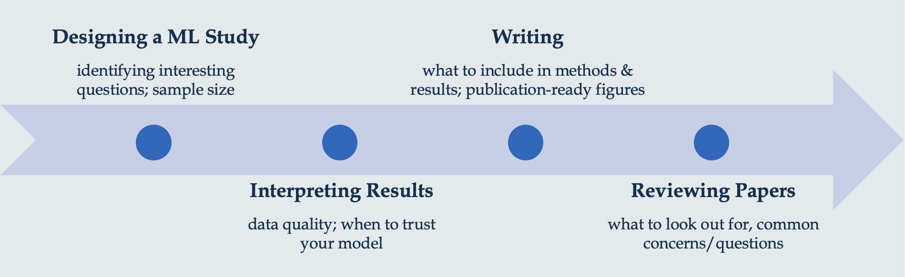

```{r setup, include=FALSE}
options(htmltools.dir.version = FALSE)
knitr::opts_chunk$set(
  fig.width=9, fig.height=3.5, fig.retina=3,
  out.width = "100%",
  cache = FALSE,
  echo = TRUE,
  message = FALSE, 
  warning = FALSE,
  hiline = TRUE,
  par(bg = "#E9ECEF")
)
knitr::opts_knit$set(global.par = TRUE)
```

```{r xaringan-themer, include=FALSE, warning=FALSE}
library(xaringanthemer)
style_mono_light(
  base_color = "#23395b",
  footnote_font_size = "20px",
  footnote_color = "gray",
  text_slide_number_font_size = "18px"
)
```

```{r packages, echo=FALSE, message=FALSE}
library(tidyverse)
library(knitr)
library(kableExtra)
library(countdown)
library(patchwork)
library(summarytools)
library(mice)
library(VIM)
library(caret)
library(gridExtra)
library(psych)
library(psychTools)
library(ggcorrplot)
library(GGally)
library(corrplot)
library(AppliedPredictiveModeling)
```

class: inverse, center, middle
# Overview

<style type="text/css">
.onecol {
    font-size: 26px;
}
.twocol {
  font-size: 24px;
}
.remark-code {
  font-size: 24px;
  border: 1px solid grey;
}
a {
  background-color: lightblue;
}
.remark-inline-code {
  background-color: white;
}
</style>

---
## Lecture Topics

</br>
```{r, echo = FALSE, out.height="110%"}

```

---
class: inverse, center, middle
# Designing Studies 

---
class: onecol

## Back to Basics

The goal of **supervised machine learning** is to  unknown values of important variables in new data.

Features used to predict tend to be **cheaper or easier to measure** in new data.

Labels to be predicted tend to be **expensive or difficult to measure** in new data. 

ML models can be used for  or  problems.

---
class: onecol

## Cause and Effect

Machine learning is a **data-driven** approach. 

However, this does not mean that it is **atheoretical**. 

--

Strong understanding of the **underlying causal structure** of labels is crucial for optimizing model performance and feature selection. 

Models with features that are  of the outcome have higher predictive accuracy in future datasets than models with features that are  of the outcome.<sup>1</sup>

Design of ML studies should be driven by strong **theory**. 

.footnote[
[1] See Piccininni et al. (2020) for theoretical explanation and simulation results: https://bmcmedresmethodol.biomedcentral.com/articles/10.1186/s12874-020-01058-z
]

---
class: onecol

## Timescale of Effects

The **timeframe** of studies should also be theoretically motivated.

Over what timescale are the features and labels expected to change? Over what timescale is the feature expected to lead to change in the label? 

--

```{r, echo = FALSE, out.width="53%"}
include_graphics("franklin2017.png")
```

---
class: onecol

## Sample Size

how much data do you need? 

how much can you reasonably collect? 

---
class: onecol

## Representativeness 

bias, garbage in garbage out

who is included in your data? 

who is being left out?

---
class: onecol

## Group Discussion

what's an ML study you would design in your area? 

what complications/concerns do you forsee? 

---
class: inverse, center, middle
# Modeling Decisions


---
class:onecol 

## Modeling Decisions 

choosing between algorithms 

try in your train --> pick one --> do in your test 

missing data handling 

imbalanced classes handling

one slide summary of pros/cons of ridge vs. lasso vs. trees vs. random forest vs. svm

---
class: inverse, center, middle
# Interpreting Results

---
## Data Quality 


---
## What's "good" accuracy? 

what metric matters most? 

example: AUC vs PPV debate in suicide prediction

---
## Can you trust your model? 


---
class: inverse, center, middle
# Writing  

---
## What to Include in Methods 

someone should be able to look at your methods and reproduce your model 

want to talk about: 

feature engineering

resampling methods (clear separation between train/test)! 

hyperparameter tuning

evaluation metrics

variable importance

model comparison

---
## Writing Results


---
class: inverse, center, middle
# Publication-Ready Figures

---
class: onecol

## {ggplot2}

We strongly recommend {ggplot2} for making publication-ready figures. 


---
class: onecol

## The Grammar of Graphics: Basic Elements

.pull-left[
**Data** </br><font size="5">describe observations with variables</font>

**Aesthetic Mappings** </br><font size="5">map data variables to visual qualities</font>

**Scales** </br><font size="5">map values in data space to values in aesthetic space (create axes and legends)
</font>

**Geometric Objects** </br><font size="5">constitute the objects seen on a plot</font>
]

---
class: twocol

## The Grammar of Graphics: Basic Elements

.pull-left[
 </br><font size="5">describe observations with variables</font>

**Aesthetic Mappings** </br><font size="5">map data variables to visual qualities</font>

**Scales** </br><font size="5">map values in data space to values in aesthetic space (create axes and legends)
</font>

**Geometric Objects** </br><font size="5">constitute the objects seen on a plot</font>
]
.pull-right[
```{r, echo = FALSE}
data(iris)
tibble(iris) %>% kable(format = "html", table.attr = "style='width:10%;'")
```
]

---
class: inverse, center, middle
# Peer-Reviewing ML Papers


---
## Peer-Reviewing ML Papers

Is the sample appropriate? 

How were features and outcomes measured? 

Separate training and testing process? 

Appropriate matching of research q --> ML model? 
