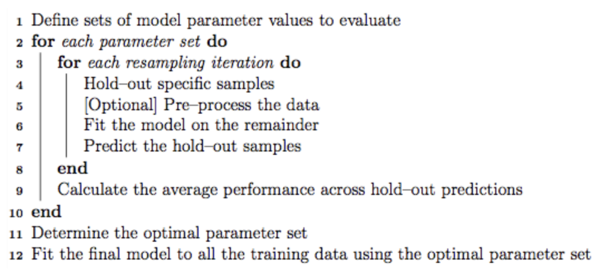
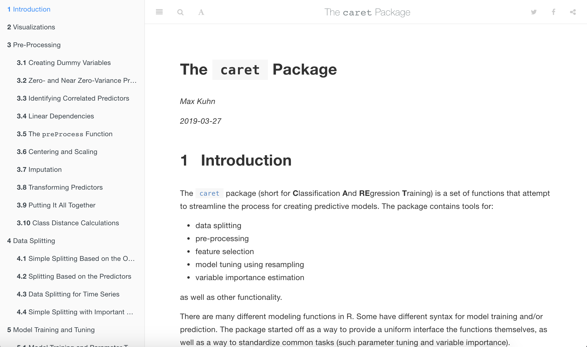
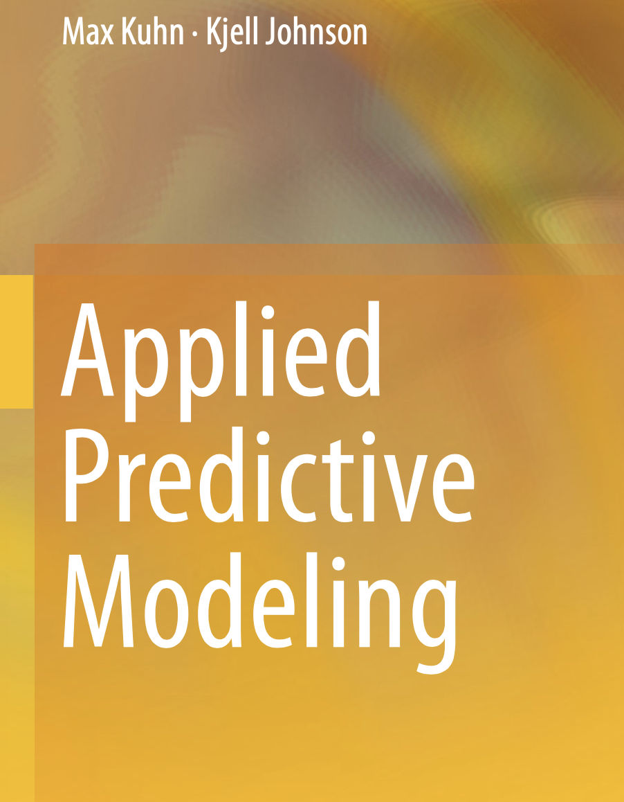
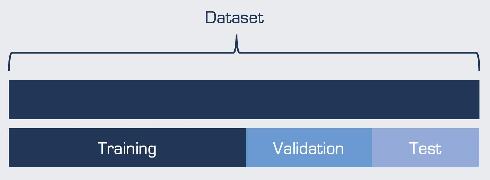
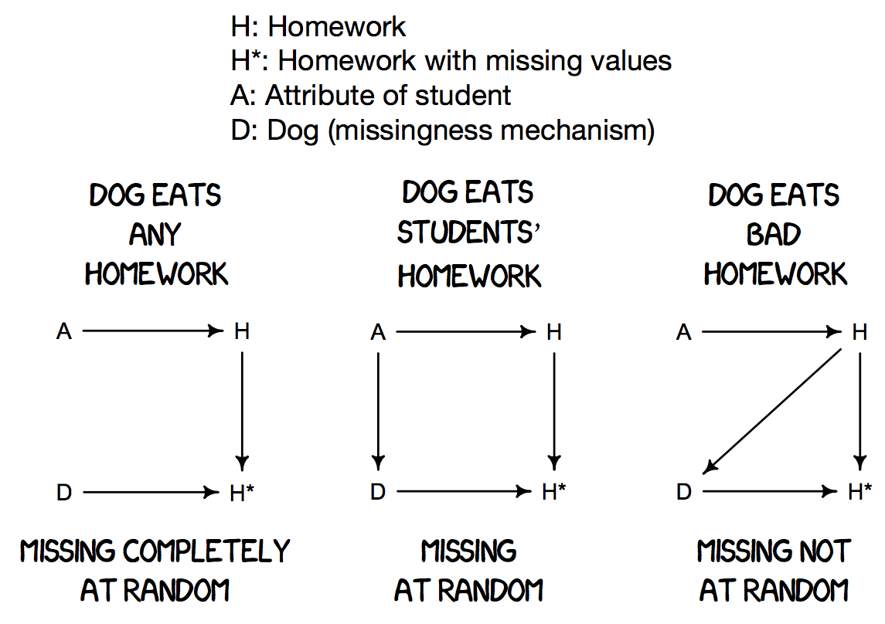
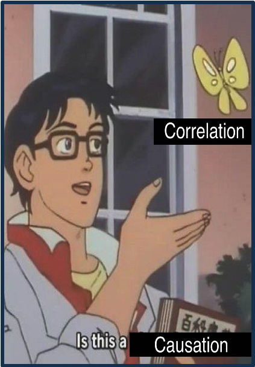

```{r setup, include=FALSE}
options(htmltools.dir.version = FALSE)
knitr::opts_chunk$set(
  fig.width=9, fig.height=3.5, fig.retina=3,
  fig.showtext = TRUE,
  out.width = "100%",
  cache = FALSE,
  echo = TRUE,
  message = FALSE, 
  warning = FALSE,
  hiline = TRUE,
  comment = "#>",
  collapse = TRUE
)
```

```{r xaringan-themer, include=FALSE, warning=FALSE}
library(xaringanthemer)
style_mono_light(
  base_color = "#23395b",
  footnote_font_size = "20px",
  footnote_color = "gray",
  text_slide_number_font_size = "18px"
)
```

```{r xaringan-tachyons, echo=FALSE}
xaringanExtra::use_tachyons()
```

```{r packages, echo=FALSE, message=FALSE}
library(tidyverse)
library(knitr)
library(kableExtra)
library(countdown)
library(patchwork)
library(summarytools)
library(mice)
library(VIM)
library(caret)
library(gridExtra)
library(psych)
library(psychTools)
library(ggcorrplot)
library(GGally)
library(corrplot)
library(AppliedPredictiveModeling)
```

class: inverse, center, middle
# Overview

<style type="text/css">
.remark-code {
  border: 1px solid grey;
}
a {
  background-color: lightblue;
}
.remark-inline-code {
  background-color: white;
}
</style>

---
##Lecture Topics
.left-column[
</br>
```{r, echo=FALSE, out.height = 350}

```
]

.right-column[

**Brief Refresher on using R**

**Packages**
- {caret} - primary package for this course
- {tidymodels}

**Simple Data Split**
- Training and testing datasets
- Data splitting in {caret}

**Exploratory Data Analysis**
- Data distributions
- Missing data
- Feature correlations 
- Linearity and nonlinearity
]

---
class: inverse, center, middle
# Brief R Refresher 

---
## Software Ecosystem

R is like the engine of a car and RStudio is like the cabin
- You don't have to use RStudio to use R, but it is more comfortable

R packages give you extra features that aren't in R by default
- To install a package into your library, use `install.packages("caret")`
- To load the {caret} package from your library, use `library("caret")`

The {tidyverse} is a collection of popular packages that work together
- We will use several functions from {tidyverse} so please make sure to install and load it to follow along
- We will try to minimize how much we use it but this may be hard (especially for Jeff)

.footnote[
[1] You only need to install a package once per version (e.g., 6.0-88)<br />
[2] You need to load a package once per session (i.e., until closing R)
]

---
## Basic Programming

Save objects and give them names using `<-`, then refer to them by name

```{r}
short_pi <- 3.1415
short_pi + 2
```

Numbers can just be typed in R but text data (called **strings**) have to be quoted

```{r}
my_fav_color <- "Cornflower Blue"
```

Use functions to transform inputs into outputs 

```{r}
round(2/3)
```

Functions often have arguments to let you modify their behavior

```{r}
round(2/3, digits = 3)
```

---
## Pipes and Pipelines

{tidyverse} gives us the pipe `%>%` which can be read as "AND THEN".

It takes an  and passes it to a function as the .

```{r}
library(tidyverse)
x <- 4.9823
# Take x and then round it
x %>% round()
```

We can also use arguments

```{r}
# Take x and then round it to 2 digits, note we don't repeat x inside round()
x %>% round(digits = 2)
```

We can chain these pipes together into a "pipeline"

```{r}
# Take x and then square root it and then round that to 1 digit
x %>% sqrt() %>% round(digits = 1)
```

---

## Vectors and Subsetting

Collect multiple objects of the same type into a single object with `c()`

```{r}
my_numbers <- c(24, 3.5, -10, 1/3)
my_numbers
my_friends <- c("Rand", "Perrin", "Matrim", "Egwene")
my_friends
```

Extract parts (i.e., elements) from a vector by positional *index* using `[]`

```{r}
my_numbers[4]
my_friends[3]
```

Extract multiple elements by giving `[]` a vector

```{r}
my_friends[c(1, 3)]
```

---

## Special Data Types

If a variable is categorical, we can tell R with `factor()`

```{r}
genre_nums <- c(1, 1, 3, 2, 1, 2, 2, 2, 3)
genre_nums
genre <- factor(genre_nums, levels = c(1, 2, 3), labels = c("Action", "Comedy", "Drama"))
genre
```

If we want to store binary (yes or no, true or false) information, we can use *logicals*

```{r}
my_statements <- c(TRUE, FALSE, FALSE, TRUE)
my_statements
```

We can also get logicals by making comparisons

```{r}
my_scores <- c(100, 93, 73, 32, 88, 54)
my_scores >= 60
```

---

## NA for Missing Values

We should tell R when a value is missing by setting it to `NA` (not available)

```{r}
bad_data <- c(1.2, 3.2, 2.1, 9999)
mean(bad_data)

good_data <- c(1.2, 3.2, 2.1, NA)
mean(good_data)
mean(good_data, na.rm = TRUE)
```

We can use {tidyverse} to automatically turn all placeholders into NAs

```{r}
na_if(bad_data, 9999)
```

---

## Data Frames

We often collect multiple vectors with the same number of elements into one object

This is called a **data frame** where rows are *observations* and columns are *variables*

```{r}
instructors <- 
  data.frame(
    name1 = c("Jeff", "Shirley", "Aidan"),
    name2 = c("Girard", "Wang", "Wright"),
    school = c("KU", "Harvard", "Pitt")
  )
instructors
```

We can extract a single variable from a data frame (as a vector) using `$`

```{r}
organizations <- instructors$school
organizations
```

---

## Data Frame Subsetting

We can also extract specific rows and columns from a data frame using `[rows, columns]`

```{r}
instructors[2, c(1, 3)]
```

If we leave rows or columns blank, it will give us all of them

```{r}
instructors[c(1, 2), ]
```

Finally, we can give negative numbers to deselect rather than select

```{r}
instructors[-c(1, 2), ]
```

---

## Importing data

Often we want to read data into R from external files (e.g., CSV files)


In this course, we will be importing data from files stored online (but this also works for local files). We can use `read.csv()` from base R or `read_csv()` from {tidyverse} and give it a URL for the file.

.scroll-output[
```{r, message=FALSE}
titanic <- read_csv("https://bit.ly/amlr-titanic")
titanic
```
]

We will also sometimes import data from R packages. In this case, we can use the `data()` function. 

.scroll-output[
```{r, message = FALSE}
library(psychTools)
data(affect)
affect
```
]

---
class: inverse, center, middle
# Packages

---
##How do we implement machine learning in R?

There are  for building and evaluating machine learning models in R. 

Each implements specific ML models (e.g., {glmnet} for lasso, ridge, and elastic net regularization, {rpart} for decision trees, {randomforest} for random forests).

These packages were built by different people over time, so .

This can be confusing to remember!

--

```{r, echo = FALSE, out.height="70%", out.width="70%"}
include_graphics("syntax_diff.png")
```

---
##{caret}

Recognizing the need for  the process of building and evaluating machine learning models, Max Kuhn and others developed the `caret` (**C**lassification **A**nd **RE**gression **T**raining) package. 

This package allows researchers to quickly build and compare many different models.

There are 200+ machine learning models available in `caret`.

--

`caret` includes functions for:
- data visualization
- data pre-processing
- feature selection
- data splitting
- model training & testing
- variable importance estimation

---
##{caret}

.pull-left[
The `train()` function is the primary function for training models and tuning hyperparameters.

This  is used to train any and all machine learning models.

Users can also specify tuning parameter values and resampling method (e.g., *k*-fold cross-validation) with the `trainControl()` function.
]

.pull-right[
```{r, echo = FALSE}

```
]

--
</br>
```{r, eval=FALSE}
iris_fit <- train(Species ~., data = iris,
                  method = 'glmnet',
                  trControl = trainControl(method = "cv", number = 10))
```

---
##{caret}

Because `caret` has historically been the most popular package for machine learning in R, there are many freely available resources, solutions, and answers to questions online.

--

.pull-left[
```{r, echo = FALSE}

```
]

--

.pull-right[
```{r, echo = FALSE, out.height = "48%", out.width="48%"}

```
]

---
## {tidymodels}

The newer {tidymodels} package is the `tidyverse` version of {caret}. Both packages were developed by the same author (Max Kuhn)! {tidymodels} is a  and includes a collection of many packages:

- `rsample` for data splitting and resampling
- `recipes` for pre-processing
- `parsnip` for trying out many models
- `workflows` to streamline the pre-processing, modeling, and post-processing
- `tune` to optimize model hyperparameters
- `yardstick` for model performance metrics
- `broom` for converting information to user-friendly formats
- `dials` for creating and managing tuning parameters

--

We will use the older `caret` but incorporate *aspects* of the newer `tidymodels`<sup>1</sup>
- This will give us access to some new features without overwhelming beginners
- It will also ease the transition to `tidymodels` if you decide to go that route

.footnote[[1] We will use `recipes` and `yardstick` but not `workflows`, `rsample`, `tune`, `parsnip`, or `dials.`]

---
class: inverse, center, middle
# Exploratory Data Analysis

---
## Typical Workflow
<br />
```{r, echo=FALSE}
include_graphics("workflow.png")
```

---
## Typical Workflow
<br />
```{r, echo=FALSE}
include_graphics("workflow_eda.png")
```

---
## Exploratory Data Analysis
.left-column[
</br>
```{r, echo=FALSE}
include_graphics("explore.jpg")
```
]

.right-column[

**Goals**
- Develop an understanding of your data
- Make informed model building decisions (e.g., feature selection)

**Questions**
- What type of variation occurs in my variables?
- Are there any anomalies, errors, or outliers?
- How much missing data do I have?
- What type of covariation occurs between my variables?
- Are there any nonlinearities in my data?
- Are my data appropriate for the task? 
]

--

.right-column[
.bg-light-yellow.b--light-red.ba.bw1.br3.pl4[
**Caution!**

Exploratory data analysis should ideally be performed **only** on training data. 

]
]

---
class: inverse, center, middle
# Simple Holdout Set

---
## Why EDA on training data only?

The **ultimate goal** of exploratory data analysis is to . 

We split our data into training and testing subsets to evaluate the accuracy of our model in predicting *unseen* data. 

This gives us a sense for how our model might perform in the **future** on new datasets.

--

</br> 
If modeling decisions are made based on data patterns we observe in the test set, we  estimates in the test set. 

**When possible, it is ideal** to perform exploratory data analysis only on your training data only.

But note that doesn't mean we can't check the test data for coding errors or data anomalies!

---
##Simple Train/Test Split

```{r, echo = FALSE}
include_graphics("datasplit_simple.png")
```

---
##Data Splitting

An important note on terminology beyond simple train/test data splits<sup>1</sup>: 

- **Training**: The data subsample used to explore the data and fit the model.
- **Validation**: Used for model evaluation while tuning hyperparameters; often implicitly split via cross-validation.
- **Test**: Entirely held-out from model training/tuning; used to provide a unbiased evaluation of the final model. 

```{r, echo = FALSE, out.height = "70%", out.width = "70%"}

```

.footnote[
[1] More details on model training and cross-validation methods to come tomorrow in section 2-B.
]
---
##Simple Train/Test Split in R

Use the `createDataPartition()` function in {caret} to create balanced training and testing splits based on the outcome variable. Random sampling occurs within each factor level to  in the datasets. 

Specify the proportion of data you want in the training split (e.g., `p = 0.8`) for an 80%/20% data split.

Remember to set a seed so your results are !

--

</br> 
```{r}
library(caret)
set.seed(2021)
trainIndex <- createDataPartition(iris$Species, p = .8,
                                  list = FALSE, 
                                  times = 1)
```

---
##Simple Train/Test Split in R

Use the `createDataPartition` row indices to split your data into single train and test sets.

```{r}
irisTrain <- iris[trainIndex, ]
irisTest <- iris[-trainIndex, ]
```

--

Now 80% of the data is designated for model training and can be used for exploratory data analysis. 20% of the data is  before testing the model, to avoid overly optimistic results. 

```{r}
dim(irisTrain)
dim(irisTest)
```


---
##Knowledge check

<span style="font-size:30px;">Taylor is interested in building a machine learning model to predict future risk of depression. How should they explore these elements of their dataset?</span>

.pull-left[
### Question 1
**Looking for outliers or data anomalies:**

a) Training data only

b) Test data only

c) Both training and test

d) Neither 
]

.pull-right[
### Question 2
**Finding features that correlate with the outcome:**

a) Training data only

b) Test data only

c) Both training and test

d) Neither
]

---
class: inverse, center, middle
# Exploratory Data Analysis
## Data Distributions and Error Detection

---
##Data distributions and error detection

.left-column[
</br>
```{r, echo = FALSE, out.height = 350}
include_graphics("normal_dist.png")
```

]
.right-column[
Typically, the first step in exploratory data analysis is to explore data distributions.

This provides insight into:

- Whether features are normally distributed
- Concerning or extreme skewness 
- Potential data anomalies or errors 
- Data outliers 
- Features with low variance
- Imbalanced data (categorical variables)

Methods:
- Summary statistics
- Histograms
- Bar charts
]

---
##Data distributions and error detection in R

The `dfsummary()` function from {summarytools} is useful for quickly identifying trends and anomalies at a glance. 

--

```{r, eval= FALSE}
print(dfSummary(irisTrain), method = 'render')
```

```{r, echo = FALSE}
print(dfSummary(irisTrain, headings = FALSE, style = 'grid', 
                plain.ascii = FALSE, graph.magnif = 0.85, tmp.img.dir = "/tmp"),
      max.tbl.height = 300, method = 'render')
```

---
##Data distributions and error detection in R

Overlaying distributions on the same plot can also be helpful. We can use the `featurePlot()` function in {caret}.

--

```{r, echo = FALSE}
par(bg = "#E9ECEF")
transparentTheme(trans = .9)
```


```{r, fig.align='center', out.width="60%"}
# basic density plot
featurePlot(x = irisTrain[, 1:4], y = irisTrain$Species, plot = 'density')
```

.footnote[
credit to https://topepo.github.io/caret/visualizations.html
]

---
##Data distributions and error detection in R

Overlaying distributions on the same plot can also be helpful. We can use the `featurePlot()` function in {caret}.

```{r, echo = FALSE}
par(bg = "#E9ECEF")
transparentTheme(trans = .9)
```


```{r, fig.align='center', out.width="60%"}
# make it prettier: free x & y axis, add legend, change plot character
featurePlot(x = irisTrain[, 1:4], y = irisTrain$Species, plot = 'density', 
            scales = list(x = list(relation = "free"), y = list(relation = "free")), 
            adjust = 1.5, pch = "|", auto.key = list(columns = 3))
```

.footnote[
credit to https://topepo.github.io/caret/visualizations.html
]

---
##Are there data anomalies, errors, or outliers?

Check data distributions and summary statistics for:
- Extreme values
- Nonsensical values
- Inconsistencies 
- Low variance
- You may need to adjust plot margins or axes!

.pull-left[
```{r, echo = FALSE}
ggplot(diamonds) +
  geom_histogram(mapping = aes(x = y), binwidth = 0.5) +
  theme_xaringan(text_font_size = 14, title_font_size = 18) +
  theme(panel.grid.minor = element_blank(), panel.background = element_rect(fill = "white"))
```
]

.pull-right[
```{r, echo = FALSE}
ggplot(diamonds) + 
  geom_histogram(mapping = aes(x = y), binwidth = 0.5) +
  coord_cartesian(ylim = c(0, 50)) +
  theme_xaringan(text_font_size = 14, title_font_size = 18) +
  theme(panel.grid.minor = element_blank(), panel.background = element_rect(fill = "white"))
```
]

---
class: inverse, center, middle
# Exploratory Data Analysis
## Missing Data

---
##A technical explanation of missing data

**Missing completely at random (MCAR)**
- No systematic pattern of missing data; the probability of an observation being missing does not depend on any observed or missing data values. 
- E.g., If a weighing scale sometimes runs out of batter, missing data on weight is only due to bad luck and not any measured or missing data.

**Missing at random (MAR)** 
- Systematic relationship between missing values and the *observed* data, but *not* the missing data.
- E.g., If people with eating disorders are more likely to decline being weighed, missing data on weight is systematically related to eating disorder diagnosis.

**Missing not at random (MNAR)**
- Systematic relationship between missing values and those values themselves. 
- E.g., If people with higher weights are more likely to decline being weighed, missing data on weight is systematically related to *weight itself*.

---
##An intuitive explanation of missing data

```{r, echo = FALSE, out.width="60%"}

```

---
##Missing Data

```{r, echo = FALSE}
iris_miss <- as.data.frame(lapply(iris[1:2], function(cc) cc[ sample(c(TRUE, NA), prob = c(0.75, 0.25), size = length(cc), replace = TRUE) ])) # credit to https://stackoverflow.com/questions/27454265/randomly-insert-nas-into-dataframe-proportionaly

iris_miss <- as.data.frame(lapply(iris[3:4], function(cc) cc[ sample(c(TRUE, NA), prob = c(0.85, 0.15), size = length(cc), replace = TRUE) ]))
```

.footnote[
credit to https://www.datacamp.com/community/tutorials/visualize-data-vim-package
]

.pull-left[
```{r, echo = FALSE}
set.seed(2021)
mnar_data <- data.frame(x = rnorm(100), y = rnorm(100)) %>%
    mutate(y_miss = ifelse(y > 1, y, NA),
           y = ifelse(is.na(y_miss), y, NA),
           x_miss = ifelse(is.na(y), x, NA))

ggplot(mnar_data, aes(x, y)) +
  geom_point(size = 4, alpha = 0.6, col = 'aquamarine4') +
  geom_vline(aes(xintercept = x_miss), col = 'darkred', alpha = 0.6, linetype = 'dashed') +
  ylim(NA, max(mnar_data$y_miss, na.rm = TRUE)) +
  ggtitle("Training Data we Observe") +
  theme_xaringan(text_font_size = 14, title_font_size = 18) +
  theme(panel.grid.minor = element_blank(), panel.background = element_rect(fill = "white"))

```
]

--

.pull-right[
```{r, echo = FALSE}
ggplot(mnar_data, aes(x, y)) +
    geom_point(size = 4, alpha = 0.6, col = "aquamarine4") +
    geom_point(aes(x, y_miss), col = "red", size = 4, alpha = 0.6) +
    geom_hline(aes(yintercept = y_miss), col = "red", alpha = 0.6,
               linetype = "dashed") +
    ylim(NA, max(mnar_data$y_miss, na.rm = TRUE)) +
    ggtitle("Where Data are Missing") +
  theme_xaringan(text_font_size = 14, title_font_size = 18) +
  theme(panel.grid.minor = element_blank(), panel.background = element_rect(fill = "white"))
```
]

--

The {VIM} package is particularly helpful for visualizing patterns of missing data.

Two helpful questions to guide missing data visualization:
- Which variables have missing observations (and how many)?
- Does missing data in one variable depend on other variables?

---
##Missing data visualization in R

**Aggregation plots** are useful for inspecting the prevalence of missing data. 

```{r, echo = FALSE}
load("biopics.RData")
```


```{r,  out.height = "75%", out.width = "75%", fig.align='center'}
aggr(biopics, numbers = TRUE, prop = c(TRUE, FALSE), col = c("bisque2","darkcyan"))
```

.footnote[
credit to https://www.datacamp.com/community/tutorials/visualize-data-vim-package
]

---
##Missing data visualization in R

We also want to know if missing data systematically vary by other observed data. If the other data are numeric we use a **spinogram**; if categorical we can use a **spineplot**.

```{r, message=FALSE, warning=FALSE, results = 'hide', out.height = "70%", out.width = "70%", fig.align='center'}
spineMiss(biopics[, c("sub_race", "earnings")], col = c("bisque2","darkcyan"))
```

.footnote[
credit to https://www.datacamp.com/community/tutorials/visualize-data-vim-package
]

---
##Missing data visualization in R

Let's flip the two variables to ask: does the percentage of missing data in `sub_race` differ by `earnings`?

```{r, message=FALSE, warning=FALSE, results = 'hide', out.height = "75%", out.width = "75%", fig.align='center'}
spineMiss(biopics[, c("earnings", "sub_race")], col = c("bisque2","darkcyan"))
```

.footnote[
credit to https://www.datacamp.com/community/tutorials/visualize-data-vim-package
]

---
##Missing data visualization in R

**Mosiac plots** generalize spineplots and spinograms (which only plot two variables at a time) to multiple variables.

```{r, echo = FALSE}
biopics <- biopics %>% mutate(US_movie = ifelse(grepl("US", country), TRUE, FALSE))
```


```{r, message=FALSE, warning=FALSE, results = 'hide', out.height = "70%", out.width = "70%", fig.align='center'}
mosaicMiss(biopics[, c("sub_sex", "US_movie", "earnings")], highlight = 3, 
           plotvars = 1:2, miss.labels = FALSE, col = c("bisque2","darkcyan"))
```

.footnote[
credit to https://www.datacamp.com/community/tutorials/visualize-data-vim-package
]

---
##Missing data visualization in R

**Parallel coordinate plots** allow us to look at patterns of missingness across the entire dataset.

```{r, message=FALSE, warning=FALSE, results = 'hide', out.height = "75%", out.width = "75%", fig.align='center'}
parcoordMiss(biopics, highlight = 'earnings', alpha = 0.6, col = c("bisque2","darkcyan"))
```

.footnote[
credit to https://www.datacamp.com/community/tutorials/visualize-data-vim-package
]
---
class: inverse, center, middle
# Exploratory Data Analysis
## Feature Covariation and Correlations

---
##Feature covariation and correlations

.left-column[
</br>
```{r, echo = FALSE}

```
]
.right-column[
In addition to exploring variation *within* features, we should also explore the covariation that occurs (1) *between* features and (2) between features and labels.

This provides insight into: 
- Highly correlated features (multicollinearity)
- Potential clusters of features that could be reduced into a single feature
- Features with strong relationships to the outcome (feature selection)

Methods:
- Correlation matrices
- Correlation matrices with clustering
- Scatterplot matrices
]
---
##Feature covariation and correlations in R

```{r}
data(msq)
cormat <- cor(subset(msq, select = c("afraid", "angry", "anxious", "cheerful", "delighted", "depressed", "frustrated", "jittery", "proud", "scared", "unhappy")), use = 'pairwise.complete.obs')
corrplot(cormat, tl.col = '#23395b', type = 'lower', tl.cex = 0.8)
```

---
##Feature covariation and correlations in R

```{r}
# Correlation matrix with numbers
corrplot(cormat, type = 'lower', method = 'number', 
         tl.col = '#23395b', tl.cex = 0.8, pch.cex = 0.5, number.cex = 0.55)
```

---
##Feature covariation and correlations in R

```{r}
# Correlation matrix with hierarchical clustering
corrplot(cormat, tl.col = '#23395b', order = 'hclust', addrect = 3, 
         tl.cex = 0.8, pch.cex = 0.5, number.cex = 0.55)
```

---
##Feature covariation and correlations in R

```{r, fig.align='center'}
# Scatterplot matrix
pairs.panels(irisTrain[, 1:4], method = 'pearson', density = TRUE, ellipses = FALSE, 
             lm = TRUE, cex.cor = 0.8, cex.labels = 0.9)
```

---
class: inverse, center, middle
# Exploratory Data Analysis
## Linearity and Nonlinearity

---
##Linearity and nonlinearity 

Nonlinearity between features and outcome variables are important to pay attention to, because these data patterns inform algorithm selection. 

While some algorithms (e.g., decision trees, random forests) can capture and model nonlinearity, other algorithms (e.g., lasso, ridge, elastic net) cannot. 

The specific **form** of nonlinearity is also important. 

.pull-left[
```{r, echo = FALSE}
par(bg = "#E9ECEF")
feature <- rnorm(1000, 0, 1)
outcome <- feature^2 + runif(1000, -0.2, 0.2)
plot(feature, outcome, cex.lab = 2)
```
]

.pull-right[
```{r, echo = FALSE}
par(bg = "#E9ECEF")
feature <- rnorm(1000, 0, 1)
outcome <- 0.4 * (feature)^3 + 0.2* (feature)^2 + runif(1000, -0.2, 0.2)
for (i in 1:1000){
  if (feature[i] < -1.4) {
    outcome[i] = feature^2 + runif(1000, -0.2, 0.2)
  }
}
plot(feature, outcome, cex.lab = 2)
```
]
---
##Linearity and nonlinearity in R

We can use the `featurePlot()` function in `caret` to look for nonlinearities between features and outcomes.

```{r, echo = FALSE, results = FALSE}
data(affect)
affect <- dplyr::rename(affect, neuroticism = neur, positiveAffect = PA1)
theme1 <- trellis.par.get()
theme1$plot.symbol$col = rgb(.2, .2, .2, .4)
theme1$plot.symbol$pch = 16
theme1$plot.line$col = rgb(1, 0, 0, .7)
theme1$plot.line$lwd <- 2
trellis.par.set(theme1)
```

```{r, out.width = "80%", fig.align='center'}
featurePlot(x = affect[, c(4, 8, 12, 20)], y = affect$NA1, plot = "scatter",
            type = c("p", "smooth"), labels = c("Feature", "Negative Affect"))
```

---
class: inverse, center, middle
# Exploratory Data Analysis
## Takeaways

---
##Using EDA to inform model building

```{r, echo = FALSE}
include_graphics("eda_takeaway.png")
```

---
class: inverse, center, middle
## Small Group Activity

---
##Small Group Activity

We will assign you to a small breakout room.

We will jump between rooms to join discussions and answer questions.


Our goal is for everyone to gain experience with all modeling processes, so everyone should work  on their own code, rather than assign one person to share their screen and do the coding. However, please feel free to discuss the topics covered with your group members - we hope you also learn from each other! 

If you're stuck or have questions, please post them in the chat or workshop Slack channel, and feel free to consult your group members.


</br>
**BONUS AND HELPFUL FURTHER READING**: 
- The EDA Chapter in *R for Data Science*: https://r4ds.had.co.nz/exploratory-data-analysis.html
- Visualizations in {caret}: https://topepo.github.io/caret/visualizations.html

.footnote[
All workshop materials are available on the course website: https://pittmethods.github.io/appliedml/.
]