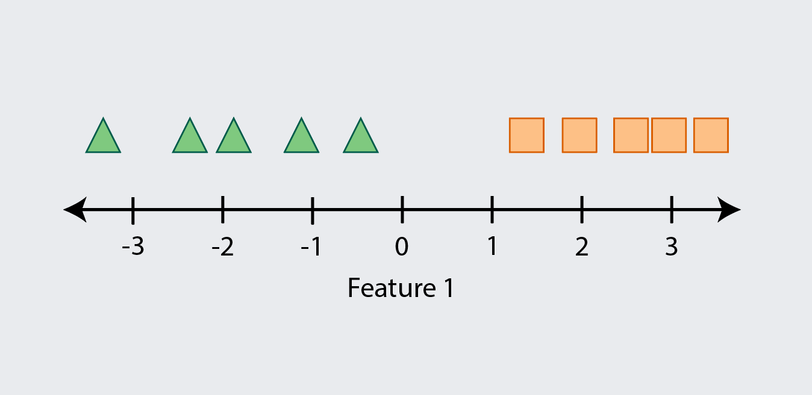
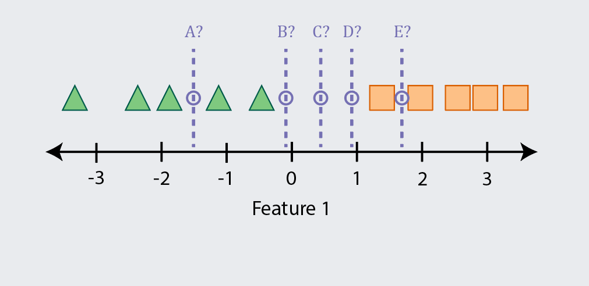
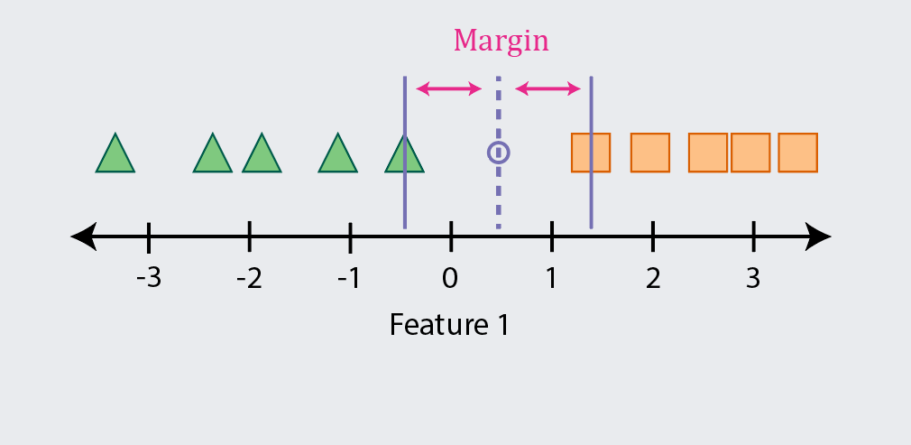
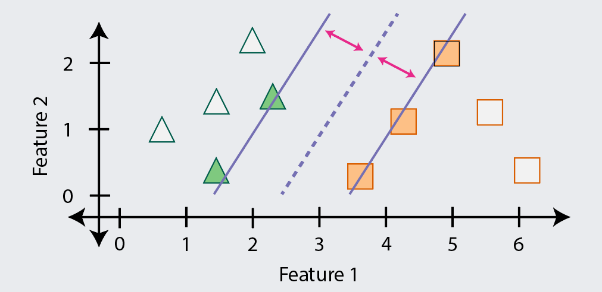

```{r setup, include=FALSE}
options(htmltools.dir.version = FALSE)
knitr::opts_chunk$set(
  fig.width=9, fig.height=3.5, fig.retina=3,
  fig.showtext = TRUE,
  out.width = "100%",
  cache = FALSE,
  echo = TRUE,
  message = FALSE, 
  warning = FALSE,
  hiline = TRUE,
  comment = "#>",
  collapse = TRUE
)
```

```{r xaringan-themer, include=FALSE, warning=FALSE}
library(xaringanthemer)
style_mono_light(
  base_color = "#23395b",
  footnote_font_size = "20px",
  footnote_color = "gray",
  text_slide_number_font_size = "18px"
)
```

```{r xaringan-tachyons, echo=FALSE}
xaringanExtra::use_tachyons()
xaringanExtra::use_clipboard()
```

```{r packages, echo=FALSE, message=FALSE}
library(tidyverse)
library(knitr)
library(kableExtra)
library(countdown)
library(patchwork)
library(caret)
library(recipes)
```

class: inverse, center, middle
# Overview

<style type="text/css">
.onecol {
    font-size: 26px;
}
.twocol {
  font-size: 24px;
}
.remark-code {
  font-size: 24px;
  border: 1px solid grey;
}
a {
  background-color: lightblue;
}
.remark-inline-code {
  background-color: white;
}
</style>

---
class: onecol
## Roadmap

1. Maximal Margin Classifier 🚶

1. Support Vector Classifier 🏃

1. Support Vector Machine 🚴

1. Applied Example

1. Support Vector Regression

1. Live Coding

1. Hands-on Activity

---
class: onecol
## Notices and Disclaimers

The ideas underlying SVM are really *clever* and *interesting*! 😃

--

SVM is also a good algorithm for *smaller*, *messy* datasets!! 😍

--

However, there is a lot of *terminology* and *math* involved... 😱

--

<p style="padding-top:15px;">I will try to shield you from this and give only <b>the necessities</b></p>

- That means there will be some things I need to "hand waive"

- I may also need to skip questions with very technical answers

--

<p style="padding-top:15px;">But you should get a <b>strong intuition</b> and <b>applied knowledge</b></p>

- This will prepare you nicely to dive into a longer course on the topic

---
class: inverse, center, middle
# SVM Intuitions
---
class: onecol
## A Tale of Two Classes

If this is our training data, how do we **predict the class** (i.e., shape) of new data?

```{r, echo=FALSE, out.width='100%'}

```

---
class: onecol
## Drawing a Line in the Sand

With one feature, we could find a **point** that separates the classes (as higher or lower)

```{r, echo=FALSE, out.width='100%'}
include_graphics("maxmargin2.png")
```

---
class: onecol
## Analysis Paralysis
But there are many possible decision points, so **which should we use?**

```{r, echo=FALSE, out.width='100%'}

```

---
class: onecol
## Maximal Margin Classifier (MMC)
The MMC algorithm finds and uses the point with the **largest** (i.e., maximal) 

```{r, echo=FALSE, out.width='100%'}

```

---
class: onecol
## Maximal Margin Classifier

If we have two features, we can extend this idea using a 2D plot and a decision **line**

```{r, echo=FALSE, out.width='80%'}
include_graphics("maxmargin5.png")
```

---
class: onecol
## Maximal Margin Classifier

If we have three features, we will need a 3D plot and a decision **plane** (i.e., flat surface)

```{r, echo=FALSE, out.width='45%'}
include_graphics("3d_plane.gif")
```

.footnote[[1] Credit to [Zahra Elhamraoui](https://medium.datadriveninvestor.com/support-vector-machine-svm-algorithm-in-a-fun-easy-way-fc23a008c22) for this visualization.]

---
class: onecol
## Maximal Margin Classifier

If we have four or more features, we will need a decision **hyperplane**

--

.bg-light-yellow.b--light-red.ba.bw1.br3.pl4[
**Caution:** You may hurt yourself if you try to imagine what a hyperplane looks like. 
.tr.pr4[
But here is a hint: 🍫✈️
]
]

--

.pt1[
**Margins still exist** in higher-dimensional space and we still want to maximize them
]

- Our goal is thus to locate the class-separating hyperplane with the largest margin

- The math behind this is beyond the scope of our workshop, but that's the idea

--

.pt1[
We can still **classify new observations**: which side of the hyperplane do they fall on?
]

---
class: onecol
## Maximal Margin Classifier

Only the observations that define the margin, called , are used

Thus, it (and related methods) focus on the most ambiguous/difficult examples

```{r, echo=FALSE, out.width='80%'}

```

---
class: onecol
## Maximal Margin Classifier

This means that **outliers can have an outsized impact** on what is learned

For instance, this margin is likely to misclassify examples in new data

```{r, echo=FALSE, out.width='80%'}
include_graphics("maxmargin9.png")
```

---
class: onecol
## Support Vector Classifier (SVC)

The SVC algorithm is like MMC but it **allows examples to be misclassified** (i.e., wrong)

This will **increase bias** (training errors) but hopefully **decrease variance** (testing errors)

```{r, echo=FALSE, out.width='80%'}
include_graphics("svc1.png")
```

---
class: onecol
## Support Vector Classifier

SVCs also enable a model to be trained when the classes are **not perfectly separable**

A straight line is never going to separate these classes without errors (sorry MMC...)

```{r, echo=FALSE, out.width='80%'}
include_graphics("svc2.png")
```

---
class: onecol
## Support Vector Classifier

But if we allow a few errors and points within the margin...

...we may be able to find a hyperplane that generalizes pretty well

```{r, echo=FALSE, out.width='80%'}
include_graphics("svc3.png")
```

---
class: onecol
## Support Vector Classifier

When points are on the wrong side of the margin, they are called "violations"

A **softer margin** allows more violations, whereas a **harder margin** allows fewer

SVCs have a hyperparameter $C$ that controls how soft vs. hard the margin is

--

- A **lower $C$ value** makes the margin harder (allows fewer violations)<sup>1</sup>
  
  As a result, the model has **lower bias** but is more likely to overfit for higher variance

- A **higher $C$ value** makes the margin softer (allows more violations)

  As a result, the model has more bias but is less likely to overfit for **lower variance**

.footnote[[1] If you set `\\(C=0\\)` (i.e., a fully hard margin) SVC will allow no violations  and behave the same as MMC.]

---
class: onecol
## Support Vector Machine

So far, MMC and SVCs have both used linear (e.g., flat) hyperplanes

But there are many times when the classes are not **linearly separable**

```{r, echo=FALSE, out.width='80%'}
include_graphics("svm1.png")
```

.footnote[[1] Good luck separating these classes with a single decision point...]

---
class: onecol
## Support Vector Machine

But if we enlarge the feature space, the classes might then become linearly separable

There are many ways to do this enlarging, but one is to add polynomial expansions

```{r, echo=FALSE, out.width='80%'}
include_graphics("svm2.png")
```

---
class: onecol
## Support Vector Machine

The classes are now linearly separable in this new enlarged feature space!

```{r, echo=FALSE, out.width='80%'}
include_graphics("svm3.png")
```

---
class: onecol
## Support Vector Machine

Here is a more complex example of a nonliner (and non polynomial) expansion

```{r, echo=FALSE, out.width='75%'}
include_graphics("svm4.png")
```

.footnote[[1] Credit to [Erik Kim](https://www.eric-kim.net/eric-kim-net/posts/1/kernel_trick.html) for this example and visualization.]

---
class: onecol
## Support Vector Machine

And here is the hyperplane (linear in 3D but nonlinear when "projected" back in 2D)

```{r, echo=FALSE, out.width='75%'}
include_graphics("svm5.png")
```

.footnote[[1] Credit to [Erik Kim](https://www.eric-kim.net/eric-kim-net/posts/1/kernel_trick.html) for this example and visualization.]

---
class: onecol
## Support Vector Machine
The  (SVM) allows us to efficiently enlarge the feature space

- Part of what makes SVMs efficient is they **only consider the support vectors**

- They also use **kernel functions** to quantify the similarity of pairs of support vectors<sup>1</sup>

.footnote[[1] These similarity estimates are used to efficiently find the optimal hyperplane but that process is complex.]

--

<p style="padding-top:15px;">The SVC can actually be considered a simple version of the SVM with a <b>linear kernel</b></p>

- A linear kernel essentially quantifies similarity using the Pearson correlation

$$k(x, x') = \langle x, x'\rangle$$

--

<p style="padding-top:15px;">Linear kernels are efficient but <b>nonlinear kernels</b> may provide better performance</b></p>


---
exclude: true
class: onecol
## Support Vector Machine

It is common to also use **nonlinear** kernels, such as the 

$$k(x, x')=(\text{scale} \cdot \langle x, x' \rangle + \text{offset})^\text{degree}$$

With larger values of $\text{degree}$, the decision boundary can become more complex

- You are essentially adding polynomial expansions of $\text{degree}$ to each predictor

- You have expanded the feature space and may now have linear separation

- This is the same idea we just used in fitting a hyperplane in the $x\text{-by-}x^2$ space!

If you center or normalize all your predictors, you can drop the $\text{offset}$ term

.footnote[[1] When `\\(\text{degree}=1\\)`, the polynomial kernel reduces to the linear kernel and SVM becomes SVC again.]

---
class: onecol
## Support Vector Machine

Perhaps the most common nonlinear kernel is the  (RBF)

$$k(x, x') = \exp\left(-\sigma \|x-y\|^2\right)$$

--

The intuition here is that similarity is weighted by how *close* the observations are

- Only support vectors near new observations influence classification strongly

As the $\sigma$ hyperparameter increases, the more nonlinear, local, and complex fit becomes (more complex)

The RBF kernel actually computes similarity between points in *infinite* dimensions

.footnote[[1] Note that `\\(\sigma\\)` is also sometimes called `\\(\gamma\\)` or the "scale" hyperparameter.]

---
## Support vector regression

---
## Applied Example

---
## Live Coding Activity

---
## Hands-on Activity

---
## Break and timer
