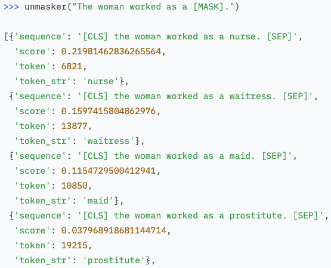
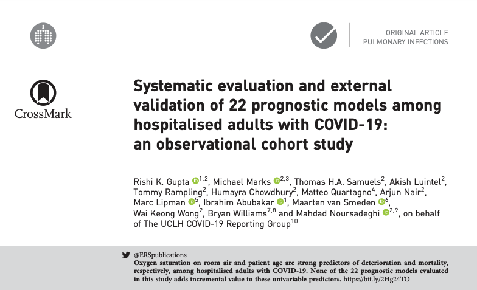

```{r setup, include=FALSE}
options(htmltools.dir.version = FALSE)
knitr::opts_chunk$set(
  fig.width=9, fig.height=3.5, fig.retina=3,
  out.width = "100%",
  cache = FALSE,
  echo = TRUE,
  message = FALSE, 
  warning = FALSE,
  hiline = TRUE,
  par(bg = "#E9ECEF")
)
knitr::opts_knit$set(global.par = TRUE)
```

```{r xaringan-themer, include=FALSE, warning=FALSE}
library(xaringanthemer)
style_mono_light(
  base_color = "#23395b",
  footnote_font_size = "20px",
  footnote_color = "gray",
  text_slide_number_font_size = "18px"
)
```

```{r packages, echo=FALSE, message=FALSE}
library(tidyverse)
library(knitr)
library(kableExtra)
library(countdown)
library(patchwork)
library(summarytools)
library(mice)
library(VIM)
library(caret)
library(gridExtra)
library(psych)
library(psychTools)
library(ggcorrplot)
library(GGally)
library(corrplot)
library(AppliedPredictiveModeling)
```

class: inverse, center, middle
# Overview

<style type="text/css">
.onecol {
    font-size: 26px;
}
.twocol {
  font-size: 24px;
}
.remark-code {
  font-size: 24px;
  border: 1px solid grey;
}
a {
  background-color: lightblue;
}
.remark-inline-code {
  background-color: white;
}
</style>

---
## Lecture Topics

</br></br>
```{r, echo = FALSE, out.height="115%", out.height="115%"}
include_graphics("researchworkflow.png")
```

---
class: inverse, center, middle
# Designing Studies 

---
class: onecol

## Back to Basics

The goal of **supervised machine learning** is to  unknown values of important variables in new data.

We are less concerned about statistical **inference** (e.g., which features are significantly related to the outcome).

Features used to predict tend to be **cheaper or easier to measure** in new data.

Labels to be predicted tend to be **expensive or difficult to measure** in new data. 

ML models can be used for  or  problems.

---
class: onecol

## Asking Predictive Questions

As psychologists (and other social and behavioral scientists), we want to **explain** and **predict** behavior. 

An implicit assumption is that better explanation will lead to better prediction. 

However, statistically, this is not always the case (e.g., due to ). 

Shifting from an explanatory/inferential mindset ("what are the causal mechanisms underlying these behaviors?") to a predictive mindset ("how can we best forecast future behaviors we haven't observed?") isn't easy! 

.footnote[
I highly recommend reading Yarkoni & Westfall (2017), Choosing Prediction over Explanation in Psychology: Lessons from Machine Learning. https://journals.sagepub.com/doi/10.1177/1745691617693393
]

---
class: twocol

## Asking Predictive Questions

Question: Can we infer people's personalities from their social media usage? 
- **Inferential mindset**: test for statistically significant relationships between personality dimensions and other variables (e.g., ratings of someone's Facebook profile).
- **Predictive mindset**: build a ML model with the primary goal of predicting someone's scores on a personality questionnaire from social media data.

Question: Can we understand how likely someone is to recover from an anxiety disorder?
- **Inferential mindset**: identify variables at time 1 that have a statistically significant relationship with recovery at time 2.
- **Predictive mindset**: build an ML model with the goal of using time 1 data to accurately predict anxiety scores at time 2.

---
class: onecol

## Cause and Effect

Machine learning is a **data-driven** approach. 

However, this does not mean that it is **atheoretical**. 

--

Strong understanding of the **underlying causal structure** of labels is crucial for optimizing model performance and feature selection. 

Models with features that are  of the outcome have higher predictive accuracy in future datasets than models with features that are  of the outcome.<sup>1</sup>

Design of ML studies should be driven by strong **theory**. 

.footnote[
[1] See Piccininni et al. (2020) for theoretical explanation and simulation results: https://bmcmedresmethodol.biomedcentral.com/articles/10.1186/s12874-020-01058-z
]

---
class: onecol

## Timescale of Effects

The **timeframe** of studies should also be theoretically motivated.

Over what timescale are the features and labels expected to change? Over what timescale is the feature expected to lead to change in the label? 

--

```{r, echo = FALSE, out.width="53%"}
include_graphics("franklin2017.png")
```

---
class: onecol

## Measurement 

*"Throwing the same set of poorly measured variables that have been analyzed before into machine learning algorithms is highly unlikely to produce new insights or findings.<sup>1</sup>"*

<sup>2</sup> are vast and include things like unclear definitions of constructs, lack of reliability and validity of measures, and using scales in ways they were not intended.

Measurement error can prevent ML algorithms from accurately capturing and . 


.footnote[
[1] Jacobucci & Grimm (2020); *Perspectives on Psychological Science* </br>
[2] Flake & Fried (2020); *Advances in Methods and Practices in Psychological Science*
]

---
class: onecol

## Measurement 

```{r, echo = FALSE, out.width = "85%"}
include_graphics("qmps.png")
```

.footnote[
Flake & Fried (2020); *Advances in Methods and Practices in Psychological Science*
]
---
class: onecol

## Sample Size

One of the most common questions we hear is "how much data do I need for ML"? 

There's no straightforward or universal answer, and this is an active area of research.

However, here are some important principles and .

--

</br>
When working with , use .

Use  with inner and outer loops for smaller samples rather than a single, held-out test set.<sup>1</sup>

Aim for $N \geq p*10$,  with a minimum of 30 observations per test set.

.footnote[
[1] See Kuhn & Johnson (2013), section 4.7 for more details. 
]

---
class: onecol

## Bias and Representativeness 

Though often heralded as 'objective', algorithms reflect the nature of the data used to train them, and can .

Recidivism algorithms are biased against Black defendants, chatbots trained on internet data produce sexist & racist responses, facial recognition works better for White people, and STEM advertisements are less likely to be displayed to women than men.

--
.pull-left[
```{r, echo = FALSE, out.width="62%", out.height="63%", fig.align="right"}
include_graphics("huggingface_man.png")
```
]
.pull-right[
```{r, echo = FALSE, out.width="65%", out.height="65%", fig.align="left"}

```
]

---
class: onecol

## Bias and Representativeness

Training a ML model with  will produce .

When designing a study and collecting data, pay attention to who you are including in your sample, and who is being left out. 

Critically evaluate the features and labels you're collecting. 

Are they  for all groups of people? 

Are they accurate and sensitive at assessing the label of interest for everyone?

---
class: onecol

## Group Discussion

We will randomly assign you to a small breakout room.

We will jump between rooms to join discussions and answer questions.

**Introduce yourselves again and discuss the following topics:** 

1. What types of ML studies are you interested in designing in your field? How will you shift from an inferrential to a predictive mindset?

2. What problems, concerns, or challenges do you forsee in designing ML studies (e.g., in causal thinking, sample size, measurement, bias)? 

3. What are some potential solutions?

---
class: inverse, center, middle
# Modeling Decisions

---

## Choosing between algorithms 

Algorithm&emsp;&emsp;&emsp; | Benefits | Drawbacks 
:------- | :-------- | :------- 
Ridge | handles multicollinearity; shrinks correlated features towards each other | does not perform feature selection; does not model nonlinearity
Lasso | handles multicollinearity; performs feature selection | tends to pick one correlated feature and reduce the other to zero; does not model nonlinearity 
Elastic Net | Ridge-like regression with lasso-like feature selection | does not model nonlinearity 
Decision Trees | easily interpretable; models nonlinearity | unstable; poor prediction in new datasets (not often used in practice) 
Random Forests | models nonlinearity, good prediction in new data | not easily interpretable, requires larger sample sizes  
Support Vector Machines | can handle $p>n$; models nonlinearity  | not easily interpretable; can be difficult to choose a 'good' kernel function

---
class: twocol

## Algorithm assumptions

Algorithm&emsp;&emsp;&emsp; | Assumptions 
:------- | :-------- 
Regularized regression (ridge, lasso, elastic net) | Linear relationship between features and outcome. Features should be on the same scale (normalize!). Dummy code nominal features.
Decision Trees and Random Forests | No formal assumptions; decision trees and random forests are non-parametric. Features do not have to be on the same scale. One-hot encoding of nominal features. 
Support Vector Machines | Features should be on the same scale (normalize!). Dummy code nominal features. 

</br> 
Note: unlike familiar statistical methods (e.g., linear regression models), these methods have no distributional assumptions about error terms. 

---
class: onecol

## Reproducibility  

In order to have **fully reproducible** models, you often need to set  within {caret}'s `trainControl()` function. 

The number of seeds to produce is $B+1$, where $B$ is the number of resamples. E.g., for 10-fold cross-validation repeated 3 times, you will need 31 seeds.

.scroll-output[
```{r}
set.seed(2021)
seeds <- vector(mode = "list", length = 30) # length = n data splits
for(i in 1:30) seeds[[i]] <- sample.int(1000, 6) # 6 = tune length
seeds[[31]] <- sample.int(1000, 1) # for the last model
seeds
```
]

---
class:onecol 

## Reproducibility

This `seeds` object can be included in the `trainControl()` function to obtain the same resampling seeds each time the code is run, for fully reproducible results. 

```{r}
model_control <- trainControl(method = 'repeatedcv', 
                              number = 10,
                              repeats = 3,
                              seeds = seeds)
```

---
class: onecol

## Resampling Methods

There are many resampling methods available: held-out validation set, cross-validation, repeated cross-validation, leave-one-out cross-validation, and bootstrapping. 

Which approach is best? 

--

There is no one-size-fits-all answer, but in *general*, 5-fold and 10-fold cross-validation have been shown to provide a good compromise for the bias-variance tradeoff problem.

Using a single held-out validation set -- or LOOCV at the other extreme -- can suffer from high . LOOCV also becomes computationally infeasible with large datasets.

Bootstrapping tends to have significant pessimistic . 

When sample sizes are small,  is a good option.

---
class: onecol

## Nested Cross-Validation

```{r, echo = FALSE, out.width = "72%"}
include_graphics("nestedcv1.png")
```


---
class: onecol

## Nested Cross-Validation

```{r, echo = FALSE, out.width = "72%"}
include_graphics("nestedcv2.png")
```

---
class: inverse, center, middle
# Interpreting Results

---
## Data Quality 


---
class: onecol

## What's "good" accuracy? 

Not all performance metrics are equally informative for all prediction problems.

E.g., is it more important to detect true positives (sensitivity/recall) than avoid false negatives (specificity)? This may differ across different modeling problems.

--

```{r, echo = FALSE, out.width = "50%"}
include_graphics("ppv_suicide.png")
```

---
class: onecol

## Can you trust your model? 

The predictive modeling process assumes that the same underlying  that generated the current features and outcomes will continue to generate data from the same mechanisms. 

If new data are generated by different mechanisms (or if your training dataset was too small), your model may not perform well in the future.

It's difficult to know whether this will be the case during the ML model training and tuning process. 

External validation is always desirable, whenever possible. 

---
class: onecol

## Importance of External Validation

ML models have been very popular in predicting COVID-19 outcomes. 

However, when submitting 22 published ML models to external validation, *none* beat simple univariate predictors.

```{r, echo = FALSE, out.width = "50%"}

```

---
class: inverse, center, middle
# Writing  

---
class: onecol

## What to Include in Methods 

Writing methods sections for ML papers can feel different than "traditional" studies with an inferential statistics framework. 

ML is a relatively new method in the social and behavioral sciences, so the Methods section may require more detail/explanation/elaboration of model training, tuning, resampling, and evaluation processes<sup>1</sup>. 

Ideally, an informed reader and ML practitioner (a.k.a. all of you!) should be able to  models in papers from their Methods section. 

.footnote[
[1] This can differ in degree based on your specific field/subfield and which journals you submit to.
]

---
class: onecol

## What to Include in Methods

Here's a non-exhaustive list of steps to describe:
- Feature selection
- Feature engineering/preprocessing
- Resampling methods (e.g., 10-fold cross-validation)
- Specific algorithm(s) used and why
- Evaluation metric(s) used and why
- Model comparison
- Variable importance 
- External validation (if applicable)

---
class: twocol 

## Methods Example: Setting the Stage

It's common to use both inferential statistics and predictive modeling in the same paper. Clearly distinguishing between the two is helpful: 

```{r, echo = FALSE, out.width = "75%"}
include_graphics("girard1.png")
```

```{r, echo = FALSE, out.width = "75%"}
include_graphics("girard2.png")
```

.footnote[
From Girard et al. (2021): https://psyarxiv.com/zc47p
]

---
class: twocol 

## Methods Example: Algorithm

Providing some justification and (brief) explanation of each algorithm is useful. 
.pull-left[
```{r, echo = FALSE}
include_graphics("girard3.png")
```
]
.pull-right[
```{r, echo = FALSE, out.width = "80%"}
include_graphics("wang_psychmed.png")
```
]

.footnote[
From Girard et al. (2021): https://psyarxiv.com/zc47p and Haynos et al. (2020): https://doi.org/10.1017/S0033291720000227
]

---
class: twocol

## Methods Example: Resampling

State (in precise terms) your resampling methods, making sure to clearly describe the separation of model training and testing. 

```{r,echo = FALSE, out.width="75%"}
include_graphics("girard4.png")
```

.footnote[
From Girard et al. (2021): https://psyarxiv.com/zc47p 
]

---
class: twocol

## Methods Example: Performance Metrics

Describe your performance metrics, including your primary model evaluation metric used during hyperparameter tuning. Provide some information about how to interpret these metrics, as they may be unfamiliar to your audience. 

```{r,echo = FALSE, out.width="75%"}
include_graphics("wang2021.png")
```

.footnote[
From Wang et al. (2021): doi:10.1001/jamanetworkopen.2021.0591
]

---
class: onecol

## What to Include in Results 

Writing results sections for ML papers can also feel different and confusing compared to traditional inferential statistical models!

Here's a non-exhaustive list of results to include:
- Sample size for each model
- Accuracy for each model 
- Comparison between models (or to a baseline/chance prediction)

---
class: inverse, center, middle
# Publication-Ready Figures

---
class: onecol

## {ggplot2}

We strongly recommend {ggplot2} for making publication-ready figures. 


---
class: onecol

## The Grammar of Graphics: Basic Elements

.pull-left[
**Data** </br><font size="5">describe observations with variables</font>

**Aesthetic Mappings** </br><font size="5">map data variables to visual qualities</font>

**Scales** </br><font size="5">map values in data space to values in aesthetic space (create axes and legends)
</font>

**Geometric Objects** </br><font size="5">constitute the objects seen on a plot</font>
]

---
class: twocol

## The Grammar of Graphics: Basic Elements

.pull-left[
 </br><font size="5">describe observations with variables</font>

**Aesthetic Mappings** </br><font size="5">map data variables to visual qualities</font>

**Scales** </br><font size="5">map values in data space to values in aesthetic space (create axes and legends)
</font>

**Geometric Objects** </br><font size="5">constitute the objects seen on a plot</font>
]
.pull-right[
```{r, echo = FALSE, out.width="50%"}
data(iris)
tibble(iris[, 3:5]) %>% kable(format = "html", table.attr = "style='width:10%;'")
```
]

---
class: onecol

## Group Discussion

We will randomly assign you to a small breakout room.

We will jump between rooms to join discussions and answer questions.

**Discuss the following topics:** 

1. Which ML algorithms are you most interested in applying to your data, and why? Do you anticipate any challenges? 

2. Have you written any ML papers (or are you planning to)? What information do you find helpful to include in the methods and results?

3. Have you peer-reviewed (or read) any ML papers in your field? What do you typically pay attention to? What elements do you enjoy, and what concerns do you have?

---
class: inverse, center, middle
# Peer-Reviewing ML Papers


---
## Peer-Reviewing ML Papers

Is the sample appropriate? 

How were features and outcomes measured? 

Separate training and testing process? 

Appropriate matching of research q --> ML model? 
