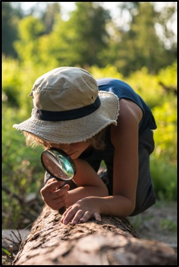
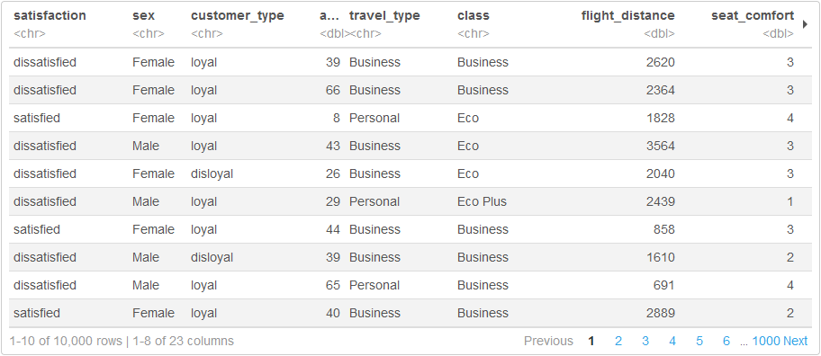
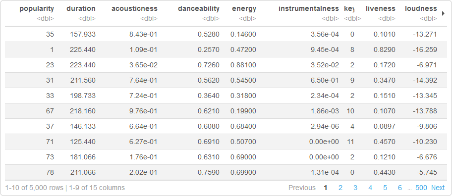
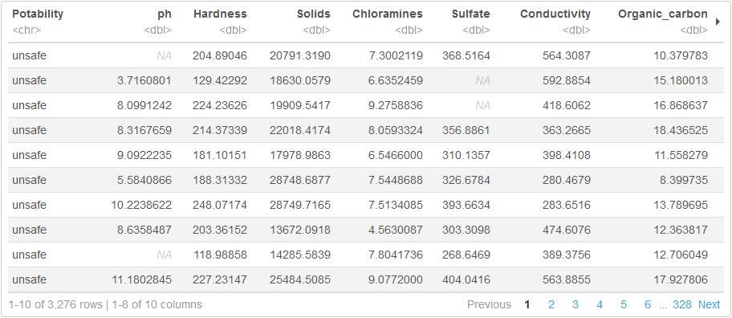

```{r setup, include=FALSE}
options(htmltools.dir.version = FALSE)
knitr::opts_chunk$set(
  fig.width=9, fig.height=3.5, fig.retina=3,
  fig.showtext = TRUE,
  out.width = "100%",
  cache = FALSE,
  echo = TRUE,
  message = FALSE, 
  warning = FALSE,
  hiline = TRUE
)
```

```{r xaringanExtra, echo=FALSE}
xaringanExtra::use_tachyons()
xaringanExtra::use_clipboard()
```

```{r packages, echo=FALSE, message=FALSE}
library(tidyverse)
library(knitr)
library(kableExtra)
library(countdown)
library(patchwork)
library(xaringanthemer)
```

class: inverse, center, middle
# Tidyverse Primer

---
class: onecol

## Projects

.footnote[*Tip.* Save your project in a cloud service folder (e.g., Box or OneDrive) to backup and sync it.]

.left-column.pv3[
```{r projects, echo=FALSE}
# TODO: Replace this image with one of a folder

```

]
.right-column[
-   .imp[Projects] are .b[special folders] on your computer
    -   They contain all files related to a task
    -   They keep everything together and organized

-   Projects make it easy to .b[find and use your files]
    -   No need to specify long, annoying file paths
    -   No need to worry about working directories

-   Projects make it easy to .b[switch between tasks]
    -   They will remember where you left off
]

---
class: onecol

## Communicating with R

.left-column.pv3[
```{r communicating, echo=FALSE}
# TODO: Replace this image with one of a scrapbook

```

]
.right-column[
-   The .imp[console] is like a .b[chat window] with R
    -   You send a command to R and get a response
    -   Neither side of the conversation is saved
    
-   A .imp[script] is like an .b[email thread] with R
    -   You send many commands to R all at once
    -   Only your side of the conversation is saved
    
-   .imp[R Markdown] is like a .b[scrapbook] with R
    -   You can combine code and formatted text
    -   Both sides of the conversation are saved
]

---

## Importing / Exporting

readr

---

## Basic Wrangling

dplyr
  - select
  - tidyselect
  - mutate
  - filter

---

## Pipes and Pipelines

pipes

---

class: inverse, center, middle
# Course Data

---

## Airline Satisfaction (airsat)

```{r, eval=FALSE}
airsat <- readr::read_csv("https://rb.gy/ldq0y4")
```

```{r, echo=FALSE}
airsat <- readr::read_csv("../data/airsat.csv")
```



---

## Airline Satisfaction (airsat)

### Labels

-   **Satisfaction:** `satisfaction` \{dissatisfied, satisfied\}

### Features
.lh-copy[
-   **Customer info:** `sex` \{Female, Male\}, `customer_type` \{disloyal, loyal\}, `age`

-   **Trip info:** `travel_type` \{Business, Personal\}, `class` \{Business, Eco, Eco Plus\}, `flight_distance`

-   **Flight info:** `departure_delay`, `arrival_delay`

-   **Ratings (0–5):** `seat_comfort`, `time_convenience`, `food_drink`, `gate_location`, `inflight_wifi`, `inflight_entertainment`, `online_support`, `ease_booking`, `onboard_service`, `leg_room`, `baggage_handling`, `checkin_service`, `cleanliness`, `online_baording`
]

---

## Spotify Song Popularity (spotify)

```{r, eval=FALSE}
spotify <- readr::read_csv("https://rb.gy/gmzeyv")
```

```{r, echo=FALSE}
spotify <- readr::read_csv("../data/spotify.csv")
```



---

## Spotify Song Popularity (spotify)

### Labels

-   **Popularity:** `popularity` (0, 100)

### Features
.lh-copy[
-   **Timing:** `duration`, `tempo`, `time_signature`

-   **Acoustics:** `energy`, `key`, `loudness`, `mode` \{major, minor\}

-   **Qualities:** `acousticness`, `danceability`, `instrumentalness`, `liveliness`, `speechiness`, `valence`
]

---

## Titanic Passengers (titanic)

```{r, eval=FALSE}
titanic <- readr::read_csv("https://rb.gy/hm7p84")
```

```{r, echo=FALSE}
titanic <- readr::read_csv("../data/titanic.csv")
```


---

## Titanic Passengers (titanic)

### Labels
.lh-copy[
-   **Survival:** `survived` \{0=no, 1=yes\}

-   **Fare Price:** `fare` \[0, 512.329\]
]

### Features
.lh-copy[
-   **Passenger info:** `sex` \{female, male\}, `pclass` \{1=1st Class, 2=2nd Class, 3=3rd Class\}

-   **Family presence:** `sibsp` (\# siblings and spouses), `parch` (\# parents and children)
]

---

## Water Potability (water)

```{r, eval=FALSE}
water <- readr::read_csv("https://rb.gy/sjmiqr")
```

```{r, echo=FALSE}
water <- readr::read_csv("../data/water.csv")
```



---

## Water Potability (water)

### Labels
.lh-copy[
-   **Safety:** `Potability` \{unsafe, safe\}
]

### Features
.lh-copy[
-   **Chemistry:** `ph`, `Hardness`, `Solids`, `Sulfate`, `Conductivity`, `Organic_carbon`, `Turbidity`

-   **Treatment:** `Chloramines`, `Trihalomethanes`
]

---
class: inverse, center, middle
# Time for a Break!
```{r countdown, echo=FALSE}
countdown(
  minutes = 60, 
  seconds = 0, 
  right = "33%", 
  left = "33%",
  bottom = "15%",
  color_background = "white",
  color_text = "black",
  color_running_background = "white",
  color_running_text = "black",
  warn_when = 120
)
```
