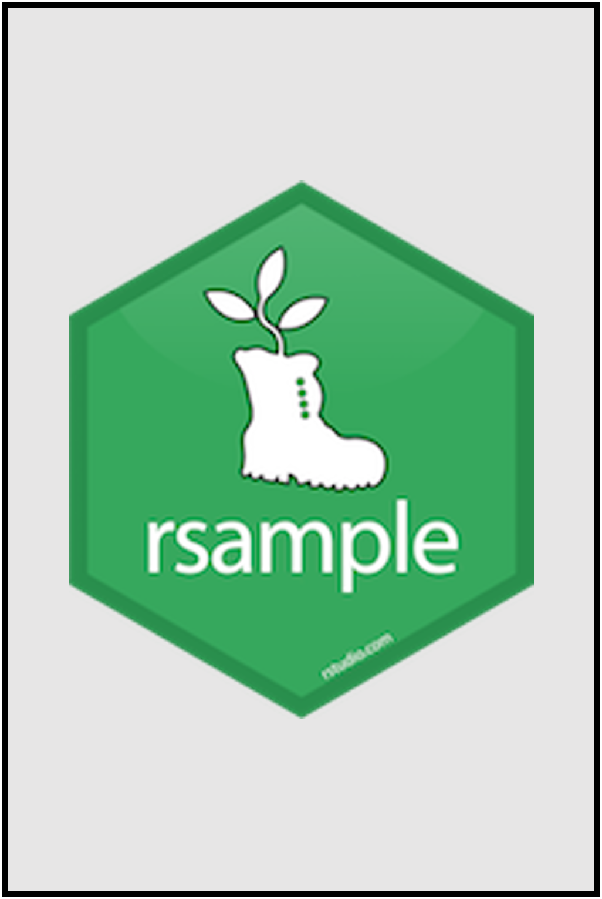
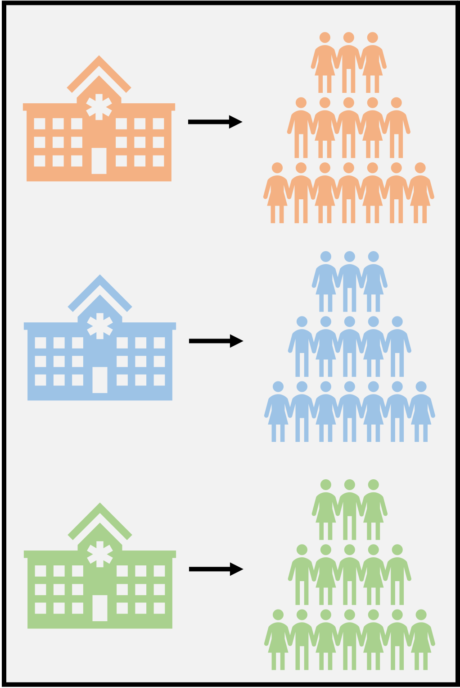

```{r setup, include=FALSE}
options(htmltools.dir.version = FALSE)
knitr::opts_chunk$set(
  fig.width=9, fig.height=3.5, fig.retina=3,
  fig.showtext = TRUE,
  out.width = "100%",
  cache = FALSE,
  echo = TRUE,
  message = FALSE, 
  warning = FALSE,
  hiline = TRUE,
  comment = "#>",
  collapse = TRUE
)
```

```{r xaringan-themer, include=FALSE, warning=FALSE}
library(xaringanthemer)
```

```{r xaringanExtra, echo=FALSE}
xaringanExtra::use_tachyons()
xaringanExtra::use_clipboard()
```

```{r packages, echo=FALSE, message=FALSE}
library(tidyverse)
library(knitr)
library(kableExtra)
library(countdown)
library(patchwork)
```

class: inverse, center, middle
# Overview

---
class: onecol
## Motivation

There are **several steps** in the machine learning workflow.

These include data exploration, engineering, model development, and evaluation.

We have a .imp[finite amount of data] to work with for each of these tasks.

--

<p style="padding-top:30px;">Reusing the same data for multiple tasks increases risk of .imp[overfitting].

---
class: onecol
count: false

## (a brief reminder about overfitting)

```{r overmeme, echo=FALSE}
include_graphics("../figs/overfitting_lay.png")
```

---
class: onecol
count: false
## Motivation

There are **several steps** in the machine learning workflow.

These include data exploration, engineering, model development, and evaluation.

We have a .imp[finite amount of data] to work with for each of these tasks.

<p style="padding-top:30px;">Reusing the same data for multiple tasks increases risk of .imp[overfitting].

--

It also reduces **generalizability** to future datasets or prediction problems.

We may not get a **true understanding** of our model's accuracy or effectiveness.

---
class: twocol
## A Data Budget

.left-column.pv3[
```{r spending, echo=FALSE}

```
]

.right-column[

Using all the data at once **causes many problems in ML**.

However, these can be addressed by **budgeting our data**.

We can **spend our data** on different tasks in the ML workflow.

This is particularly important in **model development to evaluation**.

In smaller datasets, there may be **overlap** in how we spend our data.

We need **strong methods** for how to spend data in different tasks.

]

---
class: twocol
## Avoiding Data Leaks

.left-column.pv3[
```{r, echo=FALSE}
include_graphics('../figs/leak.jpg')
```
]

.right-column[

All data is a mix of the true data-generating process and random noise<sup>1</sup>.

The modeling process includes many **decision points**. 

Which features to include? What algorithm to use?

There is risk of .imp[leaking information] from model training to evaluation.

This artificially **inflates optimism about model accuracy**.

Carefully spending data for training or testing prevents .imp[data leakage].

]

.footnote[
[1] *Data generating process* refers to the signal we want to capture - the underlying processes that gives rise to the data that we observe. *Random noise* refers to error (e.g., sampling error) we do not want to model.
]

---
class: inverse, center, middle
# Countering Overfitting

---
class: onecol
## Cross-Validation
There are some clever algorithmic tricks to prevent overfitting

- For example, we can penalize the model for adding complexity

The main approach, however, is to use .imp[cross-validation]:

--

- Multiple **fully independent** sets of data are created (by subsetting or resampling)

- Some sets are used for training (and tuning) and other sets are used for testing

- **Model evaluation is always done on data that were not used to train the model**

- This way, if performance looks good, we can worry less about variance/overfitting

--

.bg-light-yellow.b--light-red.ba.bw1.br3.ph4[
**Caution:** We still need to consider whether the original data was representative!
]

---
## Holdout Cross-Validation
```{r, echo=FALSE}
include_graphics("../figs/holdout.png")
```

---
## Holdout Cross-Validation
```{r, echo=FALSE}
include_graphics("../figs/holdout2.png")
```

---
## Comprehension Check \#1
<span style="font-size:30px;">Bogdan collects data from 1000 patients. He assigns patients 1 to 800<br />to be in his training set and patients 700 to 1000 to be in his testing set.</span>

.pull-left[
### Question 1
**What major mistake did Bogdan make?**

a) He used a testing set instead of a holdout set

b) Some patients are in both training and testing

c) The two subsets of data have different sizes

d) He did not use k-fold cross-validation 
]

.pull-right[
### Question 2
**Which step should not be done in the training set?**

a) Exploratory Analysis

b) Feature Engineering

c) Model Development

d) Model Evaluation
]

---
class: inverse, center, middle

## Holdout Cross-Validation in R

---
## Example Dataset: `titanic`

.pull-left[
**Rows:** 963 passengers&emsp;&emsp;**Columns:** 7 variables

Variable | Description
:------- | :----------
survived&emsp; | Did passenger survive? {FALSE, TRUE}&emsp; 
pclass | Passenger class {1st, 2nd, 3rd}
sex | Passenger sex {female, male}
age | Passenger age (years)
sibsp | Siblings and spouses Aboard (\#)
parch | Parents and children Aboard (\#)
fare | Cost of passenger fare ($)
]

--

.pull-right.pv4[
```{r, message=FALSE}
library(tidyverse)
library(tidymodels)

# resolve package conflicts
tidymodels_prefer()

# load titanic data
titanic <- read_csv(
  "https://rb.gy/hm7p84"
)
```
]

---
count: false

## Example Dataset: `titanic`

.pull-left[
**Rows:** 963 passengers&emsp;&emsp;**Columns:** 7 variables

Variable | Description
:------- | :----------
survived&emsp; | Did passenger survive? {FALSE, TRUE}&emsp; 
pclass | Passenger class {1st, 2nd, 3rd}
sex | Passenger sex {female, male}
age | Passenger age (years)
sibsp | Siblings and spouses Aboard (\#)
parch | Parents and children Aboard (\#)
fare | Cost of passenger fare ($)
]

.pull-right.pv4[
```{r, message=FALSE, eval = FALSE}
library(tidyverse)
library(tidymodels)

# resolve package conflicts
tidymodels_prefer()

# load titanic data
titanic <- read_csv(
  "tinyurl.com/titanic-pm"
)
```
]


---
class: onecol
## Simple Random Split

The simplest way to perform **holdout cross-validation** is by randomly splitting the data. 

One portion of the data is allocated for model training, and another for testing. 

Deciding on the proportion of data to split is very context-dependent.

--

<p style="padding-top:30px;">Too little data in the training set makes it difficult to **accurately estimate parameters**.

Too little data in the test set reduces **quality of model performance estimates**.

--

.bg-light-green.b--dark-green.ba.bw1.br3.ph4[
**Advice:** It is common to use 80% for training and 20% for testing.
]

---
class: twocol
## Simple Random Split in R

.left-column[
<br />
```{r, echo = FALSE}

```
]

.right-column[
We will use the {rsample} package from {tidymodels}. 

The `initial_split()` function was built for this purpose.

Its simplest use case requires 2 arguments: 

- `data`: the dataframe to be split.
- `prop`: the proportion of data to be used for training.
]
 
---
class: onecol
## Live Coding: Simple Random Split in R
```{r, message = FALSE}
# set random seed so results are reproducible
set.seed(2022) 

# create and save an 80/20 data split
titanic_split_simple <- initial_split(data = titanic, prop = 0.80)
```

--

<p style="padding-top:30px;">This output shows the amount of training, testing, and total data.

The resulting `initial_split` object **only contains partitioning information**.

---
class: onecol
## Live Coding: Simple Random Split in R

To get the actual training and testing data subsets, we need two more functions.

We will use the `training()` and `testing()` functions, also from {rsample}.

--

```{r, message = FALSE}
# create training set 
titanic_train_simple <- training(titanic_split_simple)

# create testing set 
titanic_test_simple <- testing(titanic_split_simple)
```

---
class: onecol
## Stratified Sampling 

While simple random sampling is sometimes sufficient, there are often exceptions. 

**Class imbalance**<sup>1</sup> (classification) and highly **skewed data** (regression) may cause issues.

Most machine learning algorithms work best when classes are of equal size. 

.footnote[
[1] Class imbalance refers to a categorical variable in which one class occurs much more frequently than others (e.g., a dataset with 90% healthy cases and 10% disease cases).
]

--

<p style="padding-top:30px;"> Random sampling may result in vastly **different distributions** between data subsets.

This can result in poor model performance (particularly for the **minority class**). 

It is important for data subsets to be representative of the whole dataset.

---
class: onecol
## Stratified Sampling

As a solution, .imp[stratified sampling] can be used instead of simple random sampling. 

For classification problems, we conduct **data splits separately within each class**. 

For regression problems, we **bin the outcome into quartiles** and sample within each.

--

<p style="padding-top:30px;">These **stratified samples are combined** together for overall training and testing sets. 

This ensures that the **distribution of the outcome variable** is preserved.

--

.bg-light-yellow.b--light-red.ba.bw1.br3.ph4[
**Caution:** We still need to ensure the sample distribution matches the population!
]

---
class: onecol
## Live Coding: Stratified Sampling in R

To create a stratified random sample, we can use the same `initial_split()` function.

We will use the `strata` argument to name the variable to stratify on.

--

```{r, message = FALSE}
set.seed(2022)

# create initial stratified split
titanic_split_strat <- initial_split(data = titanic, 
                                     prop = 0.8, 
                                     strata = 'survived')

# create training and testing sets
titanic_train_strat <- training(titanic_split_strat)
titanic_test_strat <- testing(titanic_split_strat)
```

---
class: inverse, center, middle
# Additional Considerations

---
class: twocol
## What about Validation Sets?

.left-column[
<br />
```{r, echo=FALSE}
include_graphics('../figs/validation.png')
```
]

.right-column[
We don't have to **wait until the test set** to evaluate our model.

It can be helpful to get a performance estimate **during model training**.

.imp[Validation sets]<sup>1</sup> provide a third split of the dataset to do so.

This can warn us about **overfitting** before we get to the test set.

This is most often useful when tuning model **hyperparameters**.

Validation sets can also be embedded in more **advanced CV methods**.

.footnote[
"Testing" and "validation" sets are often used interchangeably, but they refer to different splits of the data that are used for different purposes.
]
]

---
class: twocol
## What about Multilevel Data?

.left-column[
<br />
```{r, echo=FALSE}

```
]

.right-column[
Observations in multilevel data are not .imp[independent]. 

**Random resampling of rows** may cause biased train/test sets<sup>1</sup>.

Resampling should occur at the **level of the experimental unit**.

In this case, resampling would be at the level of **hospitals**. 

{tidymodels} has a development version of a function to create an initial split of multilevel data.

]

.footnote[
[1] For example, some patients from hospital 1 may end up in the training set and others in the testing set).
]

---
class: onecol
## What about Multilevel Data?

You can access the development function `group_initial_split()` from [github](https://github.com/tidymodels/rsample).

```{r, eval = FALSE}
# install.packages("devtools")
library(devtools)
install_dev("rsample")
```

--

<p style="padding-top:30px;">The `group_initial_split()` function has three arguments:
- `data`: dataset

- `group`: group to split on (e.g.. hospitals)

- `prop`: proportion of data to use for training


---
class: twocol
## What about Time Series Data?

.left-column[
<br />
```{r, echo=FALSE}
include_graphics('../figs/time.png')
```
]

.right-column[
Random resampling is also not appropriate for **time series data**.

.imp[Data from the future] can't be used to predict the past! 

Rather, it is typical to use the most **recent data** for a test set. 
]

---
class: twocol
count: false
## What about Time Series Data?

.left-column[
<br />
```{r, echo=FALSE}
include_graphics('../figs/time.png')
```
]

.right-column[
Random resampling is also not appropriate for **time series data**.

.imp[Data from the future] can't be used to predict the past! 

Rather, it is typical to use the most **recent data** for a test set. 

The {rsample} package has a function for **splitting time series data**.

`initial_time_split()`:
- `data`: dataset
- `prop`: proportion of first part of data for training
- `lag`: lag value if using lagged predictors 
]

---
class: onecol
## Coming Soon (Preview)

Today we reviewed the rationale for .imp[separating model training from model testing]. 

We learned various methods for **holdout cross-validation (CV)**: 
- Simple random split
- Stratified sampling
- Validation set
- Multilevel data
- Time series data

However, in practice, we might not want to limit ourselves to a **single test set**. 

What if we could create **multiple test sets** to evaluate our model many times? 

Tomorrow will cover advanced methods for **k-fold CV** and **nested CV**.

---
class: inverse, center, middle
# Time for a Break!
```{r countdown, echo=FALSE}
countdown(
  minutes = 10, 
  seconds = 0, 
  right = "33%", 
  left = "33%",
  bottom = "15%",
  color_background = "white",
  color_text = "black",
  color_running_background = "white",
  color_running_text = "black",
  warn_when = 60
)
```
