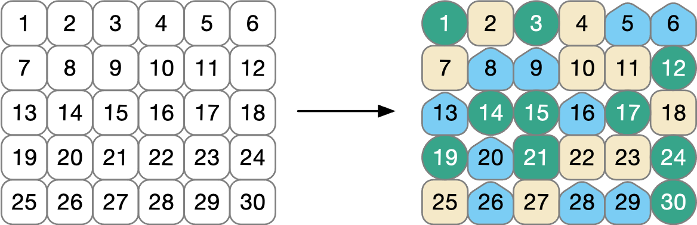
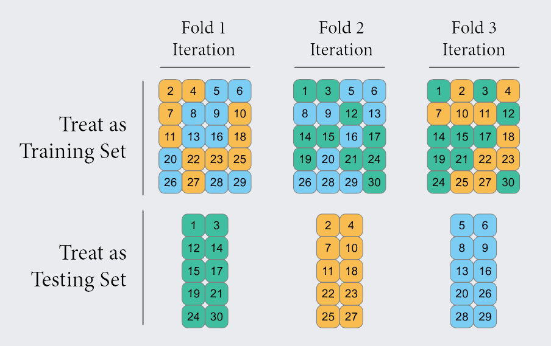
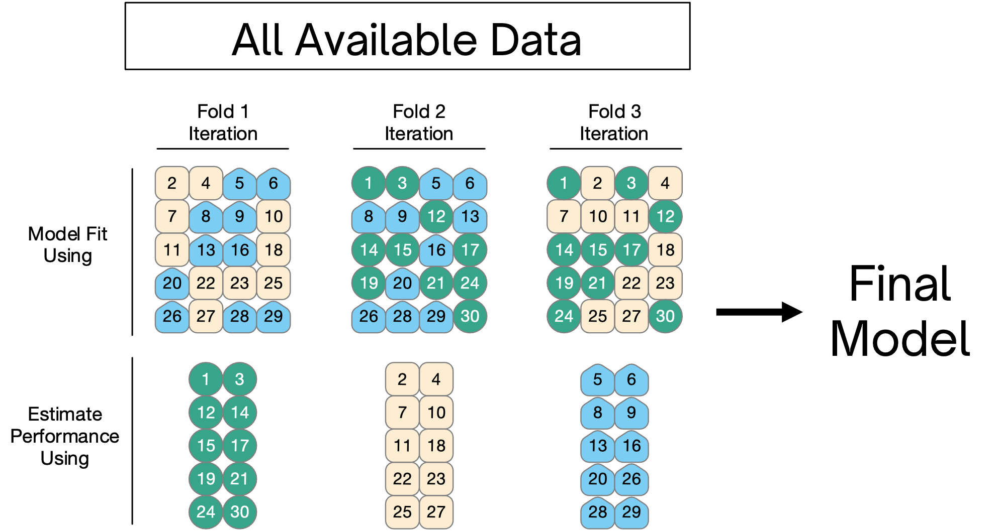
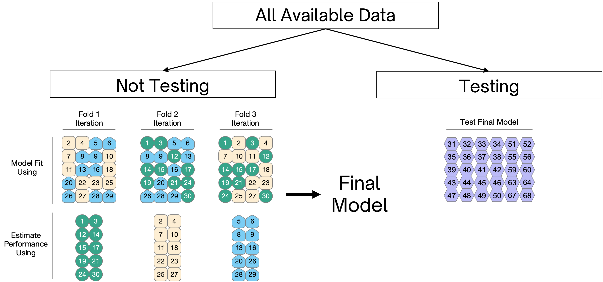
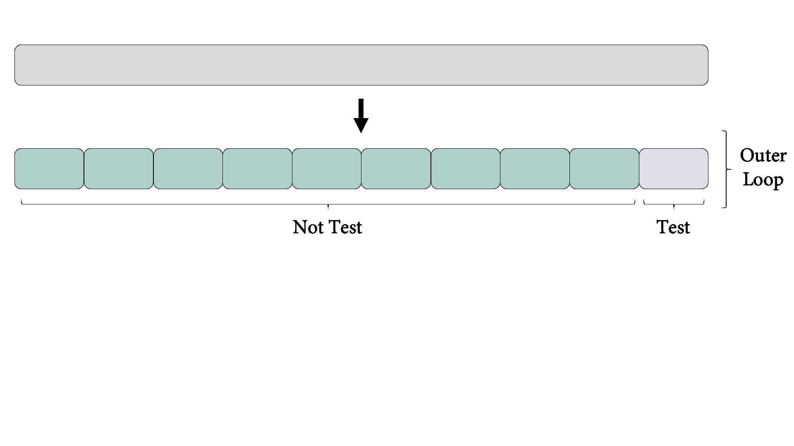

```{r setup, include=FALSE}
options(htmltools.dir.version = FALSE)
knitr::opts_chunk$set(
  fig.width=9, fig.height=3.5, fig.retina=3,
  fig.showtext = TRUE,
  out.width = "100%",
  cache = FALSE,
  echo = TRUE,
  message = FALSE, 
  warning = FALSE,
  hiline = TRUE,
  comment = "#>",
  collapse = TRUE
)
```

```{r xaringan-themer, include=FALSE, warning=FALSE}
library(xaringanthemer)
```

```{r xaringanExtra, echo=FALSE}
xaringanExtra::use_tachyons()
xaringanExtra::use_clipboard()
```

```{r packages, echo=FALSE, message=FALSE}
library(tidyverse)
library(knitr)
library(kableExtra)
library(countdown)
library(patchwork)
```

class: inverse, center, middle
# Overview

---
class: onecol
## Motivation

Yesterday, we introduced the rationale for **holdout cross-validation**. 

--

```{r, echo=FALSE, out.width = "70%"}
include_graphics("../figs/holdout.png")
```

--

This is a good first step! 

However, we often want model performance *before getting to the final test set*.

---
class: onecol
## Plan for Today

Today's focus is on advanced cross-validation methods, including: 

- *k*-fold cross-validation

- repeated *k*-fold cross-validation 

- leave-one-out cross-validation (LOOCV)

- nested cross-validation

--

All CV methods will be performed with {rsample} and {tune}.

---
class: inverse, center, middle
# k-fold Cross-Validation

---
## k-fold Cross-Validation
<br>
```{r, echo=FALSE, out.width = "95%"}

```

---
count: false
## k-fold Cross-Validation
.center[
```{r, echo=FALSE, out.width="70%"}

```
]

---
class: onecol
## k-fold Cross-Validation

The final resampling performance estimate is averaged across each *k* fold.

k-fold cross-validation can also be .imp[stratified] to keep the sets relatively similar.

k-fold cross-validation can also be .imp[repeated] to avoid problems with any single split.

--

<p style="padding-top:30px;">How many folds should be used in cross-validation?

Larger values of *k* result in resampling estimates with **lower bias** but **higher variance**. 

Smaller values of *k* result in estimates with **higher bias** but **lower variance**.

--

.bg-light-green.b--dark-green.ba.bw1.br3.pl4[
**Advice**: In practice, values of *k* = 5 or *k* = 10 are most common.
]

---
class: onecol
## k-fold Cross-Validation in R 

We will use the `vfold_cv()` function from {rsample}<sup>1</sup>.

Argument | Description
:------- | :----------
data | The data frame
v | The number of partitions to create (default = 10)
repeats | The number of times to repeat the v-fold partitioning (default = 1)
strata | Variable to conduct stratified sampling (default = NULL)


.footnote[
[1] Note that {tidymodels} refers to k-fold as v-fold CV. These refer to the same resampling process!
]

---
class: onecol
## k-fold Cross-Validation in R

Let's perform 10-fold cross-validation repeated 3 times using the `affect` dataset.

--

.scroll40[
```{r}
library(tidymodels)
affect <- read_csv("../data/affect.csv")

affect_folds <- vfold_cv(affect, v = 10, repeats = 3)
affect_folds
```
]

--

The `splits` column contains information on how to split the data. 

`[297/33]` indicates N = 297 in the analysis set and N = 33 in that particular k-fold.  

---
class: onecol
## k-fold Cross-Validation in R

We can extract individual resampled data folds with `analysis()` and `assessment()`.

--

.scroll40[
```{r}
affect_folds$splits[[1]] %>% analysis()

affect_folds$splits[[1]] %>% assessment()

```
]

--

However, we generally don't need to extract the individual folds.

{tune} has built-in functions that can use a `vfold_cv` object directly:

- `fit_resamples()` estimates model performance across resamples **with no tuning**.

- `tune_grid()` estimates model performance across resamples **with tuning**.

---
class: onecol
## Resampling Options 

There are three possible interfaces to `fit_resamples()` and `tune_grid()`:

```{r, eval = FALSE}
model_spec %>% fit_resamples(formula, resamples, ...)

model_spec %>% fit_resamples(recipe, resamples, ...)

workflow %>% fit_resamples(resamples, ...)
```

--

There are also a number of optional arguments, including:

- `metrics`: performance statistics to compute<sup>1</sup>

- `control`: a list created by `control_resamples()` or `control_grid()` with various options

.footnote[
[1] Regression default metrics are RMSE and $R^2$. Classification default metrics are AUROC and overall accuracy.
]

---
class: onecol
## Resampling Options 

The `control` argument to `fit_resamples()` can be configured by `control_resamples()`<sup>1</sup>:

Argument | Description
:------- | :----------
verbose | Whether to print progress (default = FALSE) 
save_pred | Whether to save out-of-sample predictions per *k* fold (default = FALSE)
event_level | For classification only; specify which level is considered the "event" (`"first"` or `"second"`)
extract | An optional function to retain model objects≈
oiuyt vbl,./


.footnote[
[1] The same list can be created for `tune_grid()` by `control_grid()`.
]

---
class: onecol
## Leave-One-Out Cross-Validation

The most extreme variation of k-fold CV is when $k = N-1$.

This is called .imp[leave-one-out cross-validation].

A model is trained on $N-1$ rows and used to predict a **single held-out observation**.

--

<p style="padding-top:30px;"> The {rsample} package has a `loo_cv()` function that performs LOOCV.

However, these objects are not well integrated into the broader tidymodels framework.

LOOCV is **computationally expensive** and may have poor statistical properties.

--

.bg-light-yellow.b--light-red.ba.bw1.br3.pl4[
LOOCV is not generally recommended. It's usually better to stick with k-fold CV.
]


---
class: twocol
## Should we use a separate test set?

--

.pull-left[
k-fold CV is often used on a .imp[full data set]. 

**Pro**: All data used for training and testing.

**Con**: No true test set the model hasn't seen. 
]

---
class: twocol
count: false
## Should we use a separate test set?
.pull-left[
k-fold CV is often used on a .imp[full data set]. 

**Pro**: All data used for training and testing.

**Con**: No true test set the model hasn't seen. 

```{r, echo = FALSE, out.width = "85%"}

```
]

--
.pull-right[
Others advocate for a .imp[held-out test set].

**Pro**: Final models are tested on new data.  

**Con**: Decision-making from a single test set.
]

---
class: twocol
count: false
## Should we use a separate test set?

.pull-left[
k-fold CV is often used on a .imp[full data set]. 

**Pro**: All data used for training and testing.

**Con**: No true test set the model hasn't seen. 

```{r, echo = FALSE, out.width = "85%"}

```
]

.pull-right[
Others advocate for a .imp[held-out test set].

**Pro**: Final models are tested on new data.  

**Con**: Decision-making from a single test set.

```{r, echo = FALSE, out.width = "110%"}

```
]

--

.bg-light-green.b--dark-green.ba.bw1.br3.pl4[
**Advice**: A good default is to use 10-fold CV, repeated 3 times, on the entire dataset. 
]

---
class: onecol
## Should we use a separate test set? 

<br>

####...all that being said, there *is* an option that gives us the best of both worlds!


---
class: inverse, center, middle
# Nested Cross-Validation

---
class: onecol
## Nested Cross-Validation 

Nested cross-validation adds an additional layer of resampling. 

This separates the model **tuning**<sup>1</sup> from the model evaluation process.

It also frees us from having to rely on a **single** test set to evaluate our model.

.footnote[
[1] We'll discuss model tuning in detail tomorrow!
]

--

<p style="padding-top:30px;">There are **two layers** of resampling in nested CV.

The .imp[outer loop] splits the full data set into not-testing and testing sets.

The .imp[inner loop] splits the training data set into model training and validation sets.

---
class: onecol
## Nested Cross-Validation

For every split of the outer loop, a **full inner resampling split** is conducted. 

Let's say we use 10-fold CV on the **outer loop** and 5-fold CV on the **inner loop**.

This would be a total of .imp[500 models] being fit! 

--

<p style="padding-top:30px;">In this case, **hyperparameter tuning** is performed within each inner loop.

A model is then **fit to each outer split** with the best parameter from that resample.

Results are averaged across all outer splits for an **unbiased estimate of the model**.

---
## Nested Cross-Validation

```{r xaringanExtra-freezeframe, echo = FALSE, out.width = "90%"}
xaringanExtra::use_freezeframe(trigger = "click", responsive = FALSE)

```

---
class: onecol
## Nested CV in R: The good news!

The `nested_cv()` function in {rsample} splits data for nested cross-validation<sup>1</sup>.

.footnote[
[1] This is an amazing addition to {tidymodels} beyond {caret}! 
]

--
<br> 

Argument | Description
:------- | :----------
data | The data frame
outside | The outside resampling specification (can be an existing resampled object)
inside | The inside resampling specification (e.g., `vfold_cv()`)

---
class: onecol
## Nested CV in R

Let's run nested CV with 10 outer folds and 5 inner folds in the `affect` dataset.

--

.scroll40[
```{r}
affect_folds_nested <- nested_cv(affect, 
                                 outside = vfold_cv(v = 10),
                                 inside = vfold_cv(v = 5))
affect_folds_nested
```
]

---
class: onecol
## Nested CV in R: The less-good news

Unfortunately, nested cross-validation is not yet fully supported in tidymodels. 

`fit_resamples()` does not work for nested cross-validation<sup>1</sup>.

If you want to use nested cross-validation, you will need to write your own functions.

.footnote[
[1] Though it works great for regular k-fold CV!
]

--

<p style="padding-top:30px;"> Example code can be found on the [tidymodels website](https://www.tidymodels.org/learn/work/nested-resampling/).

This is a bit complicated, so we will stick to using **repeated k-fold CV** for this course. 

But if you are ready to for a challenge, we highly encourage looking into nested CV!

---
class: inverse, center, middle
# Time for a Break!

