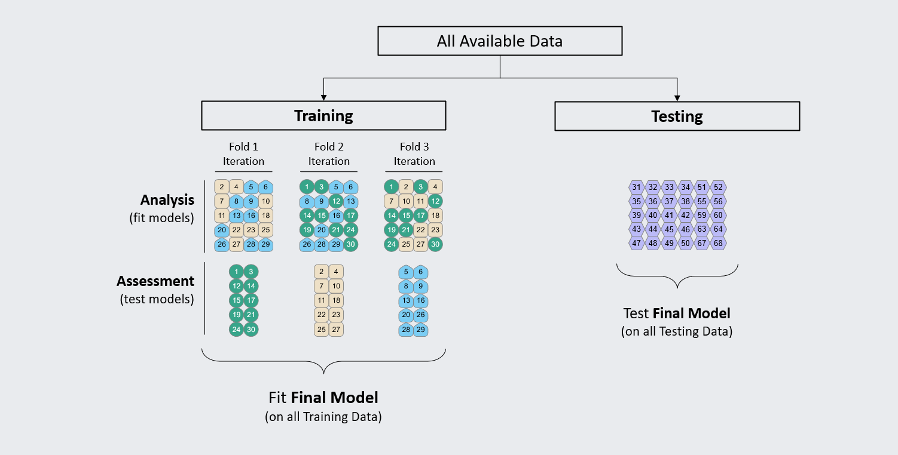

```{r setup, include=FALSE}
options(htmltools.dir.version = FALSE)
knitr::opts_chunk$set(
  fig.width=9, fig.height=3.5, fig.retina=3,
  fig.showtext = TRUE,
  out.width = "100%",
  cache = FALSE,
  echo = TRUE,
  message = FALSE, 
  warning = FALSE,
  hiline = TRUE,
  comment = "#>",
  collapse = TRUE
)
```

```{r xaringan-themer, include=FALSE, warning=FALSE}
library(xaringanthemer)
```

```{r xaringanExtra, echo=FALSE}
xaringanExtra::use_tachyons()
xaringanExtra::use_clipboard()
xaringanExtra::use_tile_view()
```

```{r packages, echo=FALSE, message=FALSE}
library(tidyverse)
library(knitr)
library(kableExtra)
library(countdown)
library(patchwork)
```

class: inverse, center, middle
# Overview

---
class: onecol
## Plan for Today

Thus far, we have learned {rsample}, {workflows}, {recipes}, {yardstick}, and {parsnip}.

This lecture aims to tie it all together and .imp[build a model from start to finish].

--

<p style="padding-top:30px;">We will adapt **familiar classification algorithms** to a predictive modeling framework.

This will **ease the transition to ML** and highlight its similarities with classical statistics.

Finally, we have a **hands-on coding activity** to build your own predictive model.

---
class: onecol
## Applied Example

Let's put what we learned into practice in R! 

Let's train a classification model on the `titanic` data to predict survival.

--

<p style="padding-top:30px;">We will: 

- Load the data

- Create a recipe for feature engineering

- Train a classification model to predict if each passanger survived the titanic

- Evaluate the model using 10-fold cross-validation 

- Interpret the model 

---
class: onecol
## Load Data, Create Splits and Recipe

.scroll.h-0l[
```{r}
library(tidyverse)
library(tidymodels)
titanic <- read_csv("https://tinyurl.com/titanic-pm")

set.seed(2023) 
surv_split <- initial_split(titanic, prop = 0.8, strata = survived)
surv_train <- training(surv_split)
surv_test <- testing(surv_split)

surv_recipe <- 
  recipe(surv_train, formula = survived ~ .) %>%
  step_naomit(survived) %>% 
  step_mutate(
    survived = factor(survived),
    pclass = factor(pclass),
    sex = factor(sex)
  ) %>% 
  step_dummy(all_nominal_predictors()) %>%
  step_impute_linear(age, fare) %>%
  step_nzv(all_predictors()) %>%
  step_corr(all_predictors()) %>%
  step_lincomb(all_predictors()) %>% 
  step_normalize(all_numeric_predictors())
```
]

---
class: onecol
## Specify Model with {parsnip}

```{r}
# Specify Model
log_reg <- logistic_reg() %>% 
  set_engine("glm") %>%
  set_mode("classification")

log_reg
```

---
class: onecol
## Build Workflow with {workflows}

.scroll.h-0l[
```{r}
surv_wflow <- 
  workflow() %>%
  add_model(log_reg) %>%
  add_recipe(surv_recipe)

surv_wflow
```
]

---
class: onecol
## Configure Resampling

```{r}
set.seed(2022)

# configure resampling
surv_folds <- vfold_cv(
  data = surv_train,
  v = 10, 
  repeats = 3,
  strata = survived
)
```

--

The goal of `fit_resamples()` is to .imp[estimate model performance]. 

Therefore, by default, the models trained are not saved or used later.

---
class: onecol
## Configure Resampling

To save each predictions from each resampled model, we need to specify it in `control_resamples()`: 

--

```{r}
# save predictions from resampling
keep_pred <- control_resamples(save_pred = TRUE)
```

---
class: onecol
## Fit Model with Resampling

Now that we've set the workflow & configured resampling, we're ready to fit the model! 

--

.scroll.h-1l[
```{r}
# train the model using the recipe, data, and method 
surv_fitr <- 
  surv_wflow %>%
  fit_resamples(
    resamples = surv_folds, 
    control = keep_pred
  )

surv_fitr
```
]

---
class: twocol
## Fit Model with Resampling

.pull-left[
```{r, echo = FALSE}

```
]

.pull-right[
Note: we are resampling the **training set**.

This means that we have analysis and assessment sets (N = 30). 

We will obtain performance metrics for each assessment set. 

We can average performance metrics across all resamples.

These averages serve as a preview for model evaluation. 
] 

---
class: onecol
## Performance during Cross-Validation

The object created by `fit_resamples()` will contain lots of information.

We can view the predictions made in each assessment set with `collect_predictions()`.

--

```{r, eval = FALSE}
collect_predictions(surv_fitr)
```

```{r, echo = FALSE}
collect_predictions(surv_fitr) %>% kable() %>% scroll_box(height = "300px")
```

---
class: onecol
## Performance during Cross-Validation

We can view a summary of the CV performance with `collect_metrics()`<sup>1</sup>.

.footnote[
[1] To see metrics for each fold, include `summarize = FALSE` in `collect_metrics()`.
]

--

```{r, eval = FALSE}
collect_metrics(surv_fitr)
```


```{r, echo = FALSE}
collect_metrics(surv_fitr) %>% kable()
```

--

These accuracy and AUC values look pretty good! 

---
class: onecol
## Performance during Cross-Validation

Let's look at a .imp[confusion matrix] for a better understanding of model performance.

```{r, eval = FALSE}
surv_cm <- collect_predictions(surv_fitr) %>%
  conf_mat(truth = survived, estimate = .pred_class)

autoplot(surv_cm, type = "mosaic")
autoplot(surv_cm, type = "heatmap")
```

--

.pull-left[
```{r, echo = FALSE}
surv_cm <- 
  collect_predictions(surv_fitr) %>%
  conf_mat(truth = survived, estimate = .pred_class)

autoplot(surv_cm, type = "mosaic")
```
]

.pull-right[
```{r, echo = FALSE}
autoplot(surv_cm, type = "heatmap")
```
]

---
class: onecol
## Performance during Cross-Validation

Finally, let's calculate all confusion matrix metrics. 

```{r, eval = FALSE}
summary(surv_cm)
```

```{r, echo = FALSE}
summary(surv_cm) %>% kable() %>% scroll_box(height = "300px")
```

---
class: inverse, center, middle
# Model Interpretation

---
class: onecol
## Model Interpretation 

Predictive **accuracy** is emphasized in ML over interpretability and inference

- The main goal of most applied ML studies is to **quantify performance**

--

But, we can get insight into an algorithm's decision-making via .imp[variable importance]. 

- Variable importance shows how much a model "uses" features to make  predictions.

- As a model usually used for inference, logistic regression has strong interpretability

- However, other models (e.g., random forests) are less directly interpretable.

- Variable importance is helpful for understanding what's going on in models.

--

The `vip()` function in the {vip} package illustrates variable importance for ML models.


.footnote[
See a full list of how {vip} creates variable importance scores [here](https://koalaverse.github.io/vip/reference/vi_model.html): 
]

---
class: onecol
## Variable Importance

{vip} requires a **final model**, so we can re-fit a logistic regression on the full dataset.

--

```{r}
library(vip)

# fit final model using the workflow specified previously
surv_final <- 
  surv_wflow %>% 
  last_fit(surv_split)
```

---
class: onecol
## Variable Importance

From this final model, we can **extract the fit** and visualize the most important features. 

--

```{r, out.width = "90%"}
surv_final %>% extract_fit_parsnip() %>% vip()
```

---
class: onecol 
## Hands-On Coding Activity

Today we've gone through a **full walkthrough** of building a predictive model.

Now it's time to practice the methods we've learned! 

In this hands-on activity, you will build a regression model from start to finish.

<p style="padding-top:30px;">You can find the activity at https://pittmethods.github.io/ under `Day 2D - Activity`.

If you have questions, please post them in the chat or Slack channel. 


---
class: inverse, center, middle
# End of Day 2 

