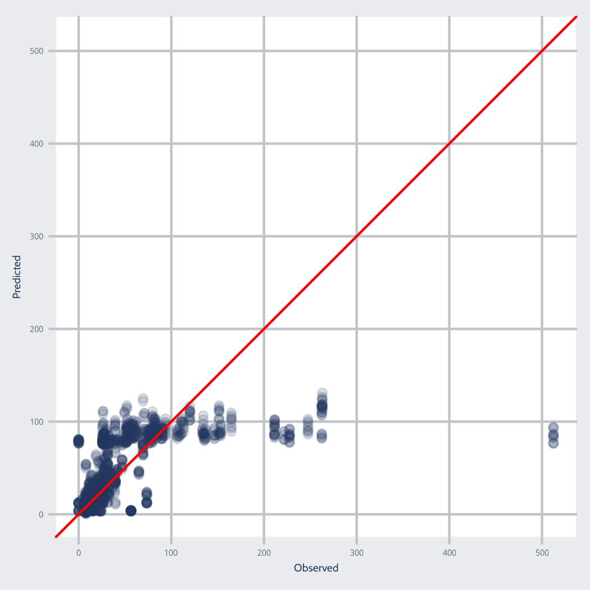

```{r setup, include=FALSE}
options(htmltools.dir.version = FALSE)
knitr::opts_chunk$set(
  fig.width=9, fig.height=3.5, fig.retina=3,
  fig.showtext = TRUE,
  out.width = "100%",
  cache = FALSE,
  echo = TRUE,
  message = FALSE, 
  warning = FALSE,
  hiline = TRUE,
  comment = "#>",
  collapse = TRUE
)
```

```{r xaringan-themer, include=FALSE, warning=FALSE}
library(xaringanthemer)
```

```{r xaringanExtra, echo=FALSE}
xaringanExtra::use_tachyons()
xaringanExtra::use_clipboard()
xaringanExtra::use_tile_view()
```

```{r packages, echo=FALSE, message=FALSE}
library(tidyverse)
library(knitr)
library(kableExtra)
library(countdown)
library(patchwork)
```

class: inverse, center, middle
# Overview

---
class: onecol
## Motivation

-   Yesterday, we introduced the rationale for **holdout set validation**

  -   To avoid overfitting, we evaluate performance on completely **unseen** data

--

-   However, we often want to check performance *during model development*

  -   This becomes especially important during tuning (discussed tomorrow)

  -   If we use the testing set now, then it won't be "unseen" later...

--

-   What do we do if we aren't ready to go to the testing set yet?

  -   We can take our *training set* and partition or resample it

  -   We then fit models on some parts and evaluate their performance on other parts

---
class: onecol
## Lecture Plan

There are various ways to do this partitioning/resampling

-   Cross-validation

-   Bootstrapping

This lecture is about several cross-validation methods, including: 

- $k$-fold cross-validation

- repeated $k$-fold cross-validation 

- leave-one-out cross-validation (LOOCV)

- nested cross-validation

---
class: inverse, center, middle
# $k$-fold Cross-Validation

---
## $k$-fold Cross-Validation
<br>
```{r, echo=FALSE, out.width = "95%"}
include_graphics("../figs/kfold1.png")
```

---
count: false
## $k$-fold Cross-Validation
.center[
```{r, echo=FALSE, out.width="70%"}
include_graphics("../figs/kfold2.png")
```
]

---
class: onecol
## $k$-fold Cross-Validation

Our resampling performance estimate is averaged across each *k* fold.

$k$-fold CV can also be .imp[stratified] to keep the folds relatively similar.

$k$-fold CV can also be .imp[repeated] to avoid problems with any single split.

--

<p style="padding-top:30px;">How many folds should be used in cross-validation?

-   Higher $k$ results in resampling estimates with **lower bias** but **higher variance**. 

-   Lower $k$ results in estimates with **higher bias** but **lower variance**.

--

.bg-light-green.b--dark-green.ba.bw1.br3.pl4[
**Advice**: The bias-variance trade-off is optimized around $k=10$, but researchers sometimes use $k=5$ when their $N$ is small (to make the assessment sets larger).
]

---

## Our Recommended Analysis Scheme

```{r, echo=FALSE, out.width="75%"}
include_graphics("../figs/kfold4_jg.png")
```

.footnote[*Note.* We recommend $k=10$ but are showing 3 folds for visual simplicity.]

---
class: onecol
## $k$-fold Cross-Validation in R 

We will use the `vfold_cv()` function from {rsample}<sup>1</sup>.

| Argument | Description |
|:-------- | :---------- |
| data     | The data frame to split (e.g., the training set) |
| v        | The number of partitions to create (default = 10) |
| repeats  | The number of times to repeat the v-fold partitioning (default = 1) |
| strata   | Variable to conduct stratified sampling (default = NULL) |


.footnote[
[1] Note that {tidymodels} refers to $k$-fold as $v$-fold CV.
]

---
class: onecol
## $k$-fold Cross-Validation in R

Let's perform 10-fold cross-validation repeated 3 times using the `titanic` dataset.

Our goal will be to predict each passenger's fare (how much they paid).

--

.scroll40[
```{r}
library(tidymodels)
titanic <- read_csv("https://tinyurl.com/titanic-pm")

set.seed(2022)
fare_split <- initial_split(titanic, prop = 0.8, strata = fare)
fare_train <- training(fare_split)
fare_test <- testing(fare_split)
fare_folds <- vfold_cv(fare_train, v = 10, repeats = 3, strata = fare)
fare_folds
```
]

--

The `splits` column contains information on how to split the data. 

`[940/106]` indicates $N = 940$ in the analysis set and $N = 106$ in the assessment set.  

---
class: onecol
## $k$-fold Cross-Validation in R

We can extract individual resampled data folds with `analysis()` and `assessment()`.

--

.scroll30[
```{r}
fare_folds$splits[[1]] %>% analysis()
```
]

--

.scroll30[
```{r}
fare_folds$splits[[1]] %>% assessment()
```
]

---
class: onecol
## $k$-fold Cross-Validation in R

However, we generally don't need to extract the individual folds.

{tidymodels} has built-in functions that use `vfold_cv` objects directly:

- `fit_resamples()` fits all resamples **with no tuning**

- `tune_grid()` fits all resample **with tuning**

--

<p style="padding-top:30px;"> Most ML algorithms include .imp[hyperparameters] to be tuned<sup>1</sup> and require `tune_grid()`. 

But we can use `fit_resamples()` for 'traditional' statistical models like LM and GLM. 

Luckily, these functions are **nearly identical** so learning one will transfer to the other! 

.footnote[
[1] We will learn our first ML algorithms and tuning tomorrow!
]

---
class: onecol
## Resampling Options 

There are three possible interfaces to `fit_resamples()` and `tune_grid()`:

```{r, eval = FALSE}
model_spec %>% fit_resamples(formula, resamples, ...)
model_spec %>% fit_resamples(recipe, resamples, ...)
workflow %>% fit_resamples(resamples, ...)
```

--

There are also a number of optional arguments, including:

- `metrics`: performance metrics to compute<sup>1</sup>

- `control`: a list created by `control_resamples()` or `control_grid()` with various resampling options

.footnote[
[1] We can provide a metric set here, just like we did for `last_fit()`
]

---
class: onecol
## Resampling Options 

The `control` argument to `fit_resamples()` can be configured by `control_resamples()`<sup>1</sup>:

Argument | Description
:------- | :----------
verbose | Whether to print progress (default = FALSE) 
save_pred | Whether to save out-of-sample predictions per *k* fold (default = FALSE)
event_level | For classification only; specify which level is considered the "event" (`"first"` or `"second"`)
extract | An optional function to retain model objects

.footnote[
[1] The same list can be created for `tune_grid()` by `control_grid()`.
]

---
class: onecol
## Leave-One-Out Cross-Validation

The most extreme variation of k-fold CV is when $k = N-1$.

This is called .imp[leave-one-out cross-validation].

A model is trained on $N-1$ rows and used to predict a **single held-out observation**.

--

<p style="padding-top:30px;"> The {rsample} package has a `loo_cv()` function that performs LOOCV.

However, these objects are not well integrated into the broader tidymodels framework.

LOOCV is **computationally expensive** and may have poor statistical properties.

--

.bg-light-yellow.b--light-red.ba.bw1.br3.pl4[
LOOCV is not generally recommended. It's usually better to stick with k-fold CV.
]

---
class: onecol
## Comprehension Check \#1

**Jamie builds an ML model using 10-fold stratified cross-validation, with 3 repeats.**

.pull-left[
### Question 1
**How many assessment results will they produce?**

a) 1

b) 3

c) 10

d) 30
]

.pull-right[
### Question 2
**What is stratified *k*-fold cross-validation?**

a) Each *k* fold contains 1/2 of the data

b) Some training data are not used in CV

c) Each *k* fold has similar data distribution

d) Multiple iterations of *k* folds are made
]

---
class: inverse, center, middle
# Nested Cross-Validation

---
class: onecol
## Nested Cross-Validation 

Nested cross-validation adds an additional layer of resampling. 

This separates the model **tuning**<sup>1</sup> from the model evaluation process.

It also frees us from having to rely on a **single** test set to evaluate our model.

.footnote[
[1] We'll discuss model tuning in detail tomorrow!
]

--

<p style="padding-top:30px;">There are **two layers** of resampling in nested CV.

The .imp[outer loop] splits the full data set into training and testing sets.

The .imp[inner loop] splits the training data set into analysis and assessment sets.

---
class: onecol
## Nested Cross-Validation

For every split of the outer loop, a **full inner resampling split** is conducted. 

Let's say we use 10-fold CV on the **outer loop** and 5-fold CV on the **inner loop**.

This would be a total of .imp[500 models] being fit! 

--

<p style="padding-top:30px;">In this case, **hyperparameter tuning** is performed within each inner loop.

A model is then **fit to each outer split** with the best parameter from that resample.

Results are averaged across all outer splits for an **unbiased estimate of the model**.

---
## Nested Cross-Validation

.center[
```{r, echo = FALSE, out.width = "60%"}
include_graphics("../figs/nestedcv_confused.png")
```
]

---
## Nested Cross-Validation

```{r xaringanExtra-freezeframe, echo = FALSE, out.width = "90%"}
xaringanExtra::use_freezeframe(trigger = "click", responsive = FALSE)
include_graphics("../figs/nested_cv.gif")
```

---
class: onecol
## Nested CV in R: It's Complicated

There is a `nested_cv()` function in {rsample} splits data for nested cross-validation<sup>1</sup>.

Unfortunately, nested cross-validation is not yet **fully supported** 
in tidymodels. 

`fit_resamples()` and `tune_grid()` do not work for nested cross-validation<sup>1</sup>.

If you want to use nested cross-validation, you will need to write your own functions.

.footnote[
[1] Though they work great for regular k-fold CV!
]

--

<p style="padding-top:30px;"> Example code can be found on the [tidymodels website](https://www.tidymodels.org/learn/work/nested-resampling/).

This is a bit complicated, so **we will stick to using repeated k-fold CV** for this course. 

But if you are ready to for a challenge, we highly encourage looking into nested CV!

---
class: inverse, center, middle
# Full Walkthrough of k-fold CV

---
class: onecol
## Applied Example: Feature Engineering

Let's use `fare_folds` to fit a resampled model in R predicting `fare`. 

First, we'll make a preprocessing {recipe} (without prepping or baking).

```{r}
fare_recipe <- 
  recipe(fare_train) %>% 
  update_role(fare, new_role = "outcome") %>% 
  update_role(pclass:parch, new_role = "predictor") %>% 
  update_role(survived, new_role = "ignore") %>% 
  step_naomit(fare) %>% 
  step_mutate(
    pclass = factor(pclass),
    sex = factor(sex)
  ) %>% 
  step_dummy(all_nominal_predictors()) %>%
  step_impute_linear(age) %>%
  step_nzv(all_predictors()) %>%
  step_corr(all_numeric_predictors()) %>%
  step_lincomb(all_numeric_predictors()) %>% 
  step_normalize(all_predictors())
```

---
class: onecol
## Applied Example: Specify Model and Workflow

Second, we'll specify a linear regression model.

```{r}
lm_model <- 
  linear_reg() %>% 
  set_engine("lm") %>%
  set_mode("regression")
```

--

Third, we'll create a {workflow}.

```{r}
fare_wflow <- 
  workflow() %>% 
  add_recipe(fare_recipe) %>% 
  add_model(lm_model)
```

---
class: onecol
## Applied Example: Fit the Model

Finally, we can fit a resampled model with our {workflow} and `fare_folds`.

```{r}
# configure sampling to save predictions from each k-fold
keep_pred <- control_resamples(save_pred = TRUE)
fare_fit <- 
  fare_wflow %>% 
  fit_resamples(resamples = fare_folds, control = keep_pred)
```

---
class: onecol
## Applied Example: Evaluate a Resampled Model

We can evaluate this model with `collect_metrics()`:

```{r}
collect_metrics(fare_fit)
```

---
class: onecol
## Applied Example: Evaluate a Resampled Model

We can also plot **predicted** against **observed** values to get a better understanding of model performance:

.pull-left[
```{r, eval = FALSE}
fare_pred <- 
  fare_fit %>% 
  collect_predictions() 

fare_pred %>%
  ggplot(aes(x = fare, y = .pred)) + 
  geom_point(alpha = .15) + 
  geom_abline(color = 'darkred') + 
  coord_obs_pred() + 
  labs(x = "Observed Fare", 
       y = "Predicted Fare")
```

```{r, echo = FALSE, fig.show = 'hide'}
config <-   
  theme_xaringan(text_font_size = 14, title_font_size = 18,
                 css_file = "../css/xaringan-themer.css") +
  theme(
    panel.grid.minor = element_blank(),
    panel.background = element_rect(fill = "white")
  )
fare_pred <- collect_predictions(fare_fit)
fare_plot_2c <- fare_pred %>%
  ggplot(aes(x = fare, y = .pred)) + 
  geom_point(alpha = .15) + 
  geom_abline(color = 'red') + 
  coord_obs_pred() + 
  ylab("Predicted") + 
  xlab("Observed") + 
  config
ggsave("../figs/fare_pred_2c.png", width = 3.5, height = 3.5, units = 'in')
```
]

.pull-right[
```{r, echo = FALSE, out.width="70%"}

```
]

---
class: onecol
## Final Performance

Remember that we have just looked at performance within the training set

To evaluate performance in the final, holdout testing set, we can do so...

```{r}
fare_fit_final <- last_fit(fare_wflow, fare_split)
collect_metrics(fare_fit_final)
```

---
class: inverse, center, middle
# Time for a Break!

```{r countdown, echo=FALSE}
countdown(
  minutes = 10, 
  seconds = 0, 
  right = "33%", 
  left = "33%",
  bottom = "15%",
  color_background = "white",
  color_text = "black",
  color_running_background = "white",
  color_running_text = "black",
  warn_when = 120
)
```