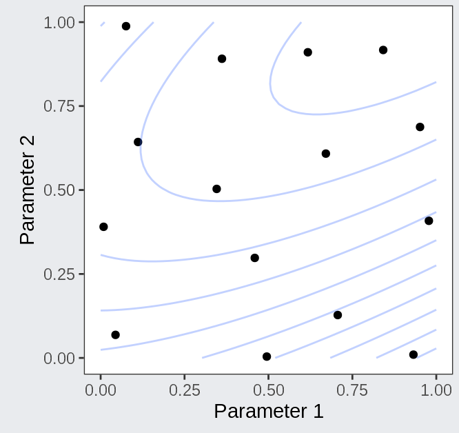

```{r setup, include=FALSE}
options(htmltools.dir.version = FALSE)
knitr::opts_chunk$set(
  fig.width=9, fig.height=3.5, fig.retina=3,
  fig.showtext = TRUE,
  out.width = "100%",
  cache = FALSE,
  echo = TRUE,
  message = FALSE, 
  warning = FALSE,
  hiline = TRUE,
  collapse = TRUE
)
```

```{r xaringanExtra, echo=FALSE}
xaringanExtra::use_tachyons()
xaringanExtra::use_clipboard()
xaringanExtra::use_tile_view()
```

```{r packages, echo=FALSE, message=FALSE}
library(tidyverse)
library(knitr)
library(kableExtra)
library(countdown)
library(patchwork)
library(xaringanthemer)
library(tidymodels)
tidymodels_prefer()
```

```{r data, echo=FALSE, message=FALSE}
titanic <- read_csv("../data/titanic.csv")
```


class: inverse, center, middle
# Parameter Tuning
---
class: twocol
## Model and tuning parameters
.pull-left[
#### Model Parameters

-   Often specify the learned .imp[relationships]

-   **LM:** intercept and slope(s)

-   **GLMNET:** intercept and slope(s)

-   To "fit" a model is to estimate the model parameter values using training data
]

--

.pull-right[
#### Tuning Parameters

-   Often control the model's .imp[complexity]

-   **LM:** *(none)* 

-   **GLMNET:** penalty and mixture

-   Unfortunately, tuning parameter values .underline[cannot be estimated] using training data
]

--
.pv3[
.bg-light-yellow.b--light-red.ba.bw1.br3.ph4[
**Caution:** The "default" values of many tuning parameters often perform quite poorly...
]
]

.footnote[
[1] Different algorithms may have different model parameters and tuning parameters.<br />
[2] Tuning parameters are sometimes also called "hyperparameters."
]
---
class: onecol
## Parameter Tuning
.pull-left[
-   Recall that we need to find a balance

  -   Too simple a model will **underfit**
  
  -   Too complex a model will **overfit**
  
  -   Both lead to poor generalizability

-   To find this optimal balance, we...

  -   Try various hyperparameter values
  
  -   Select those that best generalize
  
  -   (This is done during resampling)
]

--

.pull-right.pv3.tc[


.flex.items-center.justify-center.nt3[
.f3[Complexity Dial:]


]
]

---
class: onecol
## Determining which values to try

.lh-copy[
-   .imp[Grid Search] is the approach we will use in this course
  1.   Start with some reasonable boundaries<sup>1</sup> for each tuning parameter
  2.   Generate a list of possible values within those boundaries
  3.   Create a list of all (or some) combinations of these values
  4.   Try all of these values and then select the best
]

--
.lh-copy[
-   .imp[Iterative Search] is a more advanced approach
  1.    Start with some reasonable value<sup>1</sup> for each tuning parameter
  2.    Fit a model with those values and examine performance
  3.    Try slightly different values and compare performance
  4.    Continue until performance barely changes anymore
]

.footnote[[1] But what are "reasonable" values? Tidymodels has us covered!]
---
## Determining which values to try

.pull-left[

]

--

.pull-right[

]

---
class: onecol
## Steps in parameter tuning

1.    Split your data (full or training set) into resamples

--

2.    Determine which parameters to tune (often all)

--

3.    Create a list of tuning parameter values to try

--

4.    Try each combination of values during resampling
  -   Train a model on some of the data with these values
  -   Test the model just described on the rest of the data
  -   *Optional:* Repeat several times and average the results

--

5.    Find the combination of values with the best performance

--

6.    Train a final, "tuned" model on all your data with the best values...

---
class: twocol
## Key functions for tuning

-   `tune()`: Tell tidymodels which parameters to tune

--

.pt1[
-   `extract_parameter_dials()`: Extract information about one parameter

-   `extract_parameter_set_dials()`: Extract information about all parameters
]

--

.pt1[
-   `finalize()`: Determine reasonable boundaries for each parameter (automatically)

-   `tune_grid()`: Create a list of value combinations (within boundaries) and try them
]

--

.pt1[
-   `select_best()`: Determine which combination of values was the best

-   `finalize_workflow()`: Store the best values in the workflow object
]

---
class: inverse, center, middle
# GLMNET Example
---

## Live Coding: Prepare data and folds

```{r, eval=FALSE}
# Load data
titanic <- read_csv("https://tinyurl.com/titanic-pm")

# Create data splits, stratified by fare

fare_split <- initial_split(data = titanic, prop = 0.8, strata = fare)
fare_train <- training(fare_split)
fare_test <- testing(fare_split)

set.seed(2022)
fare_folds <- vfold_cv(data = fare_train, v = 10, repeats = 3, strata = fare)
```

---

## Live Coding: Set up model and parameters

```{r, eval=FALSE}
# Set up model (linear regression using glmnet)

glmnet_model <- 
  linear_reg(penalty = tune(), mixture = tune()) %>%
  set_mode("regression") %>% 
  set_engine("glmnet")
glmnet_model
```

---

## Live Coding: Prepare workflow and metrics

.scroll.h-0l[
```{r, eval=FALSE}
fare_recipe <- 
  recipe(titanic) %>% 
  update_role(fare, new_role = "outcome") %>% 
  update_role(pclass:parch, new_role = "predictor") %>% 
  update_role(survived, new_role = "ignore") %>% 
  step_naomit(fare) %>% 
  step_mutate(
    pclass = factor(pclass),
    sex = factor(sex)
  ) %>% 
  step_dummy(all_nominal_predictors()) %>%
  step_impute_linear(age) %>%
  step_nzv(all_predictors()) %>%
  step_corr(all_numeric_predictors()) %>%
  step_lincomb(all_numeric_predictors()) %>% 
  step_normalize(all_predictors())

# Prepare workflow

fare_wflow <-
  workflow() %>% 
  add_model(glmnet_model) %>% 
  add_recipe(fare_recipe)

# Set up metric set

fare_ms <- metric_set(rmse, rsq, huber_loss, ccc)
```
]

---

## Live Coding: Set up the parameter dials

```{r, eval=FALSE}
# Extract the parameters to tune and finalize with the data folds

glmnet_param <-
  glmnet_model %>%
  extract_parameter_set_dials() %>% 
  finalize(fare_folds) 

# View the finalized grids (not necessary, just to look)

glmnet_param %>% extract_parameter_dials("penalty")

glmnet_param %>% extract_parameter_dials("mixture")
```

---

## Live Coding: Configure grid search and tune grid

.scroll.h-0l[
```{r, eval=FALSE}
# Set up resampling to save predictions and workflows

control_keep <- control_resamples(save_pred = TRUE, save_workflow = TRUE)

# Perform tuning by searching over space-filling grid

set.seed(2022)
fare_tune <- 
  fare_wflow %>%
  tune_grid(
    resamples = fare_folds,
    grid = 10,
    param_info = glmnet_param,
    metrics = fare_ms,
    control = control_keep
  )
fare_tune

# View the performance by parameter values (averaged across folds and repeats)

collect_metrics(fare_tune)

# Plot the marginal performance by parameter values

autoplot(fare_tune, metric = "rmse")
```
]

---

## Live Coding: Finalize the workflow

```{r, eval=FALSE}
# Select the best parameters values

fare_param_final <- select_best(fare_tune, metric = "rmse")
fare_param_final

# Finalize the workflow with best parameter values

fare_wflow_final <- 
  fare_wflow %>% 
  finalize_workflow(fare_param_final)
fare_wflow_final
```

---

## Live Coding: Fit the finalized workflow to resamples

```{r, eval=FALSE}
fare_fit <-
  fare_wflow_final %>% 
  fit_resamples(
    resamples = fare_folds,
    metrics = fare_ms,
    control = control_keep
  )
```

---

## Live Coding: View performance across resamples

.scroll.h-0l[
```{r, eval=FALSE}
# View the metrics (averaged across folds and repetitions)

collect_metrics(fare_fit, summarize = TRUE)

# View and plot the metrics (per fold and repetition)

fare_perf_fold <- collect_metrics(fare_fit, summarize = FALSE)
fare_perf_fold

# Simpler version (one metric only)

fare_perf_fold %>% 
  filter(.metric == "ccc") %>% 
  ggplot(aes(x = .estimate, y = id)) +
  geom_boxplot() +
  labs(x = "CCC", y = NULL)

# Advanced version (all metrics)

fare_perf_fold %>% 
  ggplot(aes(x = .estimate, y = id)) +
  facet_wrap(~.metric, scales = "free") +
  geom_boxplot() +
  labs(y = NULL)

# Plot the predictions (averaged across folds and predictions)

fare_pred <- collect_predictions(fare_fit, summarize = TRUE)

ggplot(fare_pred, aes(x = fare, y = .pred)) + 
  geom_point(alpha = 0.1) +
  geom_abline(color = "darkred") +
  coord_obs_pred()
```
]

---

## Live Coding: Final performance and interpretation

```{r, eval=FALSE}
# Fit the final model to the entire training set and test in testing set

fare_final <- 
  fare_wflow_final %>% 
  last_fit(fare_split)

collect_metrics(fare_final)

library(vip)
fare_final %>% 
  extract_fit_parsnip() %>% 
  vip()
```

---

## Live Coding: Deployment

```{r, eval=FALSE}
# Fit the final model to the entire dataset for interpretation and deployment

fare_deploy <- 
  fare_wflow_final %>% 
  fit(titanic)

# Deployment: If new data comes in, use this model to make predictions

titanic2 <- titanic # replace with new dataset with same feature variables
predict(fare_deploy, titanic2)
```

---

## Some helpful boilerplate

.scroll.h-0l[
```{r}
# Get some boilerplate for GLMNET to start with and then modify

library(usemodels)
use_glmnet(formula = fare ~ ., data = titanic)

# Add code to do resampling

# Adjust recipe as needed

# Add code to finalize and fit the model
```
]

---

class: inverse, center, middle

# Time for a Break!
```{r countdown, echo=FALSE}
countdown(
  minutes = 60, 
  seconds = 0, 
  right = "33%", 
  left = "33%",
  bottom = "15%",
  color_background = "white",
  color_text = "black",
  color_running_background = "white",
  color_running_text = "black",
  warn_when = 120
)
```
