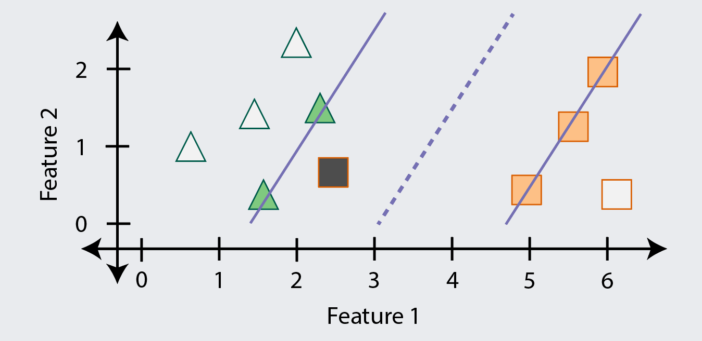
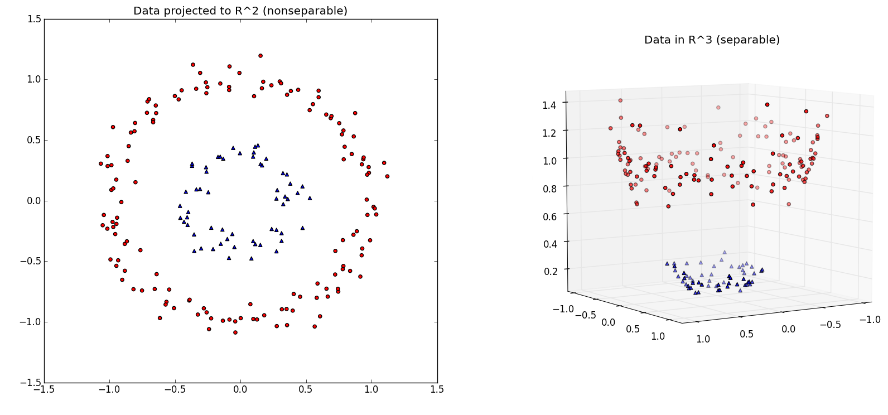

```{r setup, include=FALSE}
options(htmltools.dir.version = FALSE)
knitr::opts_chunk$set(
  fig.width=9, fig.height=3.5, fig.retina=3,
  fig.showtext = TRUE,
  out.width = "100%",
  cache = FALSE,
  echo = TRUE,
  message = FALSE, 
  warning = FALSE,
  hiline = TRUE,
  comment = "#>",
  collapse = TRUE
)
```

```{r xaringan-themer, include=FALSE, warning=FALSE}
library(xaringanthemer)
```

```{r xaringan-tachyons, echo=FALSE}
xaringanExtra::use_tachyons()
xaringanExtra::use_clipboard()
xaringanExtra::use_tile_view()
```

```{r packages, echo=FALSE, message=FALSE}
library(tidyverse)
library(knitr)
library(kableExtra)
library(countdown)
library(patchwork)
library(caret)
library(skimr)
library(tidymodels)
```

class: inverse, center, middle
# Overview

---
class: onecol
## Roadmap

.left-column[
.pt4[
```{r, echo=FALSE}

```
]
]

.right-column[
1. Maximal Margin Classifier 🚶

1. Support Vector Classifier 🏃

1. Support Vector Machine 🚴

1. Support Vector Regression 🚵

1. Applied Example

1. Live Coding

1. Hands-on Activity
]


---
class: onecol
## Notices and Disclaimers

The ideas underlying SVM are really *clever* and *interesting*! 😃

--

SVM is also a good algorithm for *smaller*, *messy* datasets!! 😍

--

However, there is a lot of *terminology* and *math* involved... 😱

--

<p style="padding-top:15px;">I will try to shield you from this and give only <b>the necessities</b></p>

- That means there will be some things I need to "hand waive"

- I may also need to skip questions with very technical answers

- Finally, it may be tough to follow along since training takes a while

--

<p style="padding-top:15px;">But you should get a <b>strong intuition</b> and <b>applied knowledge</b></p>

- This will prepare you nicely to dive into a longer course on the topic

---
class: inverse, center, middle
# SVM Intuitions
---
class: onecol
## A Tale of Two Classes

If this is our training data, how do we **predict the class** of new data?

```{r, echo=FALSE, out.width='100%'}
include_graphics("../figs/maxmargin1.png")
```

---
class: onecol
## Drawing a Line in the Sand

With one feature, we could find a **point** that separates the classes (as higher or lower)

```{r, echo=FALSE, out.width='100%'}
include_graphics("../figs/maxmargin2.png")
```

---
class: onecol
## Analysis Paralysis
But there are many possible decision points, so **which should we use?**

```{r, echo=FALSE, out.width='100%'}
include_graphics("../figs/maxmargin3.png")
```

---
class: onecol
## Maximal Margin Classifier (MMC)
The MMC algorithm finds and uses the point with the **largest** (i.e., maximal) .imp[margin]

```{r, echo=FALSE, out.width='100%'}
include_graphics("../figs/maxmargin4.png")
```

---
class: onecol
## Maximal Margin Classifier

If we have two features, we can extend this idea using a 2D plot and a decision **line**

```{r, echo=FALSE, out.width='80%'}
include_graphics("../figs/maxmargin5.png")
```

---
class: onecol
## Maximal Margin Classifier

If we have three features, we will need a 3D plot and a decision **plane** (i.e., flat surface)

```{r, echo=FALSE, out.width='45%'}
include_graphics("../figs/3d_plane.gif")
```

.footnote[[1] Credit to [Zahra Elhamraoui](https://medium.datadriveninvestor.com/support-vector-machine-svm-algorithm-in-a-fun-easy-way-fc23a008c22) for this visualization.]

---
class: onecol
## Maximal Margin Classifier

If we have four or more features, we will need a decision **hyperplane**

--

.bg-light-yellow.b--light-red.ba.bw1.br3.pl4[
**Caution:** You may hurt yourself if you try to imagine what a hyperplane looks like. 
]

--

.pt1[
**Margins still exist** in higher-dimensional space and we still want to maximize them
]

- Our goal is thus to locate the class-separating hyperplane with the largest margin

- The math behind this is beyond the scope of our workshop, but that's the idea

--

.pt1[
We can still **classify new observations**: which side of the hyperplane do they fall on?
]

---
class: onecol
## Maximal Margin Classifier

Only the observations that define the margin, called .imp[support vectors], are used

Because it only uses a subset of data anyway, MMC does well with smaller datasets

```{r, echo=FALSE, out.width='80%'}
include_graphics("../figs/maxmargin8.png")
```

---
class: onecol
## Maximal Margin Classifier

This means that **outliers can have an outsized impact** on what is learned

For instance, this margin is likely to misclassify examples in new data

```{r, echo=FALSE, out.width='80%'}
include_graphics("../figs/maxmargin9.png")
```

---
## Comprehension Check \#1

.pull-left[
### Question 1
**What is the maximum number of features you can use with the MMC algorithm?**

a) 1 feature

b) 2 features

c) 3 features

d) Any number (no maximum)
]

.pull-right[
### Question 2
**Which observations does the MMC algorithm learn from?**

a) The most ambiguous/difficult ones

b) The most obvious/easy ones

c) A random selection of observations

d) All of the observations
]

---
class: onecol
## Support Vector Classifier (SVC)

The SVC algorithm is like MMC but it **allows examples to be misclassified** (i.e., wrong)

This will **increase bias** (training errors) but hopefully **decrease variance** (testing errors)

```{r, echo=FALSE, out.width='80%'}

```

---
class: onecol
## Support Vector Classifier

SVCs also enable a model to be trained when the classes are **not perfectly separable**

A straight line is never going to separate these classes without errors (sorry MMC...)

```{r, echo=FALSE, out.width='80%'}
include_graphics("../figs/svc2.png")
```

---
class: onecol
## Support Vector Classifier

But if we allow a few errors and points within the margin...

...we may be able to find a hyperplane that generalizes pretty well

```{r, echo=FALSE, out.width='80%'}
include_graphics("../figs/svc3.png")
```

---
class: onecol
## Support Vector Classifier

When points are on the wrong side of the margin, they are called "violations"

A **softer margin** allows more violations, whereas a **harder margin** allows fewer

SVCs have a hyperparameter $C$ that controls how soft vs. hard the margin is

--

- A **lower $C$ value** makes the margin harder (allows fewer violations)<sup>1</sup>
  
  As a result, the model has **lower bias** and more flexibility but may overfit

- A **higher $C$ value** makes the margin softer (allows more violations)

  As a result, the model has less flexibility but may also have **lower variance**

.footnote[
[1] If you set $C=0$ (i.e., a fully hard margin) SVC will allow no violations  and behave the same as MMC.]

---
## Comprehension Check \#2

.pull-left[
### Question 1
**What is the main difference between the MMC and SVC algorithms?**

a) The MMC algorithm uses hyperplanes

b) The SVC algorithm allows training errors

c) The MMC algorithm uses a softer margin

d) The SVC algorithm prevents "violations"
]

.pull-right[
### Question 2
**Which value of $C$ would be least likely to overfit?**

a) $C=-1$

b) $C=0$

c) $C=1$

d) $C=10$
]

---
class: onecol
## Support Vector Machine

So far, MMC and SVCs have both used linear (e.g., flat) hyperplanes

But there are many times when the classes are not **linearly separable**

```{r, echo=FALSE, out.width='80%'}
include_graphics("../figs/svm1.png")
```

.footnote[[1] These classes seem separable, but not with a single decision point...]

---
class: onecol
## Support Vector Machine

But if we enlarge the feature space, the classes might then become linearly separable

There are many ways to do this enlarging, but one is to add polynomial expansions

```{r, echo=FALSE, out.width='80%'}
include_graphics("../figs/svm2.png")
```

---
class: onecol
## Support Vector Machine

The classes are now linearly separable in this new enlarged feature space!

The hyperplane is flat in this new space, but would not look so in the original space

```{r, echo=FALSE, out.width='80%'}
include_graphics("../figs/svm3.png")
```

---
class: onecol
## Support Vector Machine

Here is a more complex example of a nonlinear (and non-polynomial) expansion

```{r, echo=FALSE, out.width='75%'}

```

.footnote[[1] Credit to [Erik Kim](https://www.eric-kim.net/eric-kim-net/posts/1/kernel_trick.html) for this example and visualization.]

---
class: onecol
## Support Vector Machine

And here is the hyperplane: it is linear in 3D but not when "projected" back into 2D

```{r, echo=FALSE, out.width='75%'}
include_graphics("../figs/svm5.png")
```

.footnote[[1] Credit to [Erik Kim](https://www.eric-kim.net/eric-kim-net/posts/1/kernel_trick.html) for this example and visualization.]

---
class: onecol
## Support Vector Machine
The .imp[Support Vector Machine] (SVM) allows us to efficiently enlarge the feature space

- Part of what makes SVMs efficient is they **only consider the support vectors**

- They also use **kernel functions** to quantify the similarity of pairs of support vectors<sup>1</sup>

.footnote[[1] These similarity estimates are used to efficiently find the optimal hyperplane but that process is complex.]

--

<p style="padding-top:15px;">The SVC can actually be considered a simple version of the SVM with a <b>linear kernel</b></p>

- A linear kernel essentially quantifies similarity using the Pearson correlation

$$k(x, x') = \langle x, x'\rangle$$

--

<p style="padding-top:15px;">Linear kernels are efficient but <b>nonlinear kernels</b> may provide better performance</b></p>


---
exclude: true
class: onecol
## Support Vector Machine

It is common to also use **nonlinear** kernels, such as the .imp[polynomial kernel]

$$k(x, x')=(\text{scale} \cdot \langle x, x' \rangle + \text{offset})^\text{degree}$$

With larger values of $\text{degree}$, the decision boundary can become more complex

- You are essentially adding polynomial expansions of $\text{degree}$ to each predictor

- You have expanded the feature space and may now have linear separation

- This is the same idea we just used in fitting a hyperplane in the $x\text{-by-}x^2$ space!

If you center or normalize all your predictors, you can drop the $\text{offset}$ term

.footnote[[1] When `\\(\text{degree}=1\\)`, the polynomial kernel reduces to the linear kernel and SVM becomes SVC again.]

---
class: onecol
## Support Vector Machine

Perhaps the most common nonlinear kernel is the .imp[radial basis function] (RBF)

$$k(x, x') = \exp\left(-\sigma \|x-y\|^2\right)$$

--

The intuition here is that similarity is weighted by how *close* the observations are

- Only support vectors near new observations influence classification strongly

- As the $\sigma$ hyperparameter<sup>1</sup> increases, the more *local* and complex fit becomes

--

The RBF kernel computes similarity between points in *infinite* dimensions 🤯

- It is considered an ideal "general purpose" nonlinear kernel<sup>2</sup> 

--

.footnote[
[1] Note that $\sigma$ is also sometimes called $\gamma$ or the "scale" hyperparameter.<br />
[2] Other nonlinear kernels are popular for special purposes and in specialized subfields.
]

---
## Comprehension Check \#3

.pull-left[
### Question 1
**What is the main difference between the SVM and SVC algorithms?**

a) The SVM algorithm uses kernel functions

b) SVM will automatically square your features

c) SVC is just the SVM with an RBF kernel

d) They are the same exact thing, silly!
]

.pull-right[
### Question 2
**What are the hyperparameters for an SVM with a Radial kernel?**

a) $\sigma$ and $\gamma$

b) $C$ and $\sigma$

c) $\alpha$ and $\lambda$

d) $C$ and $\Delta$
]

---
class: onecol
## Support Vector Regression Machine (SVR)

So far we have been concerned only with classification, but what about regression?

In another very clever turn, you can **adapt SVM for regression** by reversing its goal

- Instead of trying to separate classes and keep data points outside of the margin...

- ...SVR instead tries to **keep all the data points** .imp[inside the margin] (with no classes)

.center[
```{r, echo=FALSE, out.width='50%'}
include_graphics("../figs/svr.png")
```

]

---
class: onecol
## Support Vector Regression Machine


All the benefits of the SVM algorithm can be applied to the regression problem

- Using a subset of the data points to define the margin, i.e., **support vectors**

- Allowing violations (now points *outside* the margin) with a **soft margin**

- Efficiently expanding the feature space through the use of **various kernels**

We can use the same {caret} `method` and hyperparameters for SVM and SVR

- We will use $C$ to control the softness vs. hardness of the margin

- If we use an RBF kernel, we will use $\sigma$ to control the kernel scaling

- Optionally, we can tune the $\varepsilon$ hyperparameter to control the margin size

---
class: onecol
## Support Vector Regression Machine

```{r, echo=FALSE, out.width='90%'}
include_graphics("../figs/epsilonsvr.png")
```


---
class: onecol
## Applied Example

Let's train three classification models to predict Titanic survival

1. A logistic regression (using "glm")

1. A linear SVM (using "svmLinear")

1. A radial SVM (using "svmRadial")

We can practice setting up tuning grids and also learn to compare models<sup>1</sup>

We will also show using CV only (and not nesting it inside of a holdout CV)<sup>2</sup>

Finally, we will train an SVR regression model to predict Titanic fare

.footnote[
[1] Note that this is a relatively small dataset with few predictors, so we may not really need the power of SVM.<br />
[2] Note that nesting a $k$-fold CV inside another $k$-fold CV would give better estimates (but take even longer).]

---
class: onecol
## Applied Example

```{r, message=FALSE}
titanic <- read_csv("https://bit.ly/amlr-titanic")
```

--

```{r}
# Create the recipe and configure resampling
surv_recipe <- 
  titanic %>% 
  recipe(survived ~ .) %>% 
  step_normalize(all_numeric_predictors()) %>% 
  step_dummy(all_nominal_predictors())

surv_tc <- trainControl(method = "cv", number = 10)
```

---
class: onecol
## Training the Logistic Regression and CV Performance

```{r glm, cache=TRUE}
set.seed(2021)

# glm has no hyperparameters
surv_glm <- train(
  surv_recipe, 
  data = titanic, #<<
  method = "glm",
  trControl = surv_tc
)
```

```{r, eval=FALSE}
surv_glm$results
```

```{r, echo=FALSE}
surv_glm$results %>% kable(digits = 3)
```

---
class: onecol
## Training the Linear SVM

```{r linsvm, cache=TRUE}
set.seed(2021)

# Let's create a tuning grid manually
surv_linsvm <- train(
  surv_recipe, 
  data = titanic,
  method = "svmLinear", #<<
  tuneGrid = expand.grid(C = c(1/4, 1/2, 1, 2, 4)), #<<
  trControl = surv_tc
)
```

---
class: onecol
## CV Performance of the Linear SVM

```{r, eval=FALSE}
surv_linsvm$results
```

```{r, echo=FALSE}
surv_linsvm$results %>% kable(digits = 3)
```

---
class: onecol
## Training the Radial SVM
```{r rbfsvm, cache=TRUE}
set.seed(2021)

# Let's let caret set up the tuning grid on this one
surv_rbfsvm <- train(
  surv_recipe, 
  data = titanic,
  method = "svmRadialSigma", #<<
  tuneLength = 5, #<<
  trControl = surv_tc
)
```


---
class: onecol
## CV Performance of the Radial SVM

```{r, eval=FALSE}
surv_rbfsvm$results
```

```{r, echo=FALSE}
surv_rbfsvm$results %>% kable(digits = 3) %>% scroll_box(height = '400px')
```

---
class: onecol
## Plotting Accuracy Against $C$ and $\sigma$ Values

```{r rbfhp, out.width='90%'}
ggplot(surv_rbfsvm)
```

---
## Comparing the Algorithms' CV Performance

```{r, echo=FALSE}
summary.resamples <- function(x, metric) {
  output <- caret:::summary.resamples(x, metric = metric)
  output$statistics$Accuracy <- round(output$statistics$Accuracy, digits = 3)
  output
}
```

```{r}
surv_res <- resamples(list(LogisticGLM = surv_glm, 
                           LinearSVM = surv_linsvm, 
                           RadialSVM = surv_rbfsvm))
summary(surv_res, metric = "Accuracy")
```

---
## Comparing the Algorithms' CV Performance

```{r}
bwplot(surv_res)
```


---
class: onecol
## Quick SVR Example

```{r}
svr_recipe <- 
  titanic %>% 
  recipe(fare ~ .) %>% 
  step_rm(survived) %>% 
  step_dummy(all_nominal_predictors()) %>% 
  step_normalize(all_numeric_predictors())
```

---
## Quick SVR Example

```{r, eval=FALSE}
fare_svr <- train(
  svr_recipe,
  data = titanic,
  method = "svmRadial",
  tuneLength = 5,
  trControl = surv_tc
)
fare_svr$results
```

```{r svr, cache=TRUE, echo=FALSE}
fare_svr <- train(
  svr_recipe,
  data = titanic,
  method = "svmRadial",
  tuneLength = 5,
  trControl = surv_tc
)
fare_svr$results %>% kable(digits = 3)
```

---
## Quick SVR Example

```{r}
densityplot(fare_svr, metric = "Rsquared")
```

---
class: onecol
## Live Coding

Let's try to predict whether it is safe or unsafe for humans to drink from a water source based on its chemical properties (e.g., pH, hardness, sulfate content).

We will recap how to **train SVM classifiers** with RBF kernels

We will also compare **two approaches** to selecting the $\sigma$ hyperparameter:

 1. Tuning it via grid search (i.e., trying and comparing many values)
 
 1. Letting the {kernlab} package automatically estimate it
 
Finally, I can also show you an example of **imputing missing values** with {recipes}

---
class: onecol
## Hands-on Activity

Let's try to predict whether an employee with quit their job based on various measures.

1. Load the `attrition` dataset<sup>1</sup> from the {modeldata} package (Hint: use `data(...)`)

1. Explore the data and create a recipe that includes normalization and dummy coding

1. Configure your resampling to be a single 10-fold cross-validation

1. Train models using the following algorithms and settings to classify `Potability`

    + GLMNET with a `tuneLength` of 5 for $\alpha$ and $\lambda$
    
    + SVM with RBF kernel with a `tuneLength` of 5 for $C$ (let {kernlab} estimate $\sigma$)
    
1. Collect the resampling results using `resamples()` and plot them using `bwplot()`

.footnote[[1] Note that this is simulated (i.e., not real) data from the IBM Watson group.]

---
class: inverse, center, middle
# Time for a Break!
```{r countdown, echo=FALSE}
countdown(
  minutes = 10, 
  seconds = 0, 
  right = "33%", 
  left = "33%",
  bottom = "15%",
  color_background = "white",
  color_text = "black",
  color_running_background = "white",
  color_running_text = "black",
  warn_when = 60
)
```
